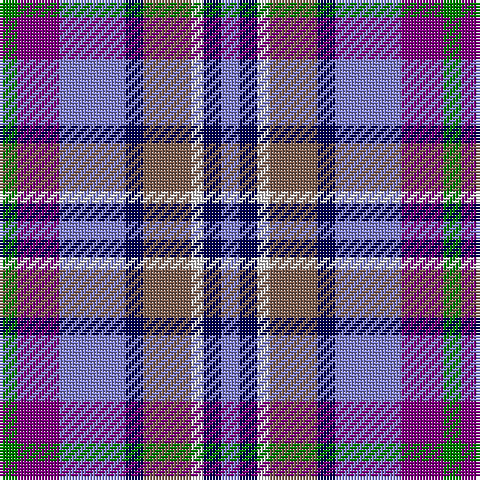

In pattern [BBWRBBBG](/stripes/bbwrbbbg/).

This was sourced from weddslist.  It is a [8 stripe tartan](/stripes/stripes8/).

Original link http://www.weddslist.com/cgi-bin/tartans/pg.pl?source=sts

## Thread count
G/6 P14 B22 DB6 LT16 LN4 DB6 B/6

## Palette
Each colour and the base-6 reference it is a variant of.

| Colour | Shade | Base |
|---|---|---|
| B | <code style="background-color:#8080D0;">#8080D0</code> `oklch(63.4% 0.119 282.5)` <small>#8080D0</small> | B <code style="background-color:#2A418A;">#2A418A</code> |
| DB | <code style="background-color:#000050;">#000050</code> `oklch(19.5% 0.135 264.1)` <small>#000050</small> | B <code style="background-color:#2A418A;">#2A418A</code> |
| G | <code style="background-color:#008000;">#008000</code> `oklch(52.0% 0.177 142.5)` <small>#008000</small> | G <code style="background-color:#006100;">#006100</code> |
| LN | <code style="background-color:#E0E0E0;">#E0E0E0</code> `oklch(90.7% 0.000 89.9)` <small>#E0E0E0</small> | W <code style="background-color:#F7F7F7;">#F7F7F7</code> |
| LT | <code style="background-color:#806050;">#806050</code> `oklch(51.7% 0.049 47.8)` <small>#806050</small> | R <code style="background-color:#CC0000;">#CC0000</code> |
| P | <code style="background-color:#800080;">#800080</code> `oklch(42.1% 0.193 328.4)` <small>#800080</small> | B <code style="background-color:#2A418A;">#2A418A</code> |

# Sample pattern

## Nearest tartans

The nearest existing variants by ΔTartan distance, with this tartan at the top so the swatches line up against it.

ΔTartan

Tartan

Sett

—

<a href="/ttd/edit/#slug=g3p7b11db3o8w2db3b3~x2">Scotia</a> <a class="nn-out" href="/setts/s8/g3p7b11db3o8w2db3b3~x2/" title="open its dictionary page">↗</a>

0.78

<a href="/ttd/edit/#slug=g3dp7t11db3dy8w2db3t3~x2">Scotia Trade Tartan Tartan Number: 89. Earliest known date: 1968 Originally designed by James Allan of East Kilbride and woven by him in 1850. The sett was reconstructed by David Easton, Galashiels, as a National tartan for Scotland. It did not catch on and the tartan is rarely seen today. See products available Copyright © Blair Urquhart, Comrie, 2015</a> <a class="nn-out" href="/setts/s8/g3dp7t11db3dy8w2db3t3~x2/" title="open its dictionary page">↗</a>

1.14

<a href="/ttd/edit/#slug=db24r6w6r6w6r6db25k12b36ly6">Lopatinsky (Personal)</a> <a class="nn-out" href="/setts/s10/db24r6w6r6w6r6db25k12b36ly6/" title="open its dictionary page">↗</a>

1.21

<a href="/ttd/edit/#slug=w8db5db30lr4db13lr13g5lo5~x2">Waterford County Crest (Fashion)</a> <a class="nn-out" href="/setts/s8/w8db5db30lr4db13lr13g5lo5~x2/" title="open its dictionary page">↗</a>

1.36

<a href="/ttd/edit/#slug=g4t2g9k4g2r6db12w2~x2">Cherokee</a> <a class="nn-out" href="/setts/s8/g4t2g9k4g2r6db12w2~x2/" title="open its dictionary page">↗</a>

1.37

<a href="/ttd/edit/#slug=db13ly2r4g2t8w2~x6">Meh Dundee</a> <a class="nn-out" href="/setts/s6/db13ly2r4g2t8w2~x6/" title="open its dictionary page">↗</a>

1.41

<a href="/ttd/edit/#slug=w1db6g1db1g1db1db4r5lo1~x4">McLion (Corporate)</a> <a class="nn-out" href="/setts/s9/w1db6g1db1g1db1db4r5lo1~x4/" title="open its dictionary page">↗</a>

1.43

<a href="/ttd/edit/#slug=db10t5lo2t2lb2t5o4t2o4lb2~x4">Unidentified #47</a> <a class="nn-out" href="/setts/s10/db10t5lo2t2lb2t5o4t2o4lb2~x4/" title="open its dictionary page">↗</a>

1.43

<a href="/ttd/edit/#slug=o10t5db15k3db15k5r25k3w4~x2">Galway County Crest (Fashion)</a> <a class="nn-out" href="/setts/s9/o10t5db15k3db15k5r25k3w4~x2/" title="open its dictionary page">↗</a>

1.44

<a href="/ttd/edit/#slug=o5db4ly1db4k4dy4w1~x4">Devon Companion</a> <a class="nn-out" href="/setts/s7/o5db4ly1db4k4dy4w1~x4/" title="open its dictionary page">↗</a>

1.48

<a href="/ttd/edit/#slug=y12k3w3k3w3k3y13n6db17r3~x2">Mitsukoshi</a> <a class="nn-out" href="/setts/s10/y12k3w3k3w3k3y13n6db17r3~x2/" title="open its dictionary page">↗</a>

## Neighbour map

Every grey dot is one of 14299 variants placed by the first two principal components of the ΔTartan feature space (44% of its variance). Red is this tartan; blue dots are its nearest — click one to open its page.

<svg viewBox="0 0 640 380" role="img" style="max-width:100%;height:auto;border:1px solid #e0e0e0;border-radius:4px;display:block" xmlns="http://www.w3.org/2000/svg"><image href="/nn/cloud.v1.png" width="640" height="380"/><a href="/setts/s8/g3dp7t11db3dy8w2db3t3~x2/"><circle cx="86.3" cy="211.1" r="4" fill="#3465a4"><title>Scotia Trade Tartan Tartan Number: 89. Earliest known date: 1968 Originally designed by James Allan of East Kilbride and woven by him in 1850. The sett was reconstructed by David Easton, Galashiels, as a National tartan for Scotland. It did not catch on and the tartan is rarely seen today. See products available Copyright © Blair Urquhart, Comrie, 2015</title></circle></a><a href="/setts/s10/db24r6w6r6w6r6db25k12b36ly6/"><circle cx="91.4" cy="167.4" r="4" fill="#3465a4"><title>Lopatinsky (Personal)</title></circle></a><a href="/setts/s8/w8db5db30lr4db13lr13g5lo5~x2/"><circle cx="99.5" cy="171.8" r="4" fill="#3465a4"><title>Waterford County Crest (Fashion)</title></circle></a><a href="/setts/s8/g4t2g9k4g2r6db12w2~x2/"><circle cx="90.5" cy="190.9" r="4" fill="#3465a4"><title>Cherokee</title></circle></a><a href="/setts/s6/db13ly2r4g2t8w2~x6/"><circle cx="136.9" cy="188.9" r="4" fill="#3465a4"><title>Meh Dundee</title></circle></a><a href="/setts/s9/w1db6g1db1g1db1db4r5lo1~x4/"><circle cx="137.7" cy="185.5" r="4" fill="#3465a4"><title>McLion (Corporate)</title></circle></a><a href="/setts/s10/db10t5lo2t2lb2t5o4t2o4lb2~x4/"><circle cx="96.6" cy="205.5" r="4" fill="#3465a4"><title>Unidentified #47</title></circle></a><a href="/setts/s9/o10t5db15k3db15k5r25k3w4~x2/"><circle cx="124.5" cy="172.9" r="4" fill="#3465a4"><title>Galway County Crest (Fashion)</title></circle></a><a href="/setts/s7/o5db4ly1db4k4dy4w1~x4/"><circle cx="53.1" cy="230.2" r="4" fill="#3465a4"><title>Devon Companion</title></circle></a><a href="/setts/s10/y12k3w3k3w3k3y13n6db17r3~x2/"><circle cx="96.8" cy="175.7" r="4" fill="#3465a4"><title>Mitsukoshi</title></circle></a><circle cx="79.3" cy="201.5" r="5" fill="#c00000"/></svg>

ID: /setts/s8/g3p7b11db3o8w2db3b3~x2/
