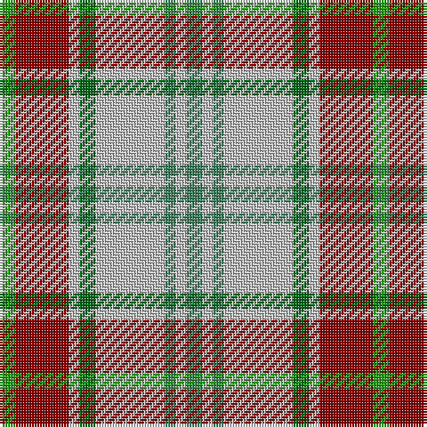

In pattern [GRWGWGWG](/patterns/grwgwgwg/).

This was sourced from register-of-tartans.  It is a [8 stripes tartan](/stripes/stripes8/).

Original link https://www.tartanregister.gov.uk/tartanDetails.aspx?ref=2806

## Thread count
Ga/6 DR20 N4 G6 N26 Gb4 N4 Gb/6

## Palette
Each colour and its ΔE from the base-6 reference it is a variant of.

| Colour | Shade | Base | ΔE (OKLab) |
|---|---|---|---|
| DR | <code style="background-color:#880000;">#880000</code> `#880000` | R <code style="background-color:#CC0000;">#CC0000</code> | 0.15 |
| G | <code style="background-color:#006818;">#006818</code> `#006818` | G <code style="background-color:#006100;">#006100</code> | 0.02 |
| Ga | <code style="background-color:#289C18;">#289C18</code> `#289C18` | G <code style="background-color:#006100;">#006100</code> | 0.19 |
| Gb | <code style="background-color:#408060;">#408060</code> `#408060` | G <code style="background-color:#006100;">#006100</code> | 0.14 |
| N | <code style="background-color:#C0C0C0;">#C0C0C0</code> `#C0C0C0` | W <code style="background-color:#F7F7F7;">#F7F7F7</code> | 0.17 |

# Sample pattern

## Nearest tartans

The nearest existing variants by ΔTartan distance.

1. [Tombow 140th Anniversary, The](/setts/s7/g4y7r9y9b20w2b2x2~b1870a4-g006400-rfa4b00-wffffff-ye0a126/) — ΔT 0.85
1. [Cotswolds Distillery](/setts/s9/g4y15ya17y4b3y3b3y12k4x2~b646464-g604000-k000000-ycbc1a4-ya97967d/) — ΔT 1.07
1. [Fraser hunting, dress](/setts/s11/b4r24g17r3w18r3w18r3g17r24ra4x2~b304080-g008000-r806050-rac00000-we0e0e0/) — ΔT 1.08
1. [Brunnbauer (2015)](/setts/s8/w4b32w12k5r9y8r4w4x2~b5c8ca8-k101010-rc80000-wfcfcfc-yd09800/) — ΔT 1.12
1. [Lindley-Highfield of Ballumbie Castle](/setts/s7/g7b3w1y2g1wa2b1x8~b800080-g006400-wffffff-wadda0dd-y32cd32/) — ΔT 1.21
1. [Toorak Chapler (Fashion)](/setts/s9/g3y1w1g1y1g3w3ya6r1x6~g604000-r880000-wc0c0c0-ya08858-yac4bc68/) — ΔT 1.24
1. [MacLachlan Dress Clan Tartan Tartan Number: 828. Earliest known date: 1990 Based on the MacLachlan pattern in Old And Rare See products available Copyright © Blair Urquhart, Comrie, 2015](/setts/s7/r34w3g4ga23w24k3g4x2~g006428-ga006818-k101010-rd05054-we0e0e0/) — ΔT 1.24
1. [Brunnbauer (2015)](/setts/s8/w4b32w12k5r9y8r4w4x2~b5f749c-k1c1714-rc8002c-wf8f8f8-ye0a126/) — ΔT 1.28
1. [Bannockbane Dark Green](/setts/s7/g4ga3g24w15y21gb3y4x2~g003820-ga289c18-gb006818-we0e0e0-ya08858/) — ΔT 1.29
1. [Fraser Hunting Dress Clan Tartan Tartan Number: 603. Earliest known date: pre 2003 In the Hunting Fraser, brown replaces the red of the Clan sett. The late Charles Ian Fraser of Reeling said, in his publication, "Clan Fraser", that this sett was designed by the Sobieski Stuart brothers at the request of Lord Lovat for use by the Inverness and Nairn militia. A letter to Lord Lovat from the War Office, c.1855, authorised the use of the Fraser tartan for the corps. The tartan is worn by the Boghall & Bathgate pipe bands. (Strathallan 1994) See products available Copyright © Blair Urquhart, Comrie, 2015](/setts/s11/b4g24ga17g3w18g3w18g3ga17g24r4x2~b2c2c80-g604000-ga006818-rc80000-we0e0e0/) — ΔT 1.30

## Neighbour map

Every grey dot is one of 15726 variants placed by the first two principal components of the ΔTartan feature space (44% of its variance). Red is this tartan; blue dots are its nearest — click one to open its page.

<svg viewBox="0 0 640 380" role="img" style="max-width:100%;height:auto;border:1px solid #e0e0e0;border-radius:4px;display:block" xmlns="http://www.w3.org/2000/svg"><image href="/nn/cloud.v1.png" width="640" height="380"/><a href="/setts/s7/g4y7r9y9b20w2b2x2~b1870a4-g006400-rfa4b00-wffffff-ye0a126/"><circle cx="180.8" cy="181.0" r="4" fill="#3465a4"><title>Tombow 140th Anniversary, The</title></circle></a><a href="/setts/s9/g4y15ya17y4b3y3b3y12k4x2~b646464-g604000-k000000-ycbc1a4-ya97967d/"><circle cx="201.2" cy="191.3" r="4" fill="#3465a4"><title>Cotswolds Distillery</title></circle></a><a href="/setts/s11/b4r24g17r3w18r3w18r3g17r24ra4x2~b304080-g008000-r806050-rac00000-we0e0e0/"><circle cx="160.0" cy="179.5" r="4" fill="#3465a4"><title>Fraser hunting, dress</title></circle></a><a href="/setts/s8/w4b32w12k5r9y8r4w4x2~b5c8ca8-k101010-rc80000-wfcfcfc-yd09800/"><circle cx="146.8" cy="157.2" r="4" fill="#3465a4"><title>Brunnbauer (2015)</title></circle></a><a href="/setts/s7/g7b3w1y2g1wa2b1x8~b800080-g006400-wffffff-wadda0dd-y32cd32/"><circle cx="167.7" cy="188.3" r="4" fill="#3465a4"><title>Lindley-Highfield of Ballumbie Castle</title></circle></a><a href="/setts/s9/g3y1w1g1y1g3w3ya6r1x6~g604000-r880000-wc0c0c0-ya08858-yac4bc68/"><circle cx="125.5" cy="191.0" r="4" fill="#3465a4"><title>Toorak Chapler (Fashion)</title></circle></a><a href="/setts/s7/r34w3g4ga23w24k3g4x2~g006428-ga006818-k101010-rd05054-we0e0e0/"><circle cx="152.8" cy="156.2" r="4" fill="#3465a4"><title>MacLachlan Dress Clan Tartan Tartan Number: 828. Earliest known date: 1990 Based on the MacLachlan pattern in Old And Rare See products available Copyright © Blair Urquhart, Comrie, 2015</title></circle></a><a href="/setts/s8/w4b32w12k5r9y8r4w4x2~b5f749c-k1c1714-rc8002c-wf8f8f8-ye0a126/"><circle cx="150.1" cy="157.3" r="4" fill="#3465a4"><title>Brunnbauer (2015)</title></circle></a><a href="/setts/s7/g4ga3g24w15y21gb3y4x2~g003820-ga289c18-gb006818-we0e0e0-ya08858/"><circle cx="142.0" cy="184.7" r="4" fill="#3465a4"><title>Bannockbane Dark Green</title></circle></a><a href="/setts/s11/b4g24ga17g3w18g3w18g3ga17g24r4x2~b2c2c80-g604000-ga006818-rc80000-we0e0e0/"><circle cx="146.1" cy="176.5" r="4" fill="#3465a4"><title>Fraser Hunting Dress Clan Tartan Tartan Number: 603. Earliest known date: pre 2003 In the Hunting Fraser, brown replaces the red of the Clan sett. The late Charles Ian Fraser of Reeling said, in his publication, &quot;Clan Fraser&quot;, that this sett was designed by the Sobieski Stuart brothers at the request of Lord Lovat for use by the Inverness and Nairn militia. A letter to Lord Lovat from the War Office, c.1855, authorised the use of the Fraser tartan for the corps. The tartan is worn by the Boghall &amp; Bathgate pipe bands. (Strathallan 1994) See products available Copyright © Blair Urquhart, Comrie, 2015</title></circle></a><circle cx="171.9" cy="181.1" r="5" fill="#c00000"/></svg>

ID: /setts/s8/g3r10w2ga3w13gb2w2gb3x2~g289c18-ga006818-gb408060-r880000-wc0c0c0/
