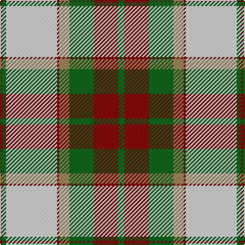

**Bands:** [GRGYRWGR](/stripes/grgyrwgr/) · **Stripes:** [G R G LO R W G R](/stripes/stripes8/) G R G LO R W G R

This was sourced from house-of-tartan.  It is a [8 band tartan](/bands/bands8/).

Original link http://www.house-of-tartan.scotland.net/house/TartanViewjs.asp?colr=Def&tnam=913

## Thread count
DR/2 G4 LN50 DR2 LT10 G24 DR24 G/6

## Palette
Each colour and its ΔE from the base-6 reference it is a variant of.

| Colour | Shade | Base | ΔE (OKLab) |
|---|---|---|---|
| DR | <code style="background-color:#880000;">#880000</code> `#880000` | R <code style="background-color:#CC0000;">#CC0000</code> | 0.15 |
| G | <code style="background-color:#006818;">#006818</code> `#006818` | G <code style="background-color:#006100;">#006100</code> | 0.02 |
| LN | <code style="background-color:#E0E0E0;">#E0E0E0</code> `#E0E0E0` | W <code style="background-color:#F7F7F7;">#F7F7F7</code> | 0.07 |
| LT | <code style="background-color:#A08858;">#A08858</code> `#A08858` | Y <code style="background-color:#F2BF00;">#F2BF00</code> | 0.21 |

# Sample pattern

## Nearest tartans

The nearest existing variants by ΔTartan distance.

1. [Dogwood](/setts/s8/g3r12g12o5r1w25g2r1~x2/) — ΔT 0.20
1. [Prince Edward Island, Dress](/setts/s9/g22r2g4r2g4r18w24r1lo3~x2/) — ΔT 0.68
1. [British Columbia #2](/setts/s8/dg4dr14dg14o6dr1w30dg2dr1~x2/) — ΔT 0.70
1. [Dogwood](/setts/s8/dg4do10dg10o6do1w26dg2do1~x4/) — ΔT 0.74
1. [Scott, dress](/setts/s11/g4r2k1w30r10g14r4g5w2g5r4~x2/) — ΔT 0.88
1. [Aviemore Check](/setts/s8/g2dy10g11ly4dy1w18g2dy1~x2/) — ΔT 0.99
1. [Crawford Arisaid (Dance)](/setts/s9/r6w1r2w25r3g12r3g12r3~x2/) — ΔT 1.07
1. [Grant - 1714 (Piper) (Portrait)](/setts/s12/r24k2g8k2r8k1g24lb6k2r14lb18k4/) — ΔT 1.11
1. [Turnberry](/setts/s8/lo3dy12do14r4do1w26do2dy1~x2/) — ΔT 1.16
1. [MacDuff, dress](/setts/s10/r6g3w22r5w5k9g16r4k1r4~x2/) — ΔT 1.18

## Neighbour map

Every grey dot is one of 14313 variants placed by the first two principal components of the ΔTartan feature space (44% of its variance). Red is this tartan; blue dots are its nearest — click one to open its page.

<svg viewBox="0 0 640 380" role="img" style="max-width:100%;height:auto;border:1px solid #e0e0e0;border-radius:4px;display:block" xmlns="http://www.w3.org/2000/svg"><image href="/nn/cloud.v1.png" width="640" height="380"/><a href="/setts/s8/g3r12g12o5r1w25g2r1~x2/"><circle cx="223.3" cy="125.1" r="4" fill="#3465a4"><title>Dogwood</title></circle></a><a href="/setts/s9/g22r2g4r2g4r18w24r1lo3~x2/"><circle cx="214.6" cy="127.0" r="4" fill="#3465a4"><title>Prince Edward Island, Dress</title></circle></a><a href="/setts/s8/dg4dr14dg14o6dr1w30dg2dr1~x2/"><circle cx="215.9" cy="111.1" r="4" fill="#3465a4"><title>British Columbia #2</title></circle></a><a href="/setts/s8/dg4do10dg10o6do1w26dg2do1~x4/"><circle cx="218.0" cy="118.3" r="4" fill="#3465a4"><title>Dogwood</title></circle></a><a href="/setts/s11/g4r2k1w30r10g14r4g5w2g5r4~x2/"><circle cx="235.8" cy="101.2" r="4" fill="#3465a4"><title>Scott, dress</title></circle></a><a href="/setts/s8/g2dy10g11ly4dy1w18g2dy1~x2/"><circle cx="188.2" cy="146.8" r="4" fill="#3465a4"><title>Aviemore Check</title></circle></a><a href="/setts/s9/r6w1r2w25r3g12r3g12r3~x2/"><circle cx="229.7" cy="133.7" r="4" fill="#3465a4"><title>Crawford Arisaid (Dance)</title></circle></a><a href="/setts/s12/r24k2g8k2r8k1g24lb6k2r14lb18k4/"><circle cx="215.3" cy="128.6" r="4" fill="#3465a4"><title>Grant - 1714 (Piper) (Portrait)</title></circle></a><a href="/setts/s8/lo3dy12do14r4do1w26do2dy1~x2/"><circle cx="197.2" cy="97.5" r="4" fill="#3465a4"><title>Turnberry</title></circle></a><a href="/setts/s10/r6g3w22r5w5k9g16r4k1r4~x2/"><circle cx="160.6" cy="127.9" r="4" fill="#3465a4"><title>MacDuff, dress</title></circle></a><circle cx="223.5" cy="124.8" r="5" fill="#c00000"/></svg>

ID: /setts/s8/g3r12g12lo5r1w25g2r1~x2/
