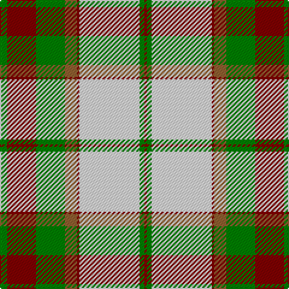

This page is one **sett** — a single exact thread-count. It belongs to the [tartan](/tartans/g3dr12g12lt5dr1ln25g2dr1/)
(the same proportion at any scale), whose colour order is pattern [GRGRRWGR](/stripes/grgrrwgr/).

Sourced from weddslist.  It is a [8 stripe tartan](/stripes/stripes8/).

Original link http://www.weddslist.com/cgi-bin/tartans/pg.pl?source=sts

## Thread count
G/6 DR24 G24 LT10 DR2 LN50 G4 DR/2

## Palette
Each colour and the base-6 reference it is a variant of.

| Colour | Shade | Base |
|---|---|---|
| DR | <code style="background-color:#800000;">#800000</code> `oklch(37.7% 0.155 29.2)` <small>#800000</small> | R <code style="background-color:#CC0000;">#CC0000</code> |
| G | <code style="background-color:#008000;">#008000</code> `oklch(52.0% 0.177 142.5)` <small>#008000</small> | G <code style="background-color:#006100;">#006100</code> |
| LN | <code style="background-color:#E0E0E0;">#E0E0E0</code> `oklch(90.7% 0.000 89.9)` <small>#E0E0E0</small> | W <code style="background-color:#F7F7F7;">#F7F7F7</code> |
| LT | <code style="background-color:#906030;">#906030</code> `oklch(53.1% 0.089 63.7)` <small>#906030</small> | R <code style="background-color:#CC0000;">#CC0000</code> |

# Sample pattern

## Nearest tartans

The nearest existing variants by ΔTartan distance, with this tartan at the top so the swatches line up against it.

ΔTartan

Tartan

Sett

—

<a href="/ttd/edit/#slug=g3r12g12o5r1w25g2r1~x2">Dogwood</a> <a class="nn-out" href="/setts/s8/g3r12g12o5r1w25g2r1~x2/" title="open its dictionary page">↗</a>

0.20

<a href="/ttd/edit/#slug=g3r12g12lo5r1w25g2r1~x2">Dogwood Trade Tartan Tartan Number: 913. Earliest known date: 1968 The registered tartan of the Dinwiddie Clan. Dinwiddies are normally associated with the Maxwells, but Lord Lyon stated, in 1988, that Dinwiddies were a sept of no other clan. See products available Copyright © Blair Urquhart, Comrie, 2015</a> <a class="nn-out" href="/setts/s8/g3r12g12lo5r1w25g2r1~x2/" title="open its dictionary page">↗</a>

0.68

<a href="/ttd/edit/#slug=dg4do10dg10o6do1w26dg2do1~x4">Dogwood</a> <a class="nn-out" href="/setts/s8/dg4do10dg10o6do1w26dg2do1~x4/" title="open its dictionary page">↗</a>

0.68

<a href="/ttd/edit/#slug=g22r2g4r2g4r18w24r1lo3~x2">Prince Edward Island, Dress</a> <a class="nn-out" href="/setts/s9/g22r2g4r2g4r18w24r1lo3~x2/" title="open its dictionary page">↗</a>

0.72

<a href="/ttd/edit/#slug=dg4dr14dg14o6dr1w30dg2dr1~x2">British Columbia #2</a> <a class="nn-out" href="/setts/s8/dg4dr14dg14o6dr1w30dg2dr1~x2/" title="open its dictionary page">↗</a>

0.82

<a href="/ttd/edit/#slug=r4g5w2g5r4g14r10w30k1r2g4~x2">Scott, dress</a> <a class="nn-out" href="/setts/s11/r4g5w2g5r4g14r10w30k1r2g4~x2/" title="open its dictionary page">↗</a>

0.88

<a href="/ttd/edit/#slug=g2dy10g11ly4dy1w18g2dy1~x2">Aviemore Check</a> <a class="nn-out" href="/setts/s8/g2dy10g11ly4dy1w18g2dy1~x2/" title="open its dictionary page">↗</a>

1.07

<a href="/ttd/edit/#slug=r6w1r2w25r3g12r3g12r3~x2">Crawford Arisaid (Dance)</a> <a class="nn-out" href="/setts/s9/r6w1r2w25r3g12r3g12r3~x2/" title="open its dictionary page">↗</a>

1.13

<a href="/ttd/edit/#slug=r24k2g8k2r8k1g24lb6k2r14lb18k4~x2">Grant - 1714 (Piper) (Portrait)</a> <a class="nn-out" href="/setts/s12/r24k2g8k2r8k1g24lb6k2r14lb18k4~x2/" title="open its dictionary page">↗</a>

1.18

<a href="/ttd/edit/#slug=g2o10g11ly4o1w18g2o1~x2">Aviemore, Check</a> <a class="nn-out" href="/setts/s8/g2o10g11ly4o1w18g2o1~x2/" title="open its dictionary page">↗</a>

1.22

<a href="/ttd/edit/#slug=lo3dy12do14r4do1w26do2dy1~x2">Turnberry</a> <a class="nn-out" href="/setts/s8/lo3dy12do14r4do1w26do2dy1~x2/" title="open its dictionary page">↗</a>

## Neighbour map

Every grey dot is one of 14299 variants placed by the first two principal components of the ΔTartan feature space (44% of its variance). Red is this tartan; blue dots are its nearest — click one to open its page.

<svg viewBox="0 0 640 380" role="img" style="max-width:100%;height:auto;border:1px solid #e0e0e0;border-radius:4px;display:block" xmlns="http://www.w3.org/2000/svg"><image href="/nn/cloud.v1.png" width="640" height="380"/><a href="/setts/s8/g3r12g12lo5r1w25g2r1~x2/"><circle cx="223.1" cy="124.7" r="4" fill="#3465a4"><title>Dogwood Trade Tartan Tartan Number: 913. Earliest known date: 1968 The registered tartan of the Dinwiddie Clan. Dinwiddies are normally associated with the Maxwells, but Lord Lyon stated, in 1988, that Dinwiddies were a sept of no other clan. See products available Copyright © Blair Urquhart, Comrie, 2015</title></circle></a><a href="/setts/s8/dg4do10dg10o6do1w26dg2do1~x4/"><circle cx="217.7" cy="118.1" r="4" fill="#3465a4"><title>Dogwood</title></circle></a><a href="/setts/s9/g22r2g4r2g4r18w24r1lo3~x2/"><circle cx="214.3" cy="126.9" r="4" fill="#3465a4"><title>Prince Edward Island, Dress</title></circle></a><a href="/setts/s8/dg4dr14dg14o6dr1w30dg2dr1~x2/"><circle cx="215.5" cy="111.0" r="4" fill="#3465a4"><title>British Columbia #2</title></circle></a><a href="/setts/s11/r4g5w2g5r4g14r10w30k1r2g4~x2/"><circle cx="235.4" cy="101.1" r="4" fill="#3465a4"><title>Scott, dress</title></circle></a><a href="/setts/s8/g2dy10g11ly4dy1w18g2dy1~x2/"><circle cx="188.0" cy="146.7" r="4" fill="#3465a4"><title>Aviemore Check</title></circle></a><a href="/setts/s9/r6w1r2w25r3g12r3g12r3~x2/"><circle cx="229.3" cy="133.5" r="4" fill="#3465a4"><title>Crawford Arisaid (Dance)</title></circle></a><a href="/setts/s12/r24k2g8k2r8k1g24lb6k2r14lb18k4~x2/"><circle cx="214.9" cy="128.5" r="4" fill="#3465a4"><title>Grant - 1714 (Piper) (Portrait)</title></circle></a><a href="/setts/s8/g2o10g11ly4o1w18g2o1~x2/"><circle cx="201.6" cy="152.2" r="4" fill="#3465a4"><title>Aviemore, Check</title></circle></a><a href="/setts/s8/lo3dy12do14r4do1w26do2dy1~x2/"><circle cx="196.8" cy="97.5" r="4" fill="#3465a4"><title>Turnberry</title></circle></a><circle cx="222.9" cy="124.9" r="5" fill="#c00000"/></svg>

ID: /setts/s8/g3r12g12o5r1w25g2r1~x2/
