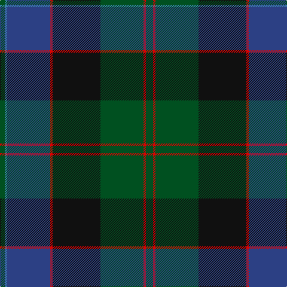

In pattern [GBBRKGRG](/patterns/gbbrkgrg/).

This was sourced from register-of-tartans.  It is a [8 stripes tartan](/stripes/stripes8/).

Original link https://www.tartanregister.gov.uk/tartanDetails.aspx?ref=2160

## Thread count
G/8 B4 Ba72 R4 K80 G72 R4 G/12

## Palette
Each colour and its ΔE from the base-6 reference it is a variant of.

| Colour | Shade | Base | ΔE (OKLab) |
|---|---|---|---|
| B | <code style="background-color:#3C82AF;">#3C82AF</code> `#3C82AF` | B <code style="background-color:#2A418A;">#2A418A</code> | 0.19 |
| Ba | <code style="background-color:#2C4084;">#2C4084</code> `#2C4084` | B <code style="background-color:#2A418A;">#2A418A</code> | 0.01 |
| G | <code style="background-color:#005020;">#005020</code> `#005020` | G <code style="background-color:#006100;">#006100</code> | 0.07 |
| K | <code style="background-color:#101010;">#101010</code> `#101010` | K <code style="background-color:#000000;">#000000</code> | 0.17 |
| R | <code style="background-color:#DC0000;">#DC0000</code> `#DC0000` | R <code style="background-color:#CC0000;">#CC0000</code> | 0.03 |

# Sample pattern

## Nearest tartans

The nearest existing variants by ΔTartan distance.

1. [Chan (Name?)](/setts/s8/r2g13r2g13k13b30k1y2x2~b003c64-g285800-k101010-r880000-ye8c000/) — ΔT 0.83
1. [Colquhoun](/setts/s7/b4k2b16w1k8g24r4x2~b2c4084-g005020-k101010-rdc0000-we0e0e0/) — ΔT 0.92
1. [Mann](/setts/s9/k3r2g4r1b25ga12g14b3r1x2~b202060-g604000-ga006818-k101010-rc80000/) — ΔT 0.99
1. [Rikaco Classic (Fashion)](/setts/s10/b4ba4b1g24b10r1b2ra5ba3r2x2~b202060-ba1474b4-g003820-rc80000-ra880000/) — ΔT 1.01
1. [Thomas, baron of Craigie, Robert (Personal)](/setts/s8/r2k4b23k14g16y1k4y2x2~b14283c-g285800-k101010-rdc0000-ye8c000/) — ΔT 1.01
1. [Kilkenny, County (District)](/setts/s7/b4g27r2ba25y5g3r3x2~b480800-ba202060-g003820-rb84c00-ybc8c00/) — ΔT 1.02
1. [MacCaskill (Personal)](/setts/s7/k2r1g15k15b15y1k2x2~b2c2c80-g285800-k101010-rc80000-ye8c000/) — ΔT 1.03
1. [Baird](/setts/s8/r7g3r2g33k31b31k3b3~b2c4084-g005020-k101010-r960028/) — ΔT 1.03
1. [Thomas of Craigie (Personal)](/setts/s8/y2k4y1g16k14b23k4r1x2~b202060-g285800-k101010-rc80000-ye8c000/) — ΔT 1.06
1. [Lawrie Clan Tartan Tartan Number: 3202. Earliest known date: 2000 One of a set of three similar designs for Laurie, Lawrie and Lowry, designed by Peter MacDonald for Iain Laurie. See products available Copyright © Blair Urquhart, Comrie, 2015](/setts/s7/b6r2b1g25ba16k2ba4x2~b440044-ba2c2c80-g006818-k101010-r945008/) — ΔT 1.09

## Neighbour map

Every grey dot is one of 15726 variants placed by the first two principal components of the ΔTartan feature space (44% of its variance). Red is this tartan; blue dots are its nearest — click one to open its page.

<svg viewBox="0 0 640 380" role="img" style="max-width:100%;height:auto;border:1px solid #e0e0e0;border-radius:4px;display:block" xmlns="http://www.w3.org/2000/svg"><image href="/nn/cloud.v1.png" width="640" height="380"/><a href="/setts/s8/r2g13r2g13k13b30k1y2x2~b003c64-g285800-k101010-r880000-ye8c000/"><circle cx="281.6" cy="159.9" r="4" fill="#3465a4"><title>Chan (Name?)</title></circle></a><a href="/setts/s7/b4k2b16w1k8g24r4x2~b2c4084-g005020-k101010-rdc0000-we0e0e0/"><circle cx="262.6" cy="168.4" r="4" fill="#3465a4"><title>Colquhoun</title></circle></a><a href="/setts/s9/k3r2g4r1b25ga12g14b3r1x2~b202060-g604000-ga006818-k101010-rc80000/"><circle cx="292.8" cy="151.3" r="4" fill="#3465a4"><title>Mann</title></circle></a><a href="/setts/s10/b4ba4b1g24b10r1b2ra5ba3r2x2~b202060-ba1474b4-g003820-rc80000-ra880000/"><circle cx="296.4" cy="144.4" r="4" fill="#3465a4"><title>Rikaco Classic (Fashion)</title></circle></a><a href="/setts/s8/r2k4b23k14g16y1k4y2x2~b14283c-g285800-k101010-rdc0000-ye8c000/"><circle cx="233.5" cy="165.4" r="4" fill="#3465a4"><title>Thomas, baron of Craigie, Robert (Personal)</title></circle></a><a href="/setts/s7/b4g27r2ba25y5g3r3x2~b480800-ba202060-g003820-rb84c00-ybc8c00/"><circle cx="280.3" cy="187.4" r="4" fill="#3465a4"><title>Kilkenny, County (District)</title></circle></a><a href="/setts/s7/k2r1g15k15b15y1k2x2~b2c2c80-g285800-k101010-rc80000-ye8c000/"><circle cx="230.9" cy="186.3" r="4" fill="#3465a4"><title>MacCaskill (Personal)</title></circle></a><a href="/setts/s8/r7g3r2g33k31b31k3b3~b2c4084-g005020-k101010-r960028/"><circle cx="253.1" cy="198.8" r="4" fill="#3465a4"><title>Baird</title></circle></a><a href="/setts/s8/y2k4y1g16k14b23k4r1x2~b202060-g285800-k101010-rc80000-ye8c000/"><circle cx="232.0" cy="159.7" r="4" fill="#3465a4"><title>Thomas of Craigie (Personal)</title></circle></a><a href="/setts/s7/b6r2b1g25ba16k2ba4x2~b440044-ba2c2c80-g006818-k101010-r945008/"><circle cx="301.9" cy="162.9" r="4" fill="#3465a4"><title>Lawrie Clan Tartan Tartan Number: 3202. Earliest known date: 2000 One of a set of three similar designs for Laurie, Lawrie and Lowry, designed by Peter MacDonald for Iain Laurie. See products available Copyright © Blair Urquhart, Comrie, 2015</title></circle></a><circle cx="260.4" cy="170.8" r="5" fill="#c00000"/></svg>

ID: /setts/s8/g3r1g18k20r1b18ba1g2x4~b2c4084-ba3c82af-g005020-k101010-rdc0000/
