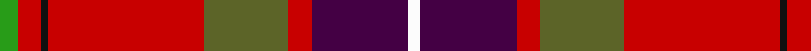
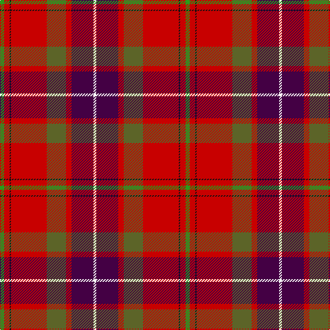

In pattern [GRKRGRBW](/stripes/grkrgrbw/).

This was sourced from tartans-authority.  It is a [8 stripe tartan](/stripes/stripes8/).

Original link http://www.tartansauthority.com/tartan-ferret/display/8892/

## Thread count
G/6 R8 K2 R52 Ga28 R8 DP32 W/4

## Palette
Each colour and the base-6 reference it is a variant of.

| Colour | Shade | Base |
|---|---|---|
| DP | <code style="background-color:#440044;">#440044</code> `oklch(27.1% 0.125 328.4)` <small>#440044</small> | B <code style="background-color:#2A418A;">#2A418A</code> |
| G | <code style="background-color:#289C18;">#289C18</code> `oklch(60.6% 0.191 141.6)` <small>#289C18</small> | G <code style="background-color:#006100;">#006100</code> |
| Ga | <code style="background-color:#5C6428;">#5C6428</code> `oklch(48.3% 0.084 116.0)` <small>#5C6428</small> | G <code style="background-color:#006100;">#006100</code> |
| K | <code style="background-color:#101010;">#101010</code> `oklch(17.3% 0.000 89.9)` <small>#101010</small> | K <code style="background-color:#000000;">#000000</code> |
| R | <code style="background-color:#C80000;">#C80000</code> `oklch(52.3% 0.215 29.2)` <small>#C80000</small> | R <code style="background-color:#CC0000;">#CC0000</code> |
| W | <code style="background-color:#FCFCFC;">#FCFCFC</code> `oklch(99.1% 0.000 89.9)` <small>#FCFCFC</small> | W <code style="background-color:#F7F7F7;">#F7F7F7</code> |

# Sample pattern

## Nearest tartans

The nearest existing variants by ΔTartan distance, with this tartan at the top so the swatches line up against it.

ΔTartan

Tartan

Sett

—

<a href="/ttd/edit/#slug=g3r4k1r26y14r4dp16w2~x2">MacQueen of Dalmagarry (Clan?)</a> <a class="nn-out" href="/setts/s8/g3r4k1r26y14r4dp16w2~x2/" title="open its dictionary page">↗</a>

0.98

<a href="/ttd/edit/#slug=r7k6r62k15r20n15lo10k16db10k3w6">Cork County Crest (Fashion)</a> <a class="nn-out" href="/setts/s11/r7k6r62k15r20n15lo10k16db10k3w6/" title="open its dictionary page">↗</a>

1.11

<a href="/ttd/edit/#slug=r64t16p18ly4p4w4p18g32r14t4r14w3~x2">Wilson's No 4</a> <a class="nn-out" href="/setts/s12/r64t16p18ly4p4w4p18g32r14t4r14w3~x2/" title="open its dictionary page">↗</a>

1.13

<a href="/ttd/edit/#slug=r60k40ly3p5p3dg12~x2">Rei Okamoto (Personal)</a> <a class="nn-out" href="/setts/s6/r60k40ly3p5p3dg12~x2/" title="open its dictionary page">↗</a>

1.15

<a href="/ttd/edit/#slug=t5k1r30dp15r8g30r8dp2">Shaw of Tordarroch Clan Tartan Tartan Number: 352. Earliest known date: 1969 When Major C.J. Shaw of Tordarroch, matriculated and became the first chief of the Clan for some 400 years, he had a new tartan designed, which reflects the Clan's Mackintosh ancestry. He specifically states that the old design is still perfectly acceptable and approves its continued use by all members of the Clan. Donald Stewart, who designed the new sett, is the author of 'The Setts of the Scottish Tartans', the first comprehensive record of tartan patterns, published in 1950. See products available Copyright © Blair Urquhart, Comrie, 2015</a> <a class="nn-out" href="/setts/s8/t5k1r30dp15r8g30r8dp2/" title="open its dictionary page">↗</a>

1.16

<a href="/ttd/edit/#slug=g9lo2g6r35db6lb1r20db5lb2~x2">Telfer</a> <a class="nn-out" href="/setts/s9/g9lo2g6r35db6lb1r20db5lb2~x2/" title="open its dictionary page">↗</a>

1.18

<a href="/ttd/edit/#slug=lb5k1r30dp15r8dg30r8dp2">Shaw</a> <a class="nn-out" href="/setts/s8/lb5k1r30dp15r8dg30r8dp2/" title="open its dictionary page">↗</a>

1.19

<a href="/ttd/edit/#slug=r41w2dp5ly2g21r9dp5db3w2~x2">Perthshire or Drummond District Tartan Tartan Number: 1670. Earliest known date: c.1819 Perthshire is known as the gateway to the Highlands. The Perthshire tartan is similar to a the Drummond sett, the tartan of a Drummond clan who had extensive lands in the district. The first record of this tartan is in the early nineteenth century account book of Wilson's of Bannockburn where it is referred to as the 'Perthshire Rock and Wheel' being an early type of soft tartan. See products available Copyright © Blair Urquhart, Comrie, 2015</a> <a class="nn-out" href="/setts/s9/r41w2dp5ly2g21r9dp5db3w2~x2/" title="open its dictionary page">↗</a>

1.19

<a href="/ttd/edit/#slug=t5k1r30dp15r8g30r8dp2~x2">Shaw Red of Tordarroch Dress (Clan 2</a> <a class="nn-out" href="/setts/s8/t5k1r30dp15r8g30r8dp2~x2/" title="open its dictionary page">↗</a>

1.19

<a href="/ttd/edit/#slug=g9ly2g6r35db6lb1r20db5lb2~x2">Telfer (Name)</a> <a class="nn-out" href="/setts/s9/g9ly2g6r35db6lb1r20db5lb2~x2/" title="open its dictionary page">↗</a>

1.20

<a href="/ttd/edit/#slug=t5k1r30p15r8g30r8p2~x2">Shaw of Tordarroch</a> <a class="nn-out" href="/setts/s8/t5k1r30p15r8g30r8p2~x2/" title="open its dictionary page">↗</a>

## Neighbour map

Every grey dot is one of 14299 variants placed by the first two principal components of the ΔTartan feature space (44% of its variance). Red is this tartan; blue dots are its nearest — click one to open its page.

<svg viewBox="0 0 640 380" role="img" style="max-width:100%;height:auto;border:1px solid #e0e0e0;border-radius:4px;display:block" xmlns="http://www.w3.org/2000/svg"><image href="/nn/cloud.v1.png" width="640" height="380"/><a href="/setts/s11/r7k6r62k15r20n15lo10k16db10k3w6/"><circle cx="263.9" cy="98.5" r="4" fill="#3465a4"><title>Cork County Crest (Fashion)</title></circle></a><a href="/setts/s12/r64t16p18ly4p4w4p18g32r14t4r14w3~x2/"><circle cx="245.5" cy="96.9" r="4" fill="#3465a4"><title>Wilson's No 4</title></circle></a><a href="/setts/s6/r60k40ly3p5p3dg12~x2/"><circle cx="274.9" cy="126.5" r="4" fill="#3465a4"><title>Rei Okamoto (Personal)</title></circle></a><a href="/setts/s8/t5k1r30dp15r8g30r8dp2/"><circle cx="294.4" cy="137.7" r="4" fill="#3465a4"><title>Shaw of Tordarroch Clan Tartan Tartan Number: 352. Earliest known date: 1969 When Major C.J. Shaw of Tordarroch, matriculated and became the first chief of the Clan for some 400 years, he had a new tartan designed, which reflects the Clan's Mackintosh ancestry. He specifically states that the old design is still perfectly acceptable and approves its continued use by all members of the Clan. Donald Stewart, who designed the new sett, is the author of 'The Setts of the Scottish Tartans', the first comprehensive record of tartan patterns, published in 1950. See products available Copyright © Blair Urquhart, Comrie, 2015</title></circle></a><a href="/setts/s9/g9lo2g6r35db6lb1r20db5lb2~x2/"><circle cx="250.8" cy="92.1" r="4" fill="#3465a4"><title>Telfer</title></circle></a><a href="/setts/s8/lb5k1r30dp15r8dg30r8dp2/"><circle cx="275.5" cy="129.9" r="4" fill="#3465a4"><title>Shaw</title></circle></a><a href="/setts/s9/r41w2dp5ly2g21r9dp5db3w2~x2/"><circle cx="316.1" cy="97.2" r="4" fill="#3465a4"><title>Perthshire or Drummond District Tartan Tartan Number: 1670. Earliest known date: c.1819 Perthshire is known as the gateway to the Highlands. The Perthshire tartan is similar to a the Drummond sett, the tartan of a Drummond clan who had extensive lands in the district. The first record of this tartan is in the early nineteenth century account book of Wilson's of Bannockburn where it is referred to as the 'Perthshire Rock and Wheel' being an early type of soft tartan. See products available Copyright © Blair Urquhart, Comrie, 2015</title></circle></a><a href="/setts/s8/t5k1r30dp15r8g30r8dp2~x2/"><circle cx="286.1" cy="135.6" r="4" fill="#3465a4"><title>Shaw Red of Tordarroch Dress (Clan 2</title></circle></a><a href="/setts/s9/g9ly2g6r35db6lb1r20db5lb2~x2/"><circle cx="250.7" cy="93.2" r="4" fill="#3465a4"><title>Telfer (Name)</title></circle></a><a href="/setts/s8/t5k1r30p15r8g30r8p2~x2/"><circle cx="285.1" cy="133.7" r="4" fill="#3465a4"><title>Shaw of Tordarroch</title></circle></a><circle cx="272.1" cy="112.8" r="5" fill="#c00000"/></svg>

ID: /setts/s8/g3r4k1r26y14r4dp16w2~x2/
