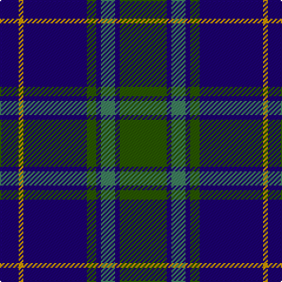

In pattern [BYBGBGBG](/patterns/bybgbgbg/).

This was sourced from tartans-authority.  It is a [8 stripes tartan](/stripes/stripes8/).

Original link http://www.tartansauthority.com/tartan-ferret/display/5362/

## Thread count
DB/16 DY4 DB54 Ga8 DB4 G12 DB4 Ga/40

## Palette
Each colour and its ΔE from the base-6 reference it is a variant of.

| Colour | Shade | Base | ΔE (OKLab) |
|---|---|---|---|
| DB | <code style="background-color:#1C0070;">#1C0070</code> `#1C0070` | B <code style="background-color:#2C4084;">#2C4084</code> | 0.14 |
| DY | <code style="background-color:#D09800;">#D09800</code> `#D09800` | Y <code style="background-color:#E8C000;">#E8C000</code> | 0.11 |
| G | <code style="background-color:#408060;">#408060</code> `#408060` | G <code style="background-color:#006400;">#006400</code> | 0.13 |
| Ga | <code style="background-color:#285800;">#285800</code> `#285800` | G <code style="background-color:#006400;">#006400</code> | 0.04 |

# Sample pattern

## Nearest tartans

The nearest existing variants by ΔTartan distance.

1. [Gracie](/setts/s8/g94r6g12b70y6b70g12r6-b1c0070-g006818-r880000-yd09800/) — ΔT 0.59
1. [Rowan Family Tartan Tartan Number: 2067. Earliest known date: 1990 Designed for Mr Robert Rowan. See products available Copyright © Blair Urquhart, Comrie, 2015](/setts/s9/b2k2b16y2g24y2b16k2b2-b2c2c80-g006818-k101010-ye8c000/) — ΔT 0.77
1. [Greenways Marketing Intl (Corporate)](/setts/s7/b48g6b6g6y4g36r4-b1c0070-g006818-r880000-yd09800/) — ΔT 0.83
1. [Tern House](/setts/s7/g23b3k8b4g4b56y8-b2c2c80-g006818-k101010-yd8b000/) — ΔT 0.91
1. [Murdoch Celebration (Personal)](/setts/s8/b60r4b4r8b18k52w4k8-b2c4084-k101010-rdc0000-we0e0e0/) — ΔT 0.92
1. [MacHardy Clan Tartan Tartan Number: 514. Earliest known date: 1906 The following is from an 1860 manuscript written by a Charles Andrew McHardy who was the Chief Constable of Dumbarton and an historian. The McHardy Tartan, for Kilting and Plaiding, according to coloured thread scale is as follows:-Warp, 6 red; 58 green; 58 blue; 4 white; 58 blue; 6 red; 6 green; 6 red; 58 blue; 4 white; 58 blue; 58 green; 6 red; 6 blue; 6 red; 58 green; 58 blue; 4 white; 58 blue; 6 red; 6 green; 6 red; 58 blue; 4 white; 58 blue; 58 green; 6 red; 6 blue; 6 red &c. The ordinary width of a web of tartan is about two feet two inches, and if made of double width the sets, as above, are to be repeated until the full width be obtained. The threads in the Woof must correspond with those in the Warp, and if this be attended to the sets and checks will be correct. The slightly smaller sett illustrated comes from Johnston book of 1906. See products available Copyright © Blair Urquhart, Comrie, 2015](/setts/s8/b6r6g36b32w4b52r6g6-b2c2c66-g006818-rc80000-we0e0e0/) — ΔT 0.97
1. [Rowan (Name)](/setts/s10/b4k4b32k8y4g48y4b32k4b4-b2c2c80-g006818-k101010-yd09800/) — ΔT 0.98
1. [MacArthur Fox Green (Personal)](/setts/s10/r8b8k4b62k20y6b10k22b12k6-b003c64-k101010-rc80000-ye8c000/) — ΔT 0.99
1. [Connaught Green](/setts/s6/r2b24g10b4g8w2-b202060-g5c6428-ra00000-wc0c0c0/) — ΔT 1.09
1. [St. Andrews Old Course Hotel (Corp)](/setts/s6/g104b40k12b8ga8b40-b1c0070-g006818-ga604000-k101010/) — ΔT 1.10

## Neighbour map

Every grey dot is one of 15726 variants placed by the first two principal components of the ΔTartan feature space (44% of its variance). Red is this tartan; blue dots are its nearest — click one to open its page.

<svg viewBox="0 0 640 380" role="img" style="max-width:100%;height:auto;border:1px solid #e0e0e0;border-radius:4px;display:block" xmlns="http://www.w3.org/2000/svg"><image href="/nn/cloud.v1.png" width="640" height="380"/><a href="/setts/s8/g94r6g12b70y6b70g12r6-b1c0070-g006818-r880000-yd09800/"><circle cx="322.4" cy="185.9" r="4" fill="#3465a4"><title>Gracie</title></circle></a><a href="/setts/s9/b2k2b16y2g24y2b16k2b2-b2c2c80-g006818-k101010-ye8c000/"><circle cx="311.0" cy="182.2" r="4" fill="#3465a4"><title>Rowan Family Tartan Tartan Number: 2067. Earliest known date: 1990 Designed for Mr Robert Rowan. See products available Copyright © Blair Urquhart, Comrie, 2015</title></circle></a><a href="/setts/s7/b48g6b6g6y4g36r4-b1c0070-g006818-r880000-yd09800/"><circle cx="308.6" cy="193.5" r="4" fill="#3465a4"><title>Greenways Marketing Intl (Corporate)</title></circle></a><a href="/setts/s7/g23b3k8b4g4b56y8-b2c2c80-g006818-k101010-yd8b000/"><circle cx="367.5" cy="171.2" r="4" fill="#3465a4"><title>Tern House</title></circle></a><a href="/setts/s8/b60r4b4r8b18k52w4k8-b2c4084-k101010-rdc0000-we0e0e0/"><circle cx="330.8" cy="178.7" r="4" fill="#3465a4"><title>Murdoch Celebration (Personal)</title></circle></a><a href="/setts/s8/b6r6g36b32w4b52r6g6-b2c2c66-g006818-rc80000-we0e0e0/"><circle cx="366.1" cy="198.0" r="4" fill="#3465a4"><title>MacHardy Clan Tartan Tartan Number: 514. Earliest known date: 1906 The following is from an 1860 manuscript written by a Charles Andrew McHardy who was the Chief Constable of Dumbarton and an historian. The McHardy Tartan, for Kilting and Plaiding, according to coloured thread scale is as follows:-Warp, 6 red; 58 green; 58 blue; 4 white; 58 blue; 6 red; 6 green; 6 red; 58 blue; 4 white; 58 blue; 58 green; 6 red; 6 blue; 6 red; 58 green; 58 blue; 4 white; 58 blue; 6 red; 6 green; 6 red; 58 blue; 4 white; 58 blue; 58 green; 6 red; 6 blue; 6 red &amp;c. The ordinary width of a web of tartan is about two feet two inches, and if made of double width the sets, as above, are to be repeated until the full width be obtained. The threads in the Woof must correspond with those in the Warp, and if this be attended to the sets and checks will be correct. The slightly smaller sett illustrated comes from Johnston book of 1906. See products available Copyright © Blair Urquhart, Comrie, 2015</title></circle></a><a href="/setts/s10/b4k4b32k8y4g48y4b32k4b4-b2c2c80-g006818-k101010-yd09800/"><circle cx="296.1" cy="180.7" r="4" fill="#3465a4"><title>Rowan (Name)</title></circle></a><a href="/setts/s10/r8b8k4b62k20y6b10k22b12k6-b003c64-k101010-rc80000-ye8c000/"><circle cx="372.1" cy="184.4" r="4" fill="#3465a4"><title>MacArthur Fox Green (Personal)</title></circle></a><a href="/setts/s6/r2b24g10b4g8w2-b202060-g5c6428-ra00000-wc0c0c0/"><circle cx="351.4" cy="215.8" r="4" fill="#3465a4"><title>Connaught Green</title></circle></a><a href="/setts/s6/g104b40k12b8ga8b40-b1c0070-g006818-ga604000-k101010/"><circle cx="311.9" cy="212.9" r="4" fill="#3465a4"><title>St. Andrews Old Course Hotel (Corp)</title></circle></a><circle cx="330.3" cy="193.4" r="5" fill="#c00000"/></svg>

ID: /setts/s8/g40b4ga12b4g8b54y4b16-b1c0070-g285800-ga408060-yd09800/
