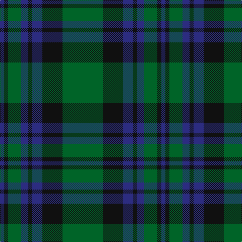

In pattern [BKGBKBKG](/patterns/bkgbkbkg/).

This was sourced from house-of-tartan.  It is a [8 stripes tartan](/stripes/stripes8/).

Original link http://www.house-of-tartan.scotland.net/house/TartanViewjs.asp?colr=Def&tnam=6718

## Thread count
DB/8 K8 G26 DB14 K8 DB20 K40 G/80

## Palette
Each colour and its ΔE from the base-6 reference it is a variant of.

| Colour | Shade | Base | ΔE (OKLab) |
|---|---|---|---|
| DB | <code style="background-color:#2C2C80;">#2C2C80</code> `#2C2C80` | B <code style="background-color:#2A418A;">#2A418A</code> | 0.06 |
| G | <code style="background-color:#006428;">#006428</code> `#006428` | G <code style="background-color:#006100;">#006100</code> | 0.03 |
| K | <code style="background-color:#101010;">#101010</code> `#101010` | K <code style="background-color:#000000;">#000000</code> | 0.17 |

# Sample pattern

## Nearest tartans

The nearest existing variants by ΔTartan distance.

1. [Brown, Barnaby (Personal)](/setts/s9/g2r1g8b2g1b2g1b10r2~b202060-g006818-rc8002c~x4/) — ΔT 1.11
1. [Letham (S.Australia)](/setts/s8/g40k20b10k4b7g13k4b4~b2888c4-g006818-k101010~x2/) — ΔT 1.19
1. [Brown, Barnaby (Personal)](/setts/s9/g2r1g8b2g1b2g1b10r2~b2c2c80-g006818-rc80000~x4/) — ΔT 1.21
1. [Menez Du](/setts/s9/b5k9g7k3g7k3g7k25g3~b202060-g006818-k101010~x2/) — ΔT 1.22
1. [Glen Nevis #3](/setts/s8/g14r2g2r3g7b12g2ba2~b202060-ba4c0000-g006818-r880000~x2/) — ΔT 1.28
1. [Inkster](/setts/s10/b6g2b2g3b10ga25b10g3b2g2~b1c0070-g604000-ga006818~x2/) — ΔT 1.29
1. [Barnaby Brown Pibroch](/setts/s9/g2r1g8b2g1b2g1b10r2~b000050-g004010-rc00020~x4/) — ΔT 1.34
1. [Davidson](/setts/s11/r1b6g1b1g8k1g8k1g1k6r1~b2c2c80-g006818-k101010-rc80000~x2/) — ΔT 1.35
1. [Davidson - 1842 (Clan)](/setts/s11/r1b6g1b1g8k1g8k1g1k6r1~b2c2c80-g006818-k101010-rc80000~x4/) — ΔT 1.35
1. [Harley (Leslie), Robert](/setts/s8/g2k3y1k3g2b8g16k1~b000048-g005020-k101010-yffe600~x4/) — ΔT 1.36

## Neighbour map

Every grey dot is one of 15726 variants placed by the first two principal components of the ΔTartan feature space (44% of its variance). Red is this tartan; blue dots are its nearest — click one to open its page.

<svg viewBox="0 0 640 380" role="img" style="max-width:100%;height:auto;border:1px solid #e0e0e0;border-radius:4px;display:block" xmlns="http://www.w3.org/2000/svg"><image href="/nn/cloud.v1.png" width="640" height="380"/><a href="/setts/s9/g2r1g8b2g1b2g1b10r2~b202060-g006818-rc8002c~x4/"><circle cx="316.8" cy="216.6" r="4" fill="#3465a4"><title>Brown, Barnaby (Personal)</title></circle></a><a href="/setts/s8/g40k20b10k4b7g13k4b4~b2888c4-g006818-k101010~x2/"><circle cx="296.3" cy="224.6" r="4" fill="#3465a4"><title>Letham (S.Australia)</title></circle></a><a href="/setts/s9/g2r1g8b2g1b2g1b10r2~b2c2c80-g006818-rc80000~x4/"><circle cx="319.7" cy="216.9" r="4" fill="#3465a4"><title>Brown, Barnaby (Personal)</title></circle></a><a href="/setts/s9/b5k9g7k3g7k3g7k25g3~b202060-g006818-k101010~x2/"><circle cx="362.6" cy="247.6" r="4" fill="#3465a4"><title>Menez Du</title></circle></a><a href="/setts/s8/g14r2g2r3g7b12g2ba2~b202060-ba4c0000-g006818-r880000~x2/"><circle cx="320.3" cy="236.6" r="4" fill="#3465a4"><title>Glen Nevis #3</title></circle></a><a href="/setts/s10/b6g2b2g3b10ga25b10g3b2g2~b1c0070-g604000-ga006818~x2/"><circle cx="310.5" cy="201.5" r="4" fill="#3465a4"><title>Inkster</title></circle></a><a href="/setts/s9/g2r1g8b2g1b2g1b10r2~b000050-g004010-rc00020~x4/"><circle cx="324.9" cy="225.3" r="4" fill="#3465a4"><title>Barnaby Brown Pibroch</title></circle></a><a href="/setts/s11/r1b6g1b1g8k1g8k1g1k6r1~b2c2c80-g006818-k101010-rc80000~x2/"><circle cx="269.2" cy="203.2" r="4" fill="#3465a4"><title>Davidson</title></circle></a><a href="/setts/s11/r1b6g1b1g8k1g8k1g1k6r1~b2c2c80-g006818-k101010-rc80000~x4/"><circle cx="269.2" cy="203.2" r="4" fill="#3465a4"><title>Davidson - 1842 (Clan)</title></circle></a><a href="/setts/s8/g2k3y1k3g2b8g16k1~b000048-g005020-k101010-yffe600~x4/"><circle cx="343.2" cy="191.6" r="4" fill="#3465a4"><title>Harley (Leslie), Robert</title></circle></a><circle cx="328.4" cy="237.3" r="5" fill="#c00000"/></svg>

ID: /setts/s8/g40k20b10k4b7g13k4b4~b2c2c80-g006428-k101010~x2/
