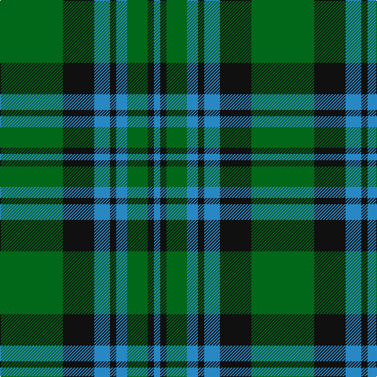

This page is one **sett** — a single exact thread-count. It belongs to the [tartan](/tartans/g40k20t10k4t7g13k4t4/)
(the same proportion at any scale), whose colour order is pattern [BKGBKBKG](/stripes/bkgbkbkg/).

Sourced from register-of-tartans.  It is a [8 stripe tartan](/stripes/stripes8/).

Original link https://www.tartanregister.gov.uk/tartanDetails.aspx?ref=2106

2 attestations — the source records this cloth was collapsed from (oldest owns this page)

<ul>
<li>01/08/2005 — Letham (S.Australia) (register-of-tartans, <a href="https://www.tartanregister.gov.uk/tartanDetails.aspx?ref=2106">record</a>)</li>
<li>2005 August — Letham (S.Australia) (Name) (tartans-authority, <a href="http://www.tartansauthority.com/tartan-ferret/display/6718/">record</a>)</li>
</ul>

## Register references

External register numbers recorded for this tartan.

- Scottish Register of Tartans: [2106](https://www.tartanregister.gov.uk/tartanDetails.aspx?ref=2106)
- Scottish Tartans Authority (ITI): 6718

## Thread count
G/80 K40 B20 K8 B14 G26 K8 B/8

## Palette

Palette: <strong>Tartan Register</strong>
<table><thead><tr><th>Colour</th><th>Threads</th><th>Shade</th><th>Base</th><th>OKLCh</th></tr></thead><tbody><tr><td>G/</td><td style="text-align:right;font-variant-numeric:tabular-nums">80</td><td><code style="background-color:#006818;">#006818</code> <small style="color:#888">#006818</small></td><td>G <code style="background-color:#006100;">#006100</code></td><td><small style="color:#888">oklch(45.0% 0.142 145.0)</small></td></tr><tr><td>K</td><td style="text-align:right;font-variant-numeric:tabular-nums">40</td><td><code style="background-color:#101010;">#101010</code> <small style="color:#888">#101010</small></td><td>K <code style="background-color:#000000;">#000000</code></td><td><small style="color:#888">oklch(17.3% 0.000 89.9)</small></td></tr><tr><td>B</td><td style="text-align:right;font-variant-numeric:tabular-nums">20</td><td><code style="background-color:#2888C4;">#2888C4</code> <small style="color:#888">#2888C4</small></td><td>B <code style="background-color:#2A418A;">#2A418A</code></td><td><small style="color:#888">oklch(60.1% 0.125 241.5)</small></td></tr><tr><td>K</td><td style="text-align:right;font-variant-numeric:tabular-nums">8</td><td><code style="background-color:#101010;">#101010</code> <small style="color:#888">#101010</small></td><td>K <code style="background-color:#000000;">#000000</code></td><td><small style="color:#888">oklch(17.3% 0.000 89.9)</small></td></tr><tr><td>B</td><td style="text-align:right;font-variant-numeric:tabular-nums">14</td><td><code style="background-color:#2888C4;">#2888C4</code> <small style="color:#888">#2888C4</small></td><td>B <code style="background-color:#2A418A;">#2A418A</code></td><td><small style="color:#888">oklch(60.1% 0.125 241.5)</small></td></tr><tr><td>G</td><td style="text-align:right;font-variant-numeric:tabular-nums">26</td><td><code style="background-color:#006818;">#006818</code> <small style="color:#888">#006818</small></td><td>G <code style="background-color:#006100;">#006100</code></td><td><small style="color:#888">oklch(45.0% 0.142 145.0)</small></td></tr><tr><td>K</td><td style="text-align:right;font-variant-numeric:tabular-nums">8</td><td><code style="background-color:#101010;">#101010</code> <small style="color:#888">#101010</small></td><td>K <code style="background-color:#000000;">#000000</code></td><td><small style="color:#888">oklch(17.3% 0.000 89.9)</small></td></tr><tr><td>B/</td><td style="text-align:right;font-variant-numeric:tabular-nums">8</td><td><code style="background-color:#2888C4;">#2888C4</code> <small style="color:#888">#2888C4</small></td><td>B <code style="background-color:#2A418A;">#2A418A</code></td><td><small style="color:#888">oklch(60.1% 0.125 241.5)</small></td></tr></tbody></table>

# Sample pattern

## Nearest tartans

The nearest existing variants by ΔTartan distance, with this tartan at the top so the swatches line up against it.

ΔTartan

Tartan

Sett

—

<a href="/ttd/edit/#slug=g40k20t10k4t7g13k4t4~x2">Letham (S.Australia)</a> <a class="nn-out" href="/setts/s8/g40k20t10k4t7g13k4t4~x2/" title="open its dictionary page">↗</a>

1.07

<a href="/ttd/edit/#slug=g3k6w2k6g2k2g16k2~x2">MacLean of Duart Hunting</a> <a class="nn-out" href="/setts/s8/g3k6w2k6g2k2g16k2~x2/" title="open its dictionary page">↗</a>

1.19

<a href="/ttd/edit/#slug=g40k20db10k4db7g13k4db4~x2">Letham Personal Tartan Tartan Number: 6718. Earliest known date: pre 2005 Jimmy said, in his recording application, &quot;To allow my family to wear a single tartan&quot; See products available Copyright © Blair Urquhart, Comrie, 2015</a> <a class="nn-out" href="/setts/s8/g40k20db10k4db7g13k4db4~x2/" title="open its dictionary page">↗</a>

1.24

<a href="/ttd/edit/#slug=b5k1g3k1b3k1g10r3~x2">Ayrton 1979 No. 2 (Personal)</a> <a class="nn-out" href="/setts/s8/b5k1g3k1b3k1g10r3~x2/" title="open its dictionary page">↗</a>

1.24

<a href="/ttd/edit/#slug=k4g32k4g4k8w3k8t4~x2">Hartmann (Personal)</a> <a class="nn-out" href="/setts/s8/k4g32k4g4k8w3k8t4~x2/" title="open its dictionary page">↗</a>

1.33

<a href="/ttd/edit/#slug=g14w1g7k7db2k2db2k2db7~x4">Abercrombie</a> <a class="nn-out" href="/setts/s9/g14w1g7k7db2k2db2k2db7~x4/" title="open its dictionary page">↗</a>

1.33

<a href="/ttd/edit/#slug=g2k3ly1k3g2db8g16k1~x4">Harley (Leslie), Robert</a> <a class="nn-out" href="/setts/s8/g2k3ly1k3g2db8g16k1~x4/" title="open its dictionary page">↗</a>

1.35

<a href="/ttd/edit/#slug=k7t7g20t2g2t2g20t7k7t7~x4">Falconer of Labhdal Personal Tartan Tartan Number: 6787. Earliest known date: 2005 August This is what James K.R. Falconer calls an update of the family tartan submitted in September 2005 and is the conventional Falconer tartan as seen at #387 with an extra blue line in the centre of the green and the colours rendered in lighter shades. Woven by Drove Weaving of Langholm (Lochcarron) and organised through Pride of Lammermuir, Lady Hilary Menzies. See products available Copyright © Blair Urquhart, Comrie, 2015</a> <a class="nn-out" href="/setts/s10/k7t7g20t2g2t2g20t7k7t7~x4/" title="open its dictionary page">↗</a>

1.35

<a href="/ttd/edit/#slug=db4w1db12g12db1g4~x2">Unidentified, Tweed</a> <a class="nn-out" href="/setts/s6/db4w1db12g12db1g4~x2/" title="open its dictionary page">↗</a>

1.35

<a href="/ttd/edit/#slug=db12w2db7g15k2g4k2g15db2k7~x2">Smeaton #2 (Name)</a> <a class="nn-out" href="/setts/s10/db12w2db7g15k2g4k2g15db2k7~x2/" title="open its dictionary page">↗</a>

1.35

<a href="/ttd/edit/#slug=g4db12r3db12g32w4~x2">MacIntyre Hunting (VS)</a> <a class="nn-out" href="/setts/s6/g4db12r3db12g32w4~x2/" title="open its dictionary page">↗</a>

## Neighbour map

Every grey dot is one of 14359 variants placed by the first two principal components of the ΔTartan feature space (44% of its variance). Red is this tartan; blue dots are its nearest — click one to open its page.

<svg viewBox="0 0 640 380" role="img" style="max-width:100%;height:auto;border:1px solid #e0e0e0;border-radius:4px;display:block" xmlns="http://www.w3.org/2000/svg"><image href="/nn/cloud.v1.png" width="640" height="380"/><a href="/setts/s8/g3k6w2k6g2k2g16k2~x2/"><circle cx="320.6" cy="232.0" r="4" fill="#3465a4"><title>MacLean of Duart Hunting</title></circle></a><a href="/setts/s8/g40k20db10k4db7g13k4db4~x2/"><circle cx="331.2" cy="243.4" r="4" fill="#3465a4"><title>Letham Personal Tartan Tartan Number: 6718. Earliest known date: pre 2005 Jimmy said, in his recording application, &quot;To allow my family to wear a single tartan&quot; See products available Copyright © Blair Urquhart, Comrie, 2015</title></circle></a><a href="/setts/s8/b5k1g3k1b3k1g10r3~x2/"><circle cx="258.4" cy="215.7" r="4" fill="#3465a4"><title>Ayrton 1979 No. 2 (Personal)</title></circle></a><a href="/setts/s8/k4g32k4g4k8w3k8t4~x2/"><circle cx="304.9" cy="191.4" r="4" fill="#3465a4"><title>Hartmann (Personal)</title></circle></a><a href="/setts/s9/g14w1g7k7db2k2db2k2db7~x4/"><circle cx="266.7" cy="203.9" r="4" fill="#3465a4"><title>Abercrombie</title></circle></a><a href="/setts/s8/g2k3ly1k3g2db8g16k1~x4/"><circle cx="337.6" cy="189.5" r="4" fill="#3465a4"><title>Harley (Leslie), Robert</title></circle></a><a href="/setts/s10/k7t7g20t2g2t2g20t7k7t7~x4/"><circle cx="289.3" cy="227.7" r="4" fill="#3465a4"><title>Falconer of Labhdal Personal Tartan Tartan Number: 6787. Earliest known date: 2005 August This is what James K.R. Falconer calls an update of the family tartan submitted in September 2005 and is the conventional Falconer tartan as seen at #387 with an extra blue line in the centre of the green and the colours rendered in lighter shades. Woven by Drove Weaving of Langholm (Lochcarron) and organised through Pride of Lammermuir, Lady Hilary Menzies. See products available Copyright © Blair Urquhart, Comrie, 2015</title></circle></a><a href="/setts/s6/db4w1db12g12db1g4~x2/"><circle cx="339.4" cy="244.5" r="4" fill="#3465a4"><title>Unidentified, Tweed</title></circle></a><a href="/setts/s10/db12w2db7g15k2g4k2g15db2k7~x2/"><circle cx="248.8" cy="227.2" r="4" fill="#3465a4"><title>Smeaton #2 (Name)</title></circle></a><a href="/setts/s6/g4db12r3db12g32w4~x2/"><circle cx="294.7" cy="211.8" r="4" fill="#3465a4"><title>MacIntyre Hunting (VS)</title></circle></a><circle cx="299.3" cy="227.6" r="5" fill="#c00000"/></svg>

ID: /setts/s8/g40k20t10k4t7g13k4t4~x2/
