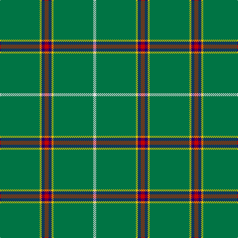

In pattern [GYBRBYGW](/patterns/gybrbygw/).

This was sourced from tartans-authority.  It is a [8 stripes tartan](/stripes/stripes8/).

Original link http://www.tartansauthority.com/tartan-ferret/display/3840/

## Thread count
G/80 Y4 DB6 R8 DB6 Y4 G80 LN/6

## Palette
Each colour and its ΔE from the base-6 reference it is a variant of.

| Colour | Shade | Base | ΔE (OKLab) |
|---|---|---|---|
| DB | <code style="background-color:#1C0070;">#1C0070</code> `#1C0070` | B <code style="background-color:#2A418A;">#2A418A</code> | 0.14 |
| G | <code style="background-color:#007444;">#007444</code> `#007444` | G <code style="background-color:#006100;">#006100</code> | 0.08 |
| LN | <code style="background-color:#E0E0E0;">#E0E0E0</code> `#E0E0E0` | W <code style="background-color:#F7F7F7;">#F7F7F7</code> | 0.07 |
| R | <code style="background-color:#C80000;">#C80000</code> `#C80000` | R <code style="background-color:#CC0000;">#CC0000</code> | 0.01 |
| Y | <code style="background-color:#E8C000;">#E8C000</code> `#E8C000` | Y <code style="background-color:#F2BF00;">#F2BF00</code> | 0.02 |

# Sample pattern

## Nearest tartans

The nearest existing variants by ΔTartan distance.

1. [Braemar Royal Highland Gathering](/setts/s6/r3k4w2g64k6y3x2~g006818-k101010-rc80000-wc0c0c0-ye8c000/) — ΔT 1.57
1. [Mar (Tribe of..) District Tartan Tartan Number: 1586. Earliest known date: 1978 There is much debate over the true representation of the Mar District tartan. In order that the matter should be settled and the design be "known and recognised as the proper tartan of the Tribe of Mar", the Rt Hon Margaret of Mar, Countess of Mar, made a petition to the Lord Lyon to record this sett. The designer is unknown and the date is possibly pre 1850. Frank Adam called the sett Skene, and said it came from the Duke of Fife whose ancestors owned Mar Lodge. Both Skenes and Robertsons lived in the Mar district in the north east of Scotland. See products available Copyright © Blair Urquhart, Comrie, 2015](/setts/s5/r2k4g45k3y2~g006818-k101010-rc80000-ye8c000/) — ΔT 1.68
1. [Mar Tribe](/setts/s5/r2k3g45k3y2~g006818-k101010-rc80000-ye8c000/) — ΔT 1.69
1. [Asher (Personal)](/setts/s8/g40y2b3r4b3y2g40w3x2~b1c0070-g003820-rc80000-we0e0e0-ye8c000/) — ΔT 1.71
1. [Mar, Tribe of (Clan)](/setts/s5/r2k4g45k3y2x2~g006818-k101010-r880000-ye8c000/) — ΔT 1.71
1. [Women's Royal Army Corps Ass. (Corp.](/setts/s12/g10w2g10y1g10r2g24ga1g2ga1g2ga2x2~g003820-ga289c18-rc80000-we0e0e0-ye8c000/) — ΔT 1.83
1. [Annapolis Valley](/setts/s6/g30b8g5w4g5r1x4~b0596fa-g00643c-rc8002c-w98c8e8/) — ΔT 1.85
1. [Annapolis Valley](/setts/s6/g30b8g5w4g5r2x4~b2888c4-g006818-rc80000-w98c8e8/) — ΔT 1.87
1. [Unidentified #12](/setts/s11/b2k1g36k1r2k1r2k1g36k1y2x2~b3c82af-g005020-k101010-rdc0000-ye8c000/) — ΔT 1.91
1. [Welsh National](/setts/s8/r8g3r4g44w4g44r4g3x2~g00643c-rc8002c-we0e0e0/) — ΔT 1.92

## Neighbour map

Every grey dot is one of 15726 variants placed by the first two principal components of the ΔTartan feature space (44% of its variance). Red is this tartan; blue dots are its nearest — click one to open its page.

<svg viewBox="0 0 640 380" role="img" style="max-width:100%;height:auto;border:1px solid #e0e0e0;border-radius:4px;display:block" xmlns="http://www.w3.org/2000/svg"><image href="/nn/cloud.v1.png" width="640" height="380"/><a href="/setts/s6/r3k4w2g64k6y3x2~g006818-k101010-rc80000-wc0c0c0-ye8c000/"><circle cx="537.7" cy="137.0" r="4" fill="#3465a4"><title>Braemar Royal Highland Gathering</title></circle></a><a href="/setts/s5/r2k4g45k3y2~g006818-k101010-rc80000-ye8c000/"><circle cx="571.2" cy="185.3" r="4" fill="#3465a4"><title>Mar (Tribe of..) District Tartan Tartan Number: 1586. Earliest known date: 1978 There is much debate over the true representation of the Mar District tartan. In order that the matter should be settled and the design be &quot;known and recognised as the proper tartan of the Tribe of Mar&quot;, the Rt Hon Margaret of Mar, Countess of Mar, made a petition to the Lord Lyon to record this sett. The designer is unknown and the date is possibly pre 1850. Frank Adam called the sett Skene, and said it came from the Duke of Fife whose ancestors owned Mar Lodge. Both Skenes and Robertsons lived in the Mar district in the north east of Scotland. See products available Copyright © Blair Urquhart, Comrie, 2015</title></circle></a><a href="/setts/s5/r2k3g45k3y2~g006818-k101010-rc80000-ye8c000/"><circle cx="587.9" cy="185.6" r="4" fill="#3465a4"><title>Mar Tribe</title></circle></a><a href="/setts/s8/g40y2b3r4b3y2g40w3x2~b1c0070-g003820-rc80000-we0e0e0-ye8c000/"><circle cx="531.9" cy="156.6" r="4" fill="#3465a4"><title>Asher (Personal)</title></circle></a><a href="/setts/s5/r2k4g45k3y2x2~g006818-k101010-r880000-ye8c000/"><circle cx="575.7" cy="187.5" r="4" fill="#3465a4"><title>Mar, Tribe of (Clan)</title></circle></a><a href="/setts/s12/g10w2g10y1g10r2g24ga1g2ga1g2ga2x2~g003820-ga289c18-rc80000-we0e0e0-ye8c000/"><circle cx="569.9" cy="148.5" r="4" fill="#3465a4"><title>Women's Royal Army Corps Ass. (Corp.</title></circle></a><a href="/setts/s6/g30b8g5w4g5r1x4~b0596fa-g00643c-rc8002c-w98c8e8/"><circle cx="509.1" cy="182.9" r="4" fill="#3465a4"><title>Annapolis Valley</title></circle></a><a href="/setts/s6/g30b8g5w4g5r2x4~b2888c4-g006818-rc80000-w98c8e8/"><circle cx="476.4" cy="211.4" r="4" fill="#3465a4"><title>Annapolis Valley</title></circle></a><a href="/setts/s11/b2k1g36k1r2k1r2k1g36k1y2x2~b3c82af-g005020-k101010-rdc0000-ye8c000/"><circle cx="624.7" cy="122.0" r="4" fill="#3465a4"><title>Unidentified #12</title></circle></a><a href="/setts/s8/r8g3r4g44w4g44r4g3x2~g00643c-rc8002c-we0e0e0/"><circle cx="575.0" cy="209.1" r="4" fill="#3465a4"><title>Welsh National</title></circle></a><circle cx="539.7" cy="157.2" r="5" fill="#c00000"/></svg>

ID: /setts/s8/g40y2b3r4b3y2g40w3x2~b1c0070-g007444-rc80000-we0e0e0-ye8c000/
