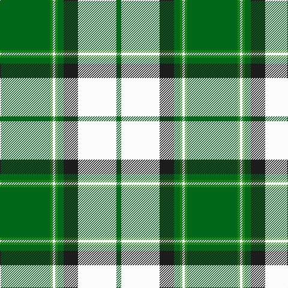

This page is one **sett** — a single exact thread-count. It belongs to the [tartan](/tartans/g42ga2w2ga2g5k12w32g4/)
(the same proportion at any scale), whose colour order is pattern [GGWGGBWG](/stripes/ggwggbwg/).

Sourced from register-of-tartans.  It is a [8 stripe tartan](/stripes/stripes8/).

Original link https://www.tartanregister.gov.uk/tartanDetails.aspx?ref=2208

## Also known as

This cloth is also recorded under:

- Longniddry, Green

2 attestations — the source records this cloth was collapsed from (oldest owns this page)

<ul>
<li>01/01/2002 — Longniddry Green (Dance) (register-of-tartans, <a href="https://www.tartanregister.gov.uk/tartanDetails.aspx?ref=2208">record</a>)</li>
<li>pre 2002 — Longniddry, Green (Dance) (tartans-authority, <a href="http://www.tartansauthority.com/tartan-ferret/display/764/">record</a>)</li>
</ul>

## Register references

External register numbers recorded for this tartan.

- Scottish Register of Tartans: [2208](https://www.tartanregister.gov.uk/tartanDetails.aspx?ref=2208)
- Scottish Tartans Authority (ITI): 764
- Scottish Tartans World Register: 764

## Thread count
G/84 Ga4 W4 Ga4 G10 K24 W64 G/8

## Palette
Each colour and the base-6 reference it is a variant of.

| Colour | Shade | Base |
|---|---|---|
| G | <code style="background-color:#006818;">#006818</code> `oklch(45.0% 0.142 145.0)` <small>#006818</small> | G <code style="background-color:#006100;">#006100</code> |
| Ga | <code style="background-color:#289C18;">#289C18</code> `oklch(60.6% 0.191 141.6)` <small>#289C18</small> | G <code style="background-color:#006100;">#006100</code> |
| K | <code style="background-color:#1C1C1C;">#1C1C1C</code> `oklch(22.6% 0.000 89.9)` <small>#1C1C1C</small> | B <code style="background-color:#2A418A;">#2A418A</code> |
| W | <code style="background-color:#FCFCFC;">#FCFCFC</code> `oklch(99.1% 0.000 89.9)` <small>#FCFCFC</small> | W <code style="background-color:#F7F7F7;">#F7F7F7</code> |

# Sample pattern

## Nearest tartans

The nearest existing variants by ΔTartan distance, with this tartan at the top so the swatches line up against it.

ΔTartan

Tartan

Sett

—

<a href="/ttd/edit/#slug=g42g2w2g2g5dt12w32g4~x2">Longniddry Green (Dance)</a> <a class="nn-out" href="/setts/s8/g42g2w2g2g5dt12w32g4~x2/" title="open its dictionary page">↗</a>

0.86

<a href="/ttd/edit/#slug=g42g2w2g2g5dg12w32g4~x2">Longniddry, Green</a> <a class="nn-out" href="/setts/s8/g42g2w2g2g5dg12w32g4~x2/" title="open its dictionary page">↗</a>

0.97

<a href="/ttd/edit/#slug=g3r2g27dg3w30dg2w3~x2">Uist, Green (Dance)</a> <a class="nn-out" href="/setts/s7/g3r2g27dg3w30dg2w3~x2/" title="open its dictionary page">↗</a>

1.07

<a href="/ttd/edit/#slug=g42ly1w2ly1g5dg12w32g4~x2">Longniddry Green Error (Dance)</a> <a class="nn-out" href="/setts/s8/g42ly1w2ly1g5dg12w32g4~x2/" title="open its dictionary page">↗</a>

1.37

<a href="/ttd/edit/#slug=ly6dg36w5b4w30b1w2~x2">Pearce Scotch Plaid 4 (Fashion)</a> <a class="nn-out" href="/setts/s7/ly6dg36w5b4w30b1w2~x2/" title="open its dictionary page">↗</a>

1.38

<a href="/ttd/edit/#slug=dg41lo3g7n3w24dg10g7n7w3~x2">Drummond of Perth Dress (Dance)</a> <a class="nn-out" href="/setts/s9/dg41lo3g7n3w24dg10g7n7w3~x2/" title="open its dictionary page">↗</a>

1.43

<a href="/ttd/edit/#slug=g26r5k1r2k1r5g16r5w16g2w8~x2">Livingston (Personal)</a> <a class="nn-out" href="/setts/s11/g26r5k1r2k1r5g16r5w16g2w8~x2/" title="open its dictionary page">↗</a>

1.45

<a href="/ttd/edit/#slug=w12k3g50w3k13lo6~x2">Limerick County Crest (Fashion)</a> <a class="nn-out" href="/setts/s6/w12k3g50w3k13lo6~x2/" title="open its dictionary page">↗</a>

1.45

<a href="/ttd/edit/#slug=w5db3w25k2w2k16g8k1w4">Unidentified (shirt fabric)</a> <a class="nn-out" href="/setts/s9/w5db3w25k2w2k16g8k1w4/" title="open its dictionary page">↗</a>

1.45

<a href="/ttd/edit/#slug=dg4do10dg10o6do1w26dg2do1~x4">Dogwood</a> <a class="nn-out" href="/setts/s8/dg4do10dg10o6do1w26dg2do1~x4/" title="open its dictionary page">↗</a>

1.45

<a href="/ttd/edit/#slug=dg7r3k3w54dg24r5dg5w5dg5r5~x2">Scott Dress #2</a> <a class="nn-out" href="/setts/s10/dg7r3k3w54dg24r5dg5w5dg5r5~x2/" title="open its dictionary page">↗</a>

## Neighbour map

Every grey dot is one of 14299 variants placed by the first two principal components of the ΔTartan feature space (44% of its variance). Red is this tartan; blue dots are its nearest — click one to open its page.

<svg viewBox="0 0 640 380" role="img" style="max-width:100%;height:auto;border:1px solid #e0e0e0;border-radius:4px;display:block" xmlns="http://www.w3.org/2000/svg"><image href="/nn/cloud.v1.png" width="640" height="380"/><a href="/setts/s8/g42g2w2g2g5dg12w32g4~x2/"><circle cx="280.9" cy="138.8" r="4" fill="#3465a4"><title>Longniddry, Green</title></circle></a><a href="/setts/s7/g3r2g27dg3w30dg2w3~x2/"><circle cx="267.4" cy="145.0" r="4" fill="#3465a4"><title>Uist, Green (Dance)</title></circle></a><a href="/setts/s8/g42ly1w2ly1g5dg12w32g4~x2/"><circle cx="303.8" cy="103.7" r="4" fill="#3465a4"><title>Longniddry Green Error (Dance)</title></circle></a><a href="/setts/s7/ly6dg36w5b4w30b1w2~x2/"><circle cx="269.8" cy="114.5" r="4" fill="#3465a4"><title>Pearce Scotch Plaid 4 (Fashion)</title></circle></a><a href="/setts/s9/dg41lo3g7n3w24dg10g7n7w3~x2/"><circle cx="212.6" cy="136.9" r="4" fill="#3465a4"><title>Drummond of Perth Dress (Dance)</title></circle></a><a href="/setts/s11/g26r5k1r2k1r5g16r5w16g2w8~x2/"><circle cx="272.4" cy="123.2" r="4" fill="#3465a4"><title>Livingston (Personal)</title></circle></a><a href="/setts/s6/w12k3g50w3k13lo6~x2/"><circle cx="309.7" cy="166.2" r="4" fill="#3465a4"><title>Limerick County Crest (Fashion)</title></circle></a><a href="/setts/s9/w5db3w25k2w2k16g8k1w4/"><circle cx="278.1" cy="117.5" r="4" fill="#3465a4"><title>Unidentified (shirt fabric)</title></circle></a><a href="/setts/s8/dg4do10dg10o6do1w26dg2do1~x4/"><circle cx="217.7" cy="118.1" r="4" fill="#3465a4"><title>Dogwood</title></circle></a><a href="/setts/s10/dg7r3k3w54dg24r5dg5w5dg5r5~x2/"><circle cx="279.4" cy="108.7" r="4" fill="#3465a4"><title>Scott Dress #2</title></circle></a><circle cx="266.5" cy="129.2" r="5" fill="#c00000"/></svg>

ID: /setts/s8/g42g2w2g2g5dt12w32g4~x2/
