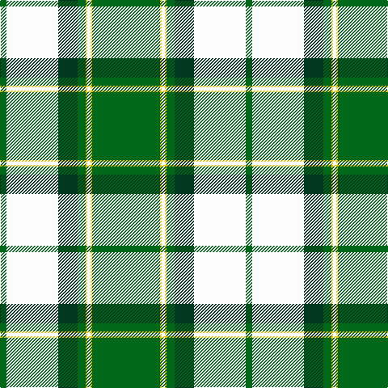

This page is one **sett** — a single exact thread-count. It belongs to the [tartan](/tartans/g42y1w2y1g5dg12w32g4/)
(the same proportion at any scale), whose colour order is pattern [GWGGYWYG](/stripes/gwggywyg/).

Sourced from register-of-tartans.  It is a [8 stripe tartan](/stripes/stripes8/).

Original link https://www.tartanregister.gov.uk/tartanDetails.aspx?ref=2209

## Also known as

This cloth is also recorded under:

- Longniddry, Green Error

2 attestations — the source records this cloth was collapsed from (oldest owns this page)

<ul>
<li>01/01/2002 — Longniddry Green Error (Dance) (register-of-tartans, <a href="https://www.tartanregister.gov.uk/tartanDetails.aspx?ref=2209">record</a>)</li>
<li>pre 2002 — Longniddry, Green Error (Dance) (tartans-authority, <a href="http://www.tartansauthority.com/tartan-ferret/display/6520/">record</a>)</li>
</ul>

## Register references

External register numbers recorded for this tartan.

- Scottish Register of Tartans: [2209](https://www.tartanregister.gov.uk/tartanDetails.aspx?ref=2209)
- Scottish Tartans Authority (ITI): 6520

## Thread count
G/84 Y2 W4 Y2 G10 DG24 W64 G/8

## Palette
Each colour and the base-6 reference it is a variant of.

| Colour | Shade | Base |
|---|---|---|
| DG | <code style="background-color:#003820;">#003820</code> `oklch(30.0% 0.070 158.3)` <small>#003820</small> | G <code style="background-color:#006100;">#006100</code> |
| G | <code style="background-color:#006818;">#006818</code> `oklch(45.0% 0.142 145.0)` <small>#006818</small> | G <code style="background-color:#006100;">#006100</code> |
| W | <code style="background-color:#FCFCFC;">#FCFCFC</code> `oklch(99.1% 0.000 89.9)` <small>#FCFCFC</small> | W <code style="background-color:#F7F7F7;">#F7F7F7</code> |
| Y | <code style="background-color:#E8C000;">#E8C000</code> `oklch(81.9% 0.168 93.7)` <small>#E8C000</small> | Y <code style="background-color:#F2BF00;">#F2BF00</code> |

# Sample pattern

## Nearest tartans

The nearest existing variants by ΔTartan distance, with this tartan at the top so the swatches line up against it.

ΔTartan

Tartan

Sett

—

<a href="/ttd/edit/#slug=g42ly1w2ly1g5dg12w32g4~x2">Longniddry Green Error (Dance)</a> <a class="nn-out" href="/setts/s8/g42ly1w2ly1g5dg12w32g4~x2/" title="open its dictionary page">↗</a>

1.07

<a href="/ttd/edit/#slug=g42g2w2g2g5dt12w32g4~x2">Longniddry Green (Dance)</a> <a class="nn-out" href="/setts/s8/g42g2w2g2g5dt12w32g4~x2/" title="open its dictionary page">↗</a>

1.25

<a href="/ttd/edit/#slug=ly6dg36w5b4w30b1w2~x2">Pearce Scotch Plaid 4 (Fashion)</a> <a class="nn-out" href="/setts/s7/ly6dg36w5b4w30b1w2~x2/" title="open its dictionary page">↗</a>

1.29

<a href="/ttd/edit/#slug=dg44w18dg6w11dt1o4~x2">Westfalia (Corporate)</a> <a class="nn-out" href="/setts/s6/dg44w18dg6w11dt1o4~x2/" title="open its dictionary page">↗</a>

1.30

<a href="/ttd/edit/#slug=g42g2w2g2g5dg12w32g4~x2">Longniddry, Green</a> <a class="nn-out" href="/setts/s8/g42g2w2g2g5dg12w32g4~x2/" title="open its dictionary page">↗</a>

1.43

<a href="/ttd/edit/#slug=g39r2w1r2db14w14g2g10~x2">Southwell (Australian) (Personal)</a> <a class="nn-out" href="/setts/s8/g39r2w1r2db14w14g2g10~x2/" title="open its dictionary page">↗</a>

1.53

<a href="/ttd/edit/#slug=n4w2n1w36g21ly4~x2">Skye, Green (Dance)</a> <a class="nn-out" href="/setts/s6/n4w2n1w36g21ly4~x2/" title="open its dictionary page">↗</a>

1.54

<a href="/ttd/edit/#slug=k4ly1g2ly1g32lt1g3lt32db3~x2">McClurg, William Thomas (Personal)</a> <a class="nn-out" href="/setts/s9/k4ly1g2ly1g32lt1g3lt32db3~x2/" title="open its dictionary page">↗</a>

1.60

<a href="/ttd/edit/#slug=r6g2w21ly2k8ly2g32w1k3~x2">Fiander, Julian (Personal)</a> <a class="nn-out" href="/setts/s9/r6g2w21ly2k8ly2g32w1k3~x2/" title="open its dictionary page">↗</a>

1.65

<a href="/ttd/edit/#slug=g30k2w3k1w4t6w2~x4">Madras 2 (Fashion)</a> <a class="nn-out" href="/setts/s7/g30k2w3k1w4t6w2~x4/" title="open its dictionary page">↗</a>

1.65

<a href="/ttd/edit/#slug=g26r5k1r2k1r5g16r5w16g2w8~x2">Livingston (Personal)</a> <a class="nn-out" href="/setts/s11/g26r5k1r2k1r5g16r5w16g2w8~x2/" title="open its dictionary page">↗</a>

## Neighbour map

Every grey dot is one of 14299 variants placed by the first two principal components of the ΔTartan feature space (44% of its variance). Red is this tartan; blue dots are its nearest — click one to open its page.

<svg viewBox="0 0 640 380" role="img" style="max-width:100%;height:auto;border:1px solid #e0e0e0;border-radius:4px;display:block" xmlns="http://www.w3.org/2000/svg"><image href="/nn/cloud.v1.png" width="640" height="380"/><a href="/setts/s8/g42g2w2g2g5dt12w32g4~x2/"><circle cx="266.5" cy="129.2" r="4" fill="#3465a4"><title>Longniddry Green (Dance)</title></circle></a><a href="/setts/s7/ly6dg36w5b4w30b1w2~x2/"><circle cx="269.8" cy="114.5" r="4" fill="#3465a4"><title>Pearce Scotch Plaid 4 (Fashion)</title></circle></a><a href="/setts/s6/dg44w18dg6w11dt1o4~x2/"><circle cx="362.7" cy="127.4" r="4" fill="#3465a4"><title>Westfalia (Corporate)</title></circle></a><a href="/setts/s8/g42g2w2g2g5dg12w32g4~x2/"><circle cx="280.9" cy="138.8" r="4" fill="#3465a4"><title>Longniddry, Green</title></circle></a><a href="/setts/s8/g39r2w1r2db14w14g2g10~x2/"><circle cx="253.6" cy="101.4" r="4" fill="#3465a4"><title>Southwell (Australian) (Personal)</title></circle></a><a href="/setts/s6/n4w2n1w36g21ly4~x2/"><circle cx="336.9" cy="121.0" r="4" fill="#3465a4"><title>Skye, Green (Dance)</title></circle></a><a href="/setts/s9/k4ly1g2ly1g32lt1g3lt32db3~x2/"><circle cx="278.5" cy="91.1" r="4" fill="#3465a4"><title>McClurg, William Thomas (Personal)</title></circle></a><a href="/setts/s9/r6g2w21ly2k8ly2g32w1k3~x2/"><circle cx="217.2" cy="86.6" r="4" fill="#3465a4"><title>Fiander, Julian (Personal)</title></circle></a><a href="/setts/s7/g30k2w3k1w4t6w2~x4/"><circle cx="381.5" cy="130.4" r="4" fill="#3465a4"><title>Madras 2 (Fashion)</title></circle></a><a href="/setts/s11/g26r5k1r2k1r5g16r5w16g2w8~x2/"><circle cx="272.4" cy="123.2" r="4" fill="#3465a4"><title>Livingston (Personal)</title></circle></a><circle cx="303.8" cy="103.7" r="5" fill="#c00000"/></svg>

ID: /setts/s8/g42ly1w2ly1g5dg12w32g4~x2/
