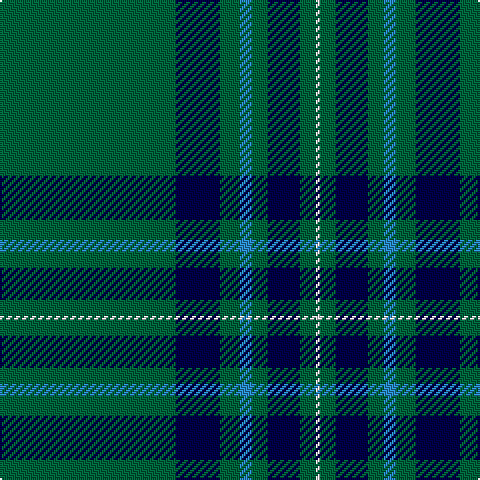

In pattern [GBGBGBGW](/patterns/gbgbgbgw/).

This was sourced from register-of-tartans.  It is a [8 stripes tartan](/stripes/stripes8/).

Original link https://www.tartanregister.gov.uk/tartanDetails.aspx?ref=11398

## Register references

External register numbers recorded for this tartan.

- Scottish Register of Tartans: [11398](https://www.tartanregister.gov.uk/tartanDetails.aspx?ref=11398)

## Thread count
G/88 DB22 G10 B6 G8 DB16 G8 W/2

## Palette
Each colour and its ΔE from the base-6 reference it is a variant of.

| Colour | Shade | Base | ΔE (OKLab) |
|---|---|---|---|
| B | <code style="background-color:#2888C4;">#2888C4</code> `#2888C4` | B <code style="background-color:#2A418A;">#2A418A</code> | 0.21 |
| DB | <code style="background-color:#000048;">#000048</code> `#000048` | B <code style="background-color:#2A418A;">#2A418A</code> | 0.22 |
| G | <code style="background-color:#00643C;">#00643C</code> `#00643C` | G <code style="background-color:#006100;">#006100</code> | 0.05 |
| W | <code style="background-color:#F8F8F8;">#F8F8F8</code> `#F8F8F8` | W <code style="background-color:#F7F7F7;">#F7F7F7</code> | 0.00 |

# Sample pattern

## Nearest tartans

The nearest existing variants by ΔTartan distance.

1. [Brooks Brothers Signature Corporate Tartan Tartan Number: 10652. Earliest known date: 01/05/2012 Brooks Brothers' Scottish roots originate in Perthshire's Glen Lyon. Thomas Lyon emigrated from Glen Lyon to the USA in the 1600s. It was his granddaughter, Lavinia, who married Henry Sands Brooks, founder of the Brooks empire. Brooks opened his first store in Cherry Street, New York in 1818. This simple and elegant tartan contains elements of the traditional 1819 Campbell tartan (the major clan in Glen Lyon) and incorporates the gold from the Brooks Brothers famous Golden Fleece logo and their equally famous necktie design, No. 1 stripe. See products available Copyright © Blair Urquhart, Comrie, 2015](/setts/s9/b5y1g7r1b45r5y3b4y3~b00506b-g006b1b-rb30000-yffd014~x2/) — ΔT 1.22
1. [Salvation Army, Hunting](/setts/s7/b40g8k1y2k1g8b5~b304080-g008000-k000000-yf0c000~x4/) — ΔT 1.28
1. [Semper](/setts/s8/g16ga1y4ga41y1ga6gb2ga2~g408060-ga004028-gb649848-y86c67c~x2/) — ΔT 1.31
1. [Semper](/setts/s8/g16ga1gb4ga41gb1ga6gc2ga2~g408060-ga003820-gb789484-gc289c18~x2/) — ΔT 1.45
1. [Annapolis Valley](/setts/s6/g30b8g5w4g5r1~b0596fa-g00643c-rc8002c-w98c8e8~x4/) — ΔT 1.48
1. [Kinfauns Castle (Corporate)](/setts/s6/r4b12g2b2g46w1~b780078-g006818-rc80000-we0e0e0~x2/) — ΔT 1.51
1. [MacGregor, Black (Personal)](/setts/s6/k72g23k7g8r1w3~g006818-k101010-rc80000-we0e0e0~x2/) — ΔT 1.72
1. [Glenfeshie (Personal)](/setts/s9/r4g3b3g44b16g10w2g2b2~b6c0070-g006818-rc8002c-wfcfcfc~x2/) — ΔT 1.75
1. [Marshall Fields Corporate Tartan Tartan Number: 747. Earliest known date: 1986 Long established and famous mail order company based in Chicago. For use in their production launch for the opening of the British production, Augst 1986 - Christmas 1986. See products available Copyright © Blair Urquhart, Comrie, 2015](/setts/s8/g40b2w2b2y2b23g32r2~b202060-g006818-rc80000-we0e0e0-ye8c000~x2/) — ΔT 1.76
1. [Bro-sant-Brieg](/setts/s7/b3g6b2y3b42k6w3~b103848-g407040-k101010-we0e0e0-yd8c800~x2/) — ΔT 1.79

## Neighbour map

Every grey dot is one of 15726 variants placed by the first two principal components of the ΔTartan feature space (44% of its variance). Red is this tartan; blue dots are its nearest — click one to open its page.

<svg viewBox="0 0 640 380" role="img" style="max-width:100%;height:auto;border:1px solid #e0e0e0;border-radius:4px;display:block" xmlns="http://www.w3.org/2000/svg"><image href="/nn/cloud.v1.png" width="640" height="380"/><a href="/setts/s9/b5y1g7r1b45r5y3b4y3~b00506b-g006b1b-rb30000-yffd014~x2/"><circle cx="505.9" cy="114.7" r="4" fill="#3465a4"><title>Brooks Brothers Signature Corporate Tartan Tartan Number: 10652. Earliest known date: 01/05/2012 Brooks Brothers' Scottish roots originate in Perthshire's Glen Lyon. Thomas Lyon emigrated from Glen Lyon to the USA in the 1600s. It was his granddaughter, Lavinia, who married Henry Sands Brooks, founder of the Brooks empire. Brooks opened his first store in Cherry Street, New York in 1818. This simple and elegant tartan contains elements of the traditional 1819 Campbell tartan (the major clan in Glen Lyon) and incorporates the gold from the Brooks Brothers famous Golden Fleece logo and their equally famous necktie design, No. 1 stripe. See products available Copyright © Blair Urquhart, Comrie, 2015</title></circle></a><a href="/setts/s7/b40g8k1y2k1g8b5~b304080-g008000-k000000-yf0c000~x4/"><circle cx="484.8" cy="142.8" r="4" fill="#3465a4"><title>Salvation Army, Hunting</title></circle></a><a href="/setts/s8/g16ga1y4ga41y1ga6gb2ga2~g408060-ga004028-gb649848-y86c67c~x2/"><circle cx="501.6" cy="148.7" r="4" fill="#3465a4"><title>Semper</title></circle></a><a href="/setts/s8/g16ga1gb4ga41gb1ga6gc2ga2~g408060-ga003820-gb789484-gc289c18~x2/"><circle cx="510.8" cy="152.7" r="4" fill="#3465a4"><title>Semper</title></circle></a><a href="/setts/s6/g30b8g5w4g5r1~b0596fa-g00643c-rc8002c-w98c8e8~x4/"><circle cx="509.1" cy="182.9" r="4" fill="#3465a4"><title>Annapolis Valley</title></circle></a><a href="/setts/s6/r4b12g2b2g46w1~b780078-g006818-rc80000-we0e0e0~x2/"><circle cx="517.0" cy="141.6" r="4" fill="#3465a4"><title>Kinfauns Castle (Corporate)</title></circle></a><a href="/setts/s6/k72g23k7g8r1w3~g006818-k101010-rc80000-we0e0e0~x2/"><circle cx="498.2" cy="150.2" r="4" fill="#3465a4"><title>MacGregor, Black (Personal)</title></circle></a><a href="/setts/s9/r4g3b3g44b16g10w2g2b2~b6c0070-g006818-rc8002c-wfcfcfc~x2/"><circle cx="448.1" cy="148.5" r="4" fill="#3465a4"><title>Glenfeshie (Personal)</title></circle></a><a href="/setts/s8/g40b2w2b2y2b23g32r2~b202060-g006818-rc80000-we0e0e0-ye8c000~x2/"><circle cx="426.6" cy="163.3" r="4" fill="#3465a4"><title>Marshall Fields Corporate Tartan Tartan Number: 747. Earliest known date: 1986 Long established and famous mail order company based in Chicago. For use in their production launch for the opening of the British production, Augst 1986 - Christmas 1986. See products available Copyright © Blair Urquhart, Comrie, 2015</title></circle></a><a href="/setts/s7/b3g6b2y3b42k6w3~b103848-g407040-k101010-we0e0e0-yd8c800~x2/"><circle cx="453.4" cy="146.7" r="4" fill="#3465a4"><title>Bro-sant-Brieg</title></circle></a><circle cx="499.7" cy="145.2" r="5" fill="#c00000"/></svg>

ID: /setts/s8/g44b11g5ba3g4b8g4w1~b000048-ba2888c4-g00643c-wf8f8f8~x2/
