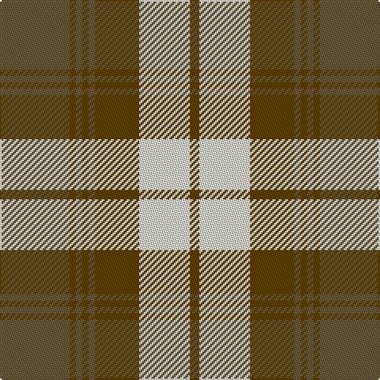

In pattern [GGGGGGWG](/patterns/ggggggwg/).

This was sourced from tartans-authority.  It is a [8 stripes tartan](/stripes/stripes8/).

Original link http://www.tartansauthority.com/tartan-ferret/display/5319/

## Thread count
G/44 T4 G4 T4 G4 T28 W32 T/6

## Palette
Each colour and its ΔE from the base-6 reference it is a variant of.

| Colour | Shade | Base | ΔE (OKLab) |
|---|---|---|---|
| G | <code style="background-color:#685838;">#685838</code> `#685838` | G <code style="background-color:#006100;">#006100</code> | 0.13 |
| T | <code style="background-color:#604000;">#604000</code> `#604000` | G <code style="background-color:#006100;">#006100</code> | 0.14 |
| W | <code style="background-color:#E8E4D0;">#E8E4D0</code> `#E8E4D0` | W <code style="background-color:#F7F7F7;">#F7F7F7</code> | 0.07 |

# Sample pattern

## Nearest tartans

The nearest existing variants by ΔTartan distance.

1. [Kildonan Brown (Fashion)](/setts/s9/g44b6g6b6g6b18w56b6w12-b441800-g604000-wc0c0c0/) — ΔT 0.80
1. [Turnberry Manx Snaefell Family Tartan Tartan Number: 1749. Earliest known date: 1981 A coincidence. See products available Copyright © Blair Urquhart, Comrie, 2015](/setts/s8/y44b4y4b4y4b30w34b6-b441800-we0e0e0-ya08858/) — ΔT 0.87
1. [Baillie Dress](/setts/s8/y48g6y6g6y6g40w44g8-g604000-we0e0e0-ya08858/) — ΔT 0.87
1. [Gleneagles USA (Dalgleish)](/setts/s6/g8w62g14r28g22r6-g006818-r880000-wc0c0c0/) — ΔT 1.03
1. [Turnberry, Manx Snaefell](/setts/s8/r44b4r4b4r4b30w34b6-b401000-r906030-we0e0e0/) — ΔT 1.05
1. [Chindecella Gorse (Personal)](/setts/s8/y14b8y4b8y46ba38b38ba8-b1c1c50-ba5c5c5c-ybc8c00/) — ΔT 1.16
1. [Logan](/setts/s7/b32r12b4r12g56r12b4-b304080-g008000-rc00000/) — ΔT 1.19
1. [Lindsay Dress Red](/setts/s9/g52r6g6r6g6r22w54r6w10-g005020-rdc0000-we0e0e0/) — ΔT 1.20
1. [Bannock Bane M.406](/setts/s8/g8ga6g42ga4w28r44ga6r8-g005020-ga604000-rbe7832-we0e0e0/) — ΔT 1.20
1. [Cranston, dress](/setts/s8/r30b3r2b3r6b14g26ga6-b304080-g30a010-ga008000-rc00000/) — ΔT 1.20

## Neighbour map

Every grey dot is one of 15726 variants placed by the first two principal components of the ΔTartan feature space (44% of its variance). Red is this tartan; blue dots are its nearest — click one to open its page.

<svg viewBox="0 0 640 380" role="img" style="max-width:100%;height:auto;border:1px solid #e0e0e0;border-radius:4px;display:block" xmlns="http://www.w3.org/2000/svg"><image href="/nn/cloud.v1.png" width="640" height="380"/><a href="/setts/s9/g44b6g6b6g6b18w56b6w12-b441800-g604000-wc0c0c0/"><circle cx="234.3" cy="180.8" r="4" fill="#3465a4"><title>Kildonan Brown (Fashion)</title></circle></a><a href="/setts/s8/y44b4y4b4y4b30w34b6-b441800-we0e0e0-ya08858/"><circle cx="221.3" cy="176.9" r="4" fill="#3465a4"><title>Turnberry Manx Snaefell Family Tartan Tartan Number: 1749. Earliest known date: 1981 A coincidence. See products available Copyright © Blair Urquhart, Comrie, 2015</title></circle></a><a href="/setts/s8/y48g6y6g6y6g40w44g8-g604000-we0e0e0-ya08858/"><circle cx="210.6" cy="201.8" r="4" fill="#3465a4"><title>Baillie Dress</title></circle></a><a href="/setts/s6/g8w62g14r28g22r6-g006818-r880000-wc0c0c0/"><circle cx="239.5" cy="211.3" r="4" fill="#3465a4"><title>Gleneagles USA (Dalgleish)</title></circle></a><a href="/setts/s8/r44b4r4b4r4b30w34b6-b401000-r906030-we0e0e0/"><circle cx="224.4" cy="177.6" r="4" fill="#3465a4"><title>Turnberry, Manx Snaefell</title></circle></a><a href="/setts/s8/y14b8y4b8y46ba38b38ba8-b1c1c50-ba5c5c5c-ybc8c00/"><circle cx="230.2" cy="209.2" r="4" fill="#3465a4"><title>Chindecella Gorse (Personal)</title></circle></a><a href="/setts/s7/b32r12b4r12g56r12b4-b304080-g008000-rc00000/"><circle cx="277.8" cy="204.0" r="4" fill="#3465a4"><title>Logan</title></circle></a><a href="/setts/s9/g52r6g6r6g6r22w54r6w10-g005020-rdc0000-we0e0e0/"><circle cx="202.9" cy="172.0" r="4" fill="#3465a4"><title>Lindsay Dress Red</title></circle></a><a href="/setts/s8/g8ga6g42ga4w28r44ga6r8-g005020-ga604000-rbe7832-we0e0e0/"><circle cx="178.6" cy="178.4" r="4" fill="#3465a4"><title>Bannock Bane M.406</title></circle></a><a href="/setts/s8/r30b3r2b3r6b14g26ga6-b304080-g30a010-ga008000-rc00000/"><circle cx="240.7" cy="169.1" r="4" fill="#3465a4"><title>Cranston, dress</title></circle></a><circle cx="246.1" cy="189.5" r="5" fill="#c00000"/></svg>

ID: /setts/s8/g44ga4g4ga4g4ga28w32ga6-g685838-ga604000-we8e4d0/
