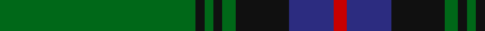

In pattern [GKGKGKBR](/patterns/gkgkgkbr/).

This was sourced from house-of-tartan.  It is a [8 stripes tartan](/stripes/stripes8/).

Original link http://www.house-of-tartan.scotland.net/house/TartanViewjs.asp?colr=Def&tnam=2232

## Thread count
G/88 K4 G4 K4 G6 K24 DB20 R/6

## Palette
Each colour and its ΔE from the base-6 reference it is a variant of.

| Colour | Shade | Base | ΔE (OKLab) |
|---|---|---|---|
| DB | <code style="background-color:#2C2C80;">#2C2C80</code> `#2C2C80` | B <code style="background-color:#2A418A;">#2A418A</code> | 0.06 |
| G | <code style="background-color:#006818;">#006818</code> `#006818` | G <code style="background-color:#006100;">#006100</code> | 0.02 |
| K | <code style="background-color:#101010;">#101010</code> `#101010` | K <code style="background-color:#000000;">#000000</code> | 0.17 |
| R | <code style="background-color:#C80000;">#C80000</code> `#C80000` | R <code style="background-color:#CC0000;">#CC0000</code> | 0.01 |

# Sample pattern

## Nearest tartans

The nearest existing variants by ΔTartan distance.

1. [Mackie (2016)](/setts/s8/g2k1b6k11g26k1g1y2x2~b000080-g006818-k101010-ybc8c00/) — ΔT 0.77
1. [Grand Lodge of Scotland (Corporate)](/setts/s10/b1k2b1k6b1k1g1k6g21y1x2~b2c2c80-g006818-k101010-ye8c000/) — ΔT 1.05
1. [Sevlon Bruce Personal Tartan Tartan Number: 7566. Earliest known date: 2008 The tartan has been designed to celebrate the wedding of Nathalie Selvon and Alex Bruce, to mark the beginning of a new family. The colours blend the histories of our two families. The red and green are from the Ancient Bruce and the yellow and blue are consistent with the flag of Mauritius, the country where the Selvon family trace their roots. See products available Copyright © Blair Urquhart, Comrie, 2015](/setts/s7/k3g2k3g18r2b2y1x4~b1c1c50-g006818-k101010-r880000-ybc8c00/) — ΔT 1.05
1. [St Andrews Hotel, Golf Resort, and SPA](/setts/s6/g50b20k3b2r2b5x2~b304080-g008000-k000000-r806050/) — ΔT 1.10
1. [St Andrews Old Course Hotel Corporate Tartan Tartan Number: 2332. Earliest known date: 1994 St Andrews Old Course Hotel, Golf Resort, and SPA See products available Copyright © Blair Urquhart, Comrie, 2015](/setts/s6/g50b20k3b2ga2b5x2~b2c2c80-g006818-ga604000-k101010/) — ΔT 1.20
1. [Harley (Leslie), Robert](/setts/s8/g2k3y1k3g2b8g16k1x4~b202060-g006818-k101010-ye8c000/) — ΔT 1.24
1. [Smeaton Hunting (Name)](/setts/s10/k6g4w3g44k32g3k3y3k2g3x2~g006818-k101010-wc0c0c0-yd09800/) — ΔT 1.25
1. [Fort William (District?)](/setts/s11/g17b2ga2b2k21b2k3g30k2b2k4x2~b5c8ca8-g006818-ga5c6428-k101010/) — ΔT 1.26
1. [Walterström (2014)](/setts/s8/g78b13y6r3y5g6b9y6x2~b003c64-g003c14-ra00000-yfccc00/) — ΔT 1.29
1. [Fort William District Tartan Tartan Number: 699. Earliest known date: 1819 The pattern books of the old firm of weavers, Wilson's of Bannockburn, provide a reliable early source for this tartan. Wilson's were in business with a monopoly to supply tartan to the regiments in the second half of the 18th century before this pattern was recorded. See products available Copyright © Blair Urquhart, Comrie, 2015](/setts/s11/g17b2ga2b2k21b2k3g30k2b2k4x2~b5c8ca8-g006818-ga289c18-k101010/) — ΔT 1.30

## Neighbour map

Every grey dot is one of 15726 variants placed by the first two principal components of the ΔTartan feature space (44% of its variance). Red is this tartan; blue dots are its nearest — click one to open its page.

<svg viewBox="0 0 640 380" role="img" style="max-width:100%;height:auto;border:1px solid #e0e0e0;border-radius:4px;display:block" xmlns="http://www.w3.org/2000/svg"><image href="/nn/cloud.v1.png" width="640" height="380"/><a href="/setts/s8/g2k1b6k11g26k1g1y2x2~b000080-g006818-k101010-ybc8c00/"><circle cx="377.7" cy="154.7" r="4" fill="#3465a4"><title>Mackie (2016)</title></circle></a><a href="/setts/s10/b1k2b1k6b1k1g1k6g21y1x2~b2c2c80-g006818-k101010-ye8c000/"><circle cx="363.0" cy="145.0" r="4" fill="#3465a4"><title>Grand Lodge of Scotland (Corporate)</title></circle></a><a href="/setts/s7/k3g2k3g18r2b2y1x4~b1c1c50-g006818-k101010-r880000-ybc8c00/"><circle cx="400.8" cy="165.8" r="4" fill="#3465a4"><title>Sevlon Bruce Personal Tartan Tartan Number: 7566. Earliest known date: 2008 The tartan has been designed to celebrate the wedding of Nathalie Selvon and Alex Bruce, to mark the beginning of a new family. The colours blend the histories of our two families. The red and green are from the Ancient Bruce and the yellow and blue are consistent with the flag of Mauritius, the country where the Selvon family trace their roots. See products available Copyright © Blair Urquhart, Comrie, 2015</title></circle></a><a href="/setts/s6/g50b20k3b2r2b5x2~b304080-g008000-k000000-r806050/"><circle cx="414.0" cy="171.5" r="4" fill="#3465a4"><title>St Andrews Hotel, Golf Resort, and SPA</title></circle></a><a href="/setts/s6/g50b20k3b2ga2b5x2~b2c2c80-g006818-ga604000-k101010/"><circle cx="444.9" cy="184.0" r="4" fill="#3465a4"><title>St Andrews Old Course Hotel Corporate Tartan Tartan Number: 2332. Earliest known date: 1994 St Andrews Old Course Hotel, Golf Resort, and SPA See products available Copyright © Blair Urquhart, Comrie, 2015</title></circle></a><a href="/setts/s8/g2k3y1k3g2b8g16k1x4~b202060-g006818-k101010-ye8c000/"><circle cx="335.1" cy="185.5" r="4" fill="#3465a4"><title>Harley (Leslie), Robert</title></circle></a><a href="/setts/s10/k6g4w3g44k32g3k3y3k2g3x2~g006818-k101010-wc0c0c0-yd09800/"><circle cx="357.6" cy="144.3" r="4" fill="#3465a4"><title>Smeaton Hunting (Name)</title></circle></a><a href="/setts/s11/g17b2ga2b2k21b2k3g30k2b2k4x2~b5c8ca8-g006818-ga5c6428-k101010/"><circle cx="337.2" cy="166.9" r="4" fill="#3465a4"><title>Fort William (District?)</title></circle></a><a href="/setts/s8/g78b13y6r3y5g6b9y6x2~b003c64-g003c14-ra00000-yfccc00/"><circle cx="424.9" cy="137.9" r="4" fill="#3465a4"><title>Walterström (2014)</title></circle></a><a href="/setts/s11/g17b2ga2b2k21b2k3g30k2b2k4x2~b5c8ca8-g006818-ga289c18-k101010/"><circle cx="333.4" cy="165.6" r="4" fill="#3465a4"><title>Fort William District Tartan Tartan Number: 699. Earliest known date: 1819 The pattern books of the old firm of weavers, Wilson's of Bannockburn, provide a reliable early source for this tartan. Wilson's were in business with a monopoly to supply tartan to the regiments in the second half of the 18th century before this pattern was recorded. See products available Copyright © Blair Urquhart, Comrie, 2015</title></circle></a><circle cx="417.4" cy="161.7" r="5" fill="#c00000"/></svg>

ID: /setts/s8/g44k2g2k2g3k12b10r3x2~b2c2c80-g006818-k101010-rc80000/
