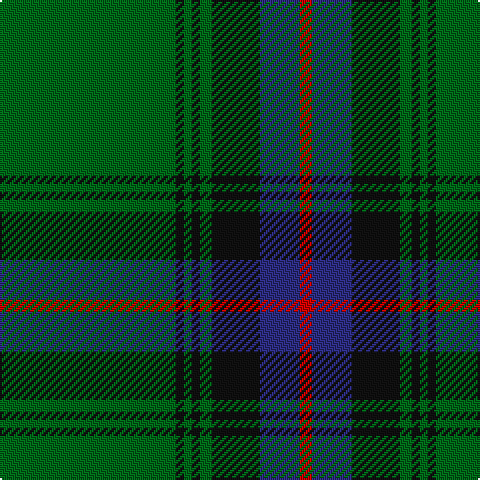

In pattern [GKGKGKBR](/stripes/gkgkgkbr/).

This was sourced from house-of-tartan.  It is a [8 stripe tartan](/stripes/stripes8/).

Original link http://www.house-of-tartan.scotland.net/house/TartanViewjs.asp?colr=Def&tnam=2232

## Thread count
G/88 K4 G4 K4 G6 K24 DB20 R/6

## Palette
Each colour and the base-6 reference it is a variant of.

| Colour | Shade | Base |
|---|---|---|
| DB | <code style="background-color:#2C2C80;">#2C2C80</code> `oklch(35.0% 0.138 276.6)` <small>#2C2C80</small> | B <code style="background-color:#2A418A;">#2A418A</code> |
| G | <code style="background-color:#006818;">#006818</code> `oklch(45.0% 0.142 145.0)` <small>#006818</small> | G <code style="background-color:#006100;">#006100</code> |
| K | <code style="background-color:#101010;">#101010</code> `oklch(17.3% 0.000 89.9)` <small>#101010</small> | K <code style="background-color:#000000;">#000000</code> |
| R | <code style="background-color:#C80000;">#C80000</code> `oklch(52.3% 0.215 29.2)` <small>#C80000</small> | R <code style="background-color:#CC0000;">#CC0000</code> |

# Sample pattern

## Nearest tartans

The nearest existing variants by ΔTartan distance.

1. [Mackie (2016)](/setts/s8/g2k1db6k11g26k1g1lo2~x2/) — ΔT 0.77
1. [Grand Lodge of Scotland (Corporate)](/setts/s10/db1k2db1k6db1k1g1k6g21ly1~x2/) — ΔT 1.05
1. [St Andrews Hotel, Golf Resort, and SPA](/setts/s6/g50db20k3db2o2db5~x2/) — ΔT 1.10
1. [St Andrews Old Course Hotel Corporate Tartan Tartan Number: 2332. Earliest known date: 1994 St Andrews Old Course Hotel, Golf Resort, and SPA See products available Copyright © Blair Urquhart, Comrie, 2015](/setts/s6/g50db20k3db2dy2db5~x2/) — ΔT 1.20
1. [Harley (Leslie), Robert](/setts/s8/g2k3ly1k3g2db8g16k1~x4/) — ΔT 1.24
1. [Smeaton Hunting (Name)](/setts/s10/k6g4lb3g44k32g3k3lo3k2g3~x2/) — ΔT 1.25
1. [Fort William (District?)](/setts/s11/g17t2y2t2k21t2k3g30k2t2k4~x2/) — ΔT 1.26
1. [Walterström (2014)](/setts/s8/dg78dt13ly6r3ly5dg6dt9ly6~x2/) — ΔT 1.29
1. [Scotts Valley](/setts/s9/dg20r1ly1r1lb1dg1r1lb1db5~x4/) — ΔT 1.33
1. [Hall, from Springbrook and Newtown (Personal)](/setts/s8/w3m11db4m6dg48o2dg3o2~x2/) — ΔT 1.35

## Neighbour map

Every grey dot is one of 14299 variants placed by the first two principal components of the ΔTartan feature space (44% of its variance). Red is this tartan; blue dots are its nearest — click one to open its page.

<svg viewBox="0 0 640 380" role="img" style="max-width:100%;height:auto;border:1px solid #e0e0e0;border-radius:4px;display:block" xmlns="http://www.w3.org/2000/svg"><image href="/nn/cloud.v1.png" width="640" height="380"/><a href="/setts/s8/g2k1db6k11g26k1g1lo2~x2/"><circle cx="380.7" cy="157.4" r="4" fill="#3465a4"><title>Mackie (2016)</title></circle></a><a href="/setts/s10/db1k2db1k6db1k1g1k6g21ly1~x2/"><circle cx="365.9" cy="147.9" r="4" fill="#3465a4"><title>Grand Lodge of Scotland (Corporate)</title></circle></a><a href="/setts/s6/g50db20k3db2o2db5~x2/"><circle cx="416.7" cy="173.4" r="4" fill="#3465a4"><title>St Andrews Hotel, Golf Resort, and SPA</title></circle></a><a href="/setts/s6/g50db20k3db2dy2db5~x2/"><circle cx="447.4" cy="189.0" r="4" fill="#3465a4"><title>St Andrews Old Course Hotel Corporate Tartan Tartan Number: 2332. Earliest known date: 1994 St Andrews Old Course Hotel, Golf Resort, and SPA See products available Copyright © Blair Urquhart, Comrie, 2015</title></circle></a><a href="/setts/s8/g2k3ly1k3g2db8g16k1~x4/"><circle cx="338.0" cy="188.9" r="4" fill="#3465a4"><title>Harley (Leslie), Robert</title></circle></a><a href="/setts/s10/k6g4lb3g44k32g3k3lo3k2g3~x2/"><circle cx="360.5" cy="145.8" r="4" fill="#3465a4"><title>Smeaton Hunting (Name)</title></circle></a><a href="/setts/s11/g17t2y2t2k21t2k3g30k2t2k4~x2/"><circle cx="340.1" cy="170.4" r="4" fill="#3465a4"><title>Fort William (District?)</title></circle></a><a href="/setts/s8/dg78dt13ly6r3ly5dg6dt9ly6~x2/"><circle cx="427.4" cy="136.6" r="4" fill="#3465a4"><title>Walterström (2014)</title></circle></a><a href="/setts/s9/dg20r1ly1r1lb1dg1r1lb1db5~x4/"><circle cx="403.1" cy="122.9" r="4" fill="#3465a4"><title>Scotts Valley</title></circle></a><a href="/setts/s8/w3m11db4m6dg48o2dg3o2~x2/"><circle cx="427.3" cy="137.9" r="4" fill="#3465a4"><title>Hall, from Springbrook and Newtown (Personal)</title></circle></a><circle cx="419.8" cy="164.8" r="5" fill="#c00000"/></svg>

ID: /setts/s8/g44k2g2k2g3k12db10r3~x2/
