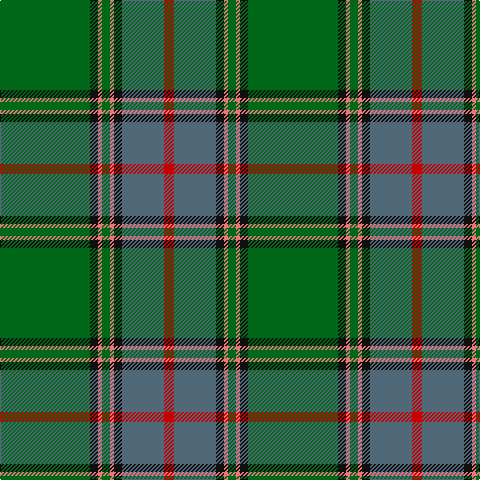

This page is one **sett** — a single exact thread-count. It belongs to the [tartan](/tartans/g45k4ri2g4ri2k4n21r5/)
(the same proportion at any scale), whose colour order is pattern [GKRGRKBR](/stripes/gkrgrkbr/).

Sourced from tartans-authority.  It is a [8 stripe tartan](/stripes/stripes8/).

Original link http://www.tartansauthority.com/tartan-ferret/display/7645/

2 attestations — the source records this cloth was collapsed from (oldest owns this page)

<ul>
<li>pre 2008 — Shiach (Personal) (tartans-authority, <a href="http://www.tartansauthority.com/tartan-ferret/display/7645/">record</a>)</li>
<li>undated — Shiach (Personal) (register-of-tartans, <a href="https://www.tartanregister.gov.uk/tartanDetails.aspx?ref=5658">record</a>)</li>
</ul>

## Register references

External register numbers recorded for this tartan.

- Scottish Register of Tartans: [5658](https://www.tartanregister.gov.uk/tartanDetails.aspx?ref=5658)
- Scottish Tartans Authority (ITI): 7645
- Scottish Tartans World Register: 3248

## Thread count
G/90 K8 LR4 G8 LR4 K8 N42 R/10

## Palette

Palette: <strong>Tartan Register</strong> <small style="color:#888">(4 of 5 colours)</small>
<table><thead><tr><th>Colour</th><th>Threads</th><th>Shade</th><th>Base</th><th>OKLCh</th></tr></thead><tbody><tr><td>G/</td><td style="text-align:right;font-variant-numeric:tabular-nums">90</td><td><code style="background-color:#006818;">#006818</code> <small style="color:#888">#006818</small></td><td>G <code style="background-color:#006100;">#006100</code></td><td><small style="color:#888">oklch(45.0% 0.142 145.0)</small></td></tr><tr><td>K</td><td style="text-align:right;font-variant-numeric:tabular-nums">8</td><td><code style="background-color:#101010;">#101010</code> <small style="color:#888">#101010</small></td><td>K <code style="background-color:#000000;">#000000</code></td><td><small style="color:#888">oklch(17.3% 0.000 89.9)</small></td></tr><tr><td>LR</td><td style="text-align:right;font-variant-numeric:tabular-nums">4</td><td><code style="background-color:#E87878;">#E87878</code> <small style="color:#888">#E87878</small></td><td>R <code style="background-color:#CC0000;">#CC0000</code></td><td><small style="color:#888">oklch(70.0% 0.139 21.2)</small></td></tr><tr><td>G</td><td style="text-align:right;font-variant-numeric:tabular-nums">8</td><td><code style="background-color:#006818;">#006818</code> <small style="color:#888">#006818</small></td><td>G <code style="background-color:#006100;">#006100</code></td><td><small style="color:#888">oklch(45.0% 0.142 145.0)</small></td></tr><tr><td>LR</td><td style="text-align:right;font-variant-numeric:tabular-nums">4</td><td><code style="background-color:#E87878;">#E87878</code> <small style="color:#888">#E87878</small></td><td>R <code style="background-color:#CC0000;">#CC0000</code></td><td><small style="color:#888">oklch(70.0% 0.139 21.2)</small></td></tr><tr><td>K</td><td style="text-align:right;font-variant-numeric:tabular-nums">8</td><td><code style="background-color:#101010;">#101010</code> <small style="color:#888">#101010</small></td><td>K <code style="background-color:#000000;">#000000</code></td><td><small style="color:#888">oklch(17.3% 0.000 89.9)</small></td></tr><tr><td>N</td><td style="text-align:right;font-variant-numeric:tabular-nums">42</td><td><code style="background-color:#506878;">#506878</code> <small style="color:#888">#506878</small></td><td>B <code style="background-color:#2A418A;">#2A418A</code></td><td><small style="color:#888">oklch(50.4% 0.038 237.7)</small></td></tr><tr><td>R/</td><td style="text-align:right;font-variant-numeric:tabular-nums">10</td><td><code style="background-color:#C80000;">#C80000</code> <small style="color:#888">#C80000</small></td><td>R <code style="background-color:#CC0000;">#CC0000</code></td><td><small style="color:#888">oklch(52.3% 0.215 29.2)</small></td></tr></tbody></table>

# Sample pattern

## Nearest tartans

The nearest existing variants by ΔTartan distance, with this tartan at the top so the swatches line up against it.

ΔTartan

Tartan

Sett

—

<a href="/ttd/edit/#slug=g45k4ri2g4ri2k4n21r5~x2">Shiach (Personal)</a> <a class="nn-out" href="/setts/s8/g45k4ri2g4ri2k4n21r5~x2/" title="open its dictionary page">↗</a>

0.97

<a href="/ttd/edit/#slug=g55db7r24g12dt4ly3dt4~x2">Crieff &amp; Strathearn #1</a> <a class="nn-out" href="/setts/s7/g55db7r24g12dt4ly3dt4~x2/" title="open its dictionary page">↗</a>

1.11

<a href="/ttd/edit/#slug=gi62o3gi3o31k4g5t5r3~x2">Sheffield, City of (District)</a> <a class="nn-out" href="/setts/s8/gi62o3gi3o31k4g5t5r3~x2/" title="open its dictionary page">↗</a>

1.20

<a href="/ttd/edit/#slug=y32w1k3w1g14y7k3dp3w1~x2">Leach Htg #2 (Name)</a> <a class="nn-out" href="/setts/s9/y32w1k3w1g14y7k3dp3w1~x2/" title="open its dictionary page">↗</a>

1.32

<a href="/ttd/edit/#slug=k3w1g29o8m2o2m2o2m8g7k2~x2">Gray Htg (Name)</a> <a class="nn-out" href="/setts/s11/k3w1g29o8m2o2m2o2m8g7k2~x2/" title="open its dictionary page">↗</a>

1.33

<a href="/ttd/edit/#slug=ly4g3r2g36b30k3b3k3~x2">Chartered Accountants of Scotland</a> <a class="nn-out" href="/setts/s8/ly4g3r2g36b30k3b3k3~x2/" title="open its dictionary page">↗</a>

1.37

<a href="/ttd/edit/#slug=o6w1o24db6g2db1g2db1g12r1~x2">Chisholm hunting</a> <a class="nn-out" href="/setts/s10/o6w1o24db6g2db1g2db1g12r1~x2/" title="open its dictionary page">↗</a>

1.38

<a href="/ttd/edit/#slug=g11r6dt6do2g3do2dt6r6g36lo2do3lo2dt5r5~x2">Westmeath (District)</a> <a class="nn-out" href="/setts/s14/g11r6dt6do2g3do2dt6r6g36lo2do3lo2dt5r5~x2/" title="open its dictionary page">↗</a>

1.39

<a href="/ttd/edit/#slug=dg38w2dg6db24o6db2o3db2~x2">MacAuliffe/McAucliffe</a> <a class="nn-out" href="/setts/s8/dg38w2dg6db24o6db2o3db2~x2/" title="open its dictionary page">↗</a>

1.40

<a href="/ttd/edit/#slug=lo4g4db2g29w1db12g2lo16g4db2~x2">Unidentified (Pahls)</a> <a class="nn-out" href="/setts/s10/lo4g4db2g29w1db12g2lo16g4db2~x2/" title="open its dictionary page">↗</a>

1.41

<a href="/ttd/edit/#slug=g28r2g2r2g8db24y3r2~x2">Leatherneck, U.S.Marine Corps</a> <a class="nn-out" href="/setts/s8/g28r2g2r2g8db24y3r2~x2/" title="open its dictionary page">↗</a>

## Neighbour map

Every grey dot is one of 14359 variants placed by the first two principal components of the ΔTartan feature space (44% of its variance). Red is this tartan; blue dots are its nearest — click one to open its page.

<svg viewBox="0 0 640 380" role="img" style="max-width:100%;height:auto;border:1px solid #e0e0e0;border-radius:4px;display:block" xmlns="http://www.w3.org/2000/svg"><image href="/nn/cloud.v1.png" width="640" height="380"/><a href="/setts/s7/g55db7r24g12dt4ly3dt4~x2/"><circle cx="386.2" cy="175.6" r="4" fill="#3465a4"><title>Crieff &amp; Strathearn #1</title></circle></a><a href="/setts/s8/gi62o3gi3o31k4g5t5r3~x2/"><circle cx="364.0" cy="142.1" r="4" fill="#3465a4"><title>Sheffield, City of (District)</title></circle></a><a href="/setts/s9/y32w1k3w1g14y7k3dp3w1~x2/"><circle cx="381.5" cy="121.1" r="4" fill="#3465a4"><title>Leach Htg #2 (Name)</title></circle></a><a href="/setts/s11/k3w1g29o8m2o2m2o2m8g7k2~x2/"><circle cx="334.3" cy="115.6" r="4" fill="#3465a4"><title>Gray Htg (Name)</title></circle></a><a href="/setts/s8/ly4g3r2g36b30k3b3k3~x2/"><circle cx="303.9" cy="159.7" r="4" fill="#3465a4"><title>Chartered Accountants of Scotland</title></circle></a><a href="/setts/s10/o6w1o24db6g2db1g2db1g12r1~x2/"><circle cx="382.3" cy="151.9" r="4" fill="#3465a4"><title>Chisholm hunting</title></circle></a><a href="/setts/s14/g11r6dt6do2g3do2dt6r6g36lo2do3lo2dt5r5~x2/"><circle cx="331.1" cy="145.4" r="4" fill="#3465a4"><title>Westmeath (District)</title></circle></a><a href="/setts/s8/dg38w2dg6db24o6db2o3db2~x2/"><circle cx="364.2" cy="179.6" r="4" fill="#3465a4"><title>MacAuliffe/McAucliffe</title></circle></a><a href="/setts/s10/lo4g4db2g29w1db12g2lo16g4db2~x2/"><circle cx="341.0" cy="151.0" r="4" fill="#3465a4"><title>Unidentified (Pahls)</title></circle></a><a href="/setts/s8/g28r2g2r2g8db24y3r2~x2/"><circle cx="340.8" cy="187.5" r="4" fill="#3465a4"><title>Leatherneck, U.S.Marine Corps</title></circle></a><circle cx="368.8" cy="154.7" r="5" fill="#c00000"/></svg>

ID: /setts/s8/g45k4ri2g4ri2k4n21r5~x2/
