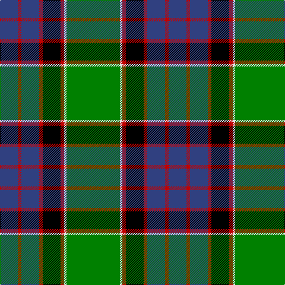

In pattern [BRBRKRWG](/patterns/brbrkrwg/).

This was sourced from weddslist.  It is a [8 stripes tartan](/stripes/stripes8/).

Original link http://www.weddslist.com/cgi-bin/tartans/pg.pl?source=sts

## Thread count
B/30 R6 B30 R6 K30 R6 LN4 G/90

## Palette
Each colour and its ΔE from the base-6 reference it is a variant of.

| Colour | Shade | Base | ΔE (OKLab) |
|---|---|---|---|
| B | <code style="background-color:#304080;">#304080</code> `#304080` | B <code style="background-color:#2A418A;">#2A418A</code> | 0.02 |
| G | <code style="background-color:#008000;">#008000</code> `#008000` | G <code style="background-color:#006100;">#006100</code> | 0.10 |
| K | <code style="background-color:#000000;">#000000</code> `#000000` | K <code style="background-color:#000000;">#000000</code> | 0.00 |
| LN | <code style="background-color:#E0E0E0;">#E0E0E0</code> `#E0E0E0` | W <code style="background-color:#F7F7F7;">#F7F7F7</code> | 0.07 |
| R | <code style="background-color:#C00000;">#C00000</code> `#C00000` | R <code style="background-color:#CC0000;">#CC0000</code> | 0.03 |

# Sample pattern

## Nearest tartans

The nearest existing variants by ΔTartan distance.

1. [Colquhoun](/setts/s7/b4k2b16w1k8g24r4~b304080-g008000-k000000-rc00000-we0e0e0~x2/) — ΔT 0.63
1. [Ogilvie 1](/setts/s9/b24y2k8g16k1g3k1g3r4~b304080-g008000-k000000-rc00000-yf0c000~x2/) — ΔT 0.67
1. [Sinclair, hunting](/setts/s7/g2r1g30k16w1b16r2~b304080-g008000-k000000-rc00000-we0e0e0~x2/) — ΔT 0.75
1. [MacLaren](/setts/s7/b24k8g8r2g8k1y2~b304080-g008000-k000000-rc00000-yf0c000~x2/) — ΔT 0.84
1. [Smoke Showing (UFES)](/setts/s9/g3b5k4b33g12k4w2k18y3~b505050-g289c18-k101010-wffffff-ye0a126~x2/) — ΔT 0.86
1. [John.W.Mackay, Restricted](/setts/s9/k4g34y1k18g3b18r3g3r3~b304080-g008000-k000000-rc00020-yf0c000~x2/) — ΔT 0.87
1. [Hutchens (Kansas) (Personal)](/setts/s9/b10k12g3k1g1k1g30y4w4~b000080-g006400-k101010-wffffff-yb8860b~x2/) — ΔT 0.92
1. [Ferguson of Athol](/setts/s7/b24k8g8r2g8k1w2~b304080-g008000-k000000-rc00000-we0e0e0~x2/) — ΔT 0.94
1. [Sutherland, Old](/setts/s12/g6w2g24k12b3k2b2k2b12r1b1r3~b304080-g008000-k000000-rc00000-we0e0e0~x2/) — ΔT 0.95
1. [MacDonald of The Isles](/setts/s9/w4g30k1g1k1g3k12b10r3~b202060-g006818-k101010-rc80000-wfcfcfc~x2/) — ΔT 0.98

## Neighbour map

Every grey dot is one of 15726 variants placed by the first two principal components of the ΔTartan feature space (44% of its variance). Red is this tartan; blue dots are its nearest — click one to open its page.

<svg viewBox="0 0 640 380" role="img" style="max-width:100%;height:auto;border:1px solid #e0e0e0;border-radius:4px;display:block" xmlns="http://www.w3.org/2000/svg"><image href="/nn/cloud.v1.png" width="640" height="380"/><a href="/setts/s7/b4k2b16w1k8g24r4~b304080-g008000-k000000-rc00000-we0e0e0~x2/"><circle cx="209.3" cy="147.7" r="4" fill="#3465a4"><title>Colquhoun</title></circle></a><a href="/setts/s9/b24y2k8g16k1g3k1g3r4~b304080-g008000-k000000-rc00000-yf0c000~x2/"><circle cx="206.8" cy="125.2" r="4" fill="#3465a4"><title>Ogilvie 1</title></circle></a><a href="/setts/s7/g2r1g30k16w1b16r2~b304080-g008000-k000000-rc00000-we0e0e0~x2/"><circle cx="248.4" cy="131.3" r="4" fill="#3465a4"><title>Sinclair, hunting</title></circle></a><a href="/setts/s7/b24k8g8r2g8k1y2~b304080-g008000-k000000-rc00000-yf0c000~x2/"><circle cx="233.1" cy="146.5" r="4" fill="#3465a4"><title>MacLaren</title></circle></a><a href="/setts/s9/g3b5k4b33g12k4w2k18y3~b505050-g289c18-k101010-wffffff-ye0a126~x2/"><circle cx="237.4" cy="146.5" r="4" fill="#3465a4"><title>Smoke Showing (UFES)</title></circle></a><a href="/setts/s9/k4g34y1k18g3b18r3g3r3~b304080-g008000-k000000-rc00020-yf0c000~x2/"><circle cx="242.1" cy="113.1" r="4" fill="#3465a4"><title>John.W.Mackay, Restricted</title></circle></a><a href="/setts/s9/b10k12g3k1g1k1g30y4w4~b000080-g006400-k101010-wffffff-yb8860b~x2/"><circle cx="274.8" cy="115.3" r="4" fill="#3465a4"><title>Hutchens (Kansas) (Personal)</title></circle></a><a href="/setts/s7/b24k8g8r2g8k1w2~b304080-g008000-k000000-rc00000-we0e0e0~x2/"><circle cx="231.3" cy="146.0" r="4" fill="#3465a4"><title>Ferguson of Athol</title></circle></a><a href="/setts/s12/g6w2g24k12b3k2b2k2b12r1b1r3~b304080-g008000-k000000-rc00000-we0e0e0~x2/"><circle cx="208.2" cy="108.8" r="4" fill="#3465a4"><title>Sutherland, Old</title></circle></a><a href="/setts/s9/w4g30k1g1k1g3k12b10r3~b202060-g006818-k101010-rc80000-wfcfcfc~x2/"><circle cx="290.0" cy="115.3" r="4" fill="#3465a4"><title>MacDonald of The Isles</title></circle></a><circle cx="227.0" cy="134.4" r="5" fill="#c00000"/></svg>

ID: /setts/s8/g45w2r3k15r3b15r3b15~b304080-g008000-k000000-rc00000-we0e0e0~x2/
