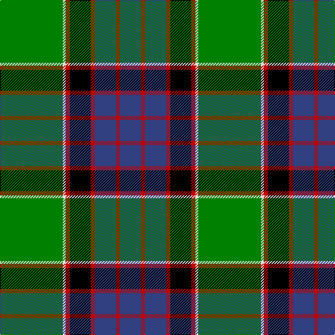

This page is one **sett** — a single exact thread-count. It belongs to the [tartan](/tartans/g45w2r3k15r3db15r3db15/)
(the same proportion at any scale), whose colour order is pattern [BRBRKRWG](/stripes/brbrkrwg/).

Sourced from weddslist.  It is a [8 stripe tartan](/stripes/stripes8/).

Original link http://www.weddslist.com/cgi-bin/tartans/pg.pl?source=sts

## Thread count
G/90 LN4 R6 K30 R6 B30 R6 B/30

## Palette

Palette: <strong>Tartan Register</strong> <small style="color:#888">(2 of 5 colours)</small>
<table><thead><tr><th>Colour</th><th>Threads</th><th>Shade</th><th>Base</th><th>OKLCh</th></tr></thead><tbody><tr><td>G/</td><td style="text-align:right;font-variant-numeric:tabular-nums">90</td><td><code style="background-color:#008000;">#008000</code> <small style="color:#888">#008000</small></td><td>G <code style="background-color:#006100;">#006100</code></td><td><small style="color:#888">oklch(52.0% 0.177 142.5)</small></td></tr><tr><td>LN</td><td style="text-align:right;font-variant-numeric:tabular-nums">4</td><td><code style="background-color:#E0E0E0;">#E0E0E0</code> <small style="color:#888">#E0E0E0</small></td><td>W <code style="background-color:#F7F7F7;">#F7F7F7</code></td><td><small style="color:#888">oklch(90.7% 0.000 89.9)</small></td></tr><tr><td>R</td><td style="text-align:right;font-variant-numeric:tabular-nums">6</td><td><code style="background-color:#C00000;">#C00000</code> <small style="color:#888">#C00000</small></td><td>R <code style="background-color:#CC0000;">#CC0000</code></td><td><small style="color:#888">oklch(50.7% 0.208 29.2)</small></td></tr><tr><td>K</td><td style="text-align:right;font-variant-numeric:tabular-nums">30</td><td><code style="background-color:#000000;">#000000</code> <small style="color:#888">#000000</small></td><td>K <code style="background-color:#000000;">#000000</code></td><td><small style="color:#888">oklch(0.0% 0.000 0.0)</small></td></tr><tr><td>R</td><td style="text-align:right;font-variant-numeric:tabular-nums">6</td><td><code style="background-color:#C00000;">#C00000</code> <small style="color:#888">#C00000</small></td><td>R <code style="background-color:#CC0000;">#CC0000</code></td><td><small style="color:#888">oklch(50.7% 0.208 29.2)</small></td></tr><tr><td>B</td><td style="text-align:right;font-variant-numeric:tabular-nums">30</td><td><code style="background-color:#304080;">#304080</code> <small style="color:#888">#304080</small></td><td>B <code style="background-color:#2A418A;">#2A418A</code></td><td><small style="color:#888">oklch(39.4% 0.109 270.2)</small></td></tr><tr><td>R</td><td style="text-align:right;font-variant-numeric:tabular-nums">6</td><td><code style="background-color:#C00000;">#C00000</code> <small style="color:#888">#C00000</small></td><td>R <code style="background-color:#CC0000;">#CC0000</code></td><td><small style="color:#888">oklch(50.7% 0.208 29.2)</small></td></tr><tr><td>B/</td><td style="text-align:right;font-variant-numeric:tabular-nums">30</td><td><code style="background-color:#304080;">#304080</code> <small style="color:#888">#304080</small></td><td>B <code style="background-color:#2A418A;">#2A418A</code></td><td><small style="color:#888">oklch(39.4% 0.109 270.2)</small></td></tr></tbody></table>

# Sample pattern

## Nearest tartans

The nearest existing variants by ΔTartan distance, with this tartan at the top so the swatches line up against it.

ΔTartan

Tartan

Sett

—

<a href="/ttd/edit/#slug=g45w2r3k15r3db15r3db15~x2">MacNeil 3</a> <a class="nn-out" href="/setts/s8/g45w2r3k15r3db15r3db15~x2/" title="open its dictionary page">↗</a>

0.63

<a href="/ttd/edit/#slug=db4k2db16w1k8g24r4~x2">Colquhoun</a> <a class="nn-out" href="/setts/s7/db4k2db16w1k8g24r4~x2/" title="open its dictionary page">↗</a>

0.67

<a href="/ttd/edit/#slug=db24ly2k8g16k1g3k1g3r4~x2">Ogilvie 1</a> <a class="nn-out" href="/setts/s9/db24ly2k8g16k1g3k1g3r4~x2/" title="open its dictionary page">↗</a>

0.83

<a href="/ttd/edit/#slug=db24k8g8r2g8k1ly2~x2">MacLaren</a> <a class="nn-out" href="/setts/s7/db24k8g8r2g8k1ly2~x2/" title="open its dictionary page">↗</a>

0.86

<a href="/ttd/edit/#slug=g3n5k4n33g12k4w2k18lo3~x2">Smoke Showing (UFES)</a> <a class="nn-out" href="/setts/s9/g3n5k4n33g12k4w2k18lo3~x2/" title="open its dictionary page">↗</a>

0.87

<a href="/ttd/edit/#slug=k4g34ly1k18g3db18r3g3r3~x2">John.W.Mackay, Restricted</a> <a class="nn-out" href="/setts/s9/k4g34ly1k18g3db18r3g3r3~x2/" title="open its dictionary page">↗</a>

0.92

<a href="/ttd/edit/#slug=db10k12g3k1g1k1g30lo4w4~x2">Hutchens (Kansas) (Personal)</a> <a class="nn-out" href="/setts/s9/db10k12g3k1g1k1g30lo4w4~x2/" title="open its dictionary page">↗</a>

0.94

<a href="/ttd/edit/#slug=db24k8g8r2g8k1w2~x2">Ferguson of Athol</a> <a class="nn-out" href="/setts/s7/db24k8g8r2g8k1w2~x2/" title="open its dictionary page">↗</a>

0.98

<a href="/ttd/edit/#slug=w4g30k1g1k1g3k12db10r3~x2">MacDonald of The Isles</a> <a class="nn-out" href="/setts/s9/w4g30k1g1k1g3k12db10r3~x2/" title="open its dictionary page">↗</a>

0.99

<a href="/ttd/edit/#slug=y7yi2k2yi41k12g22yi6k2r4k2~x2">Dinwiddie</a> <a class="nn-out" href="/setts/s10/y7yi2k2yi41k12g22yi6k2r4k2~x2/" title="open its dictionary page">↗</a>

1.01

<a href="/ttd/edit/#slug=g5ly1r2g25k14db19w4g2~x2">Tooth</a> <a class="nn-out" href="/setts/s8/g5ly1r2g25k14db19w4g2~x2/" title="open its dictionary page">↗</a>

## Neighbour map

Every grey dot is one of 14359 variants placed by the first two principal components of the ΔTartan feature space (44% of its variance). Red is this tartan; blue dots are its nearest — click one to open its page.

<svg viewBox="0 0 640 380" role="img" style="max-width:100%;height:auto;border:1px solid #e0e0e0;border-radius:4px;display:block" xmlns="http://www.w3.org/2000/svg"><image href="/nn/cloud.v1.png" width="640" height="380"/><a href="/setts/s7/db4k2db16w1k8g24r4~x2/"><circle cx="212.5" cy="149.4" r="4" fill="#3465a4"><title>Colquhoun</title></circle></a><a href="/setts/s9/db24ly2k8g16k1g3k1g3r4~x2/"><circle cx="210.1" cy="127.2" r="4" fill="#3465a4"><title>Ogilvie 1</title></circle></a><a href="/setts/s7/db24k8g8r2g8k1ly2~x2/"><circle cx="236.1" cy="147.9" r="4" fill="#3465a4"><title>MacLaren</title></circle></a><a href="/setts/s9/g3n5k4n33g12k4w2k18lo3~x2/"><circle cx="239.8" cy="148.9" r="4" fill="#3465a4"><title>Smoke Showing (UFES)</title></circle></a><a href="/setts/s9/k4g34ly1k18g3db18r3g3r3~x2/"><circle cx="245.1" cy="113.8" r="4" fill="#3465a4"><title>John.W.Mackay, Restricted</title></circle></a><a href="/setts/s9/db10k12g3k1g1k1g30lo4w4~x2/"><circle cx="277.7" cy="116.6" r="4" fill="#3465a4"><title>Hutchens (Kansas) (Personal)</title></circle></a><a href="/setts/s7/db24k8g8r2g8k1w2~x2/"><circle cx="234.5" cy="147.2" r="4" fill="#3465a4"><title>Ferguson of Athol</title></circle></a><a href="/setts/s9/w4g30k1g1k1g3k12db10r3~x2/"><circle cx="292.6" cy="116.8" r="4" fill="#3465a4"><title>MacDonald of The Isles</title></circle></a><a href="/setts/s10/y7yi2k2yi41k12g22yi6k2r4k2~x2/"><circle cx="247.8" cy="115.7" r="4" fill="#3465a4"><title>Dinwiddie</title></circle></a><a href="/setts/s8/g5ly1r2g25k14db19w4g2~x2/"><circle cx="193.9" cy="121.3" r="4" fill="#3465a4"><title>Tooth</title></circle></a><circle cx="229.9" cy="135.7" r="5" fill="#c00000"/></svg>

ID: /setts/s8/g45w2r3k15r3db15r3db15~x2/
