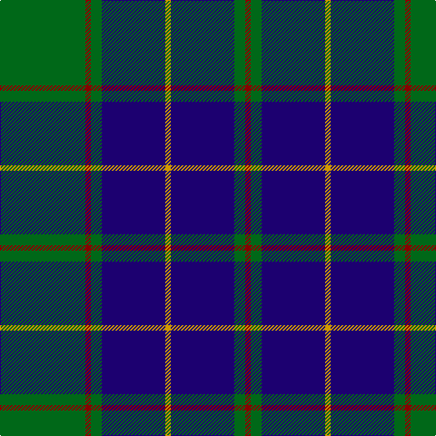

This page is one **sett** — a single exact thread-count. It belongs to the [tartan](/tartans/g47dr3g6db35dy3/)
(the same proportion at any scale), whose colour order is pattern [GRGBYBGR](/stripes/grgbybgr/).

Sourced from register-of-tartans.  It is a [8 stripe tartan](/stripes/stripes8/).

Original link https://www.tartanregister.gov.uk/tartanDetails.aspx?ref=1476

## Register references

External register numbers recorded for this tartan.

- Scottish Register of Tartans: [1476](https://www.tartanregister.gov.uk/tartanDetails.aspx?ref=1476)
- Scottish Tartans Authority (ITI): 2337
- Scottish Tartans World Register: 2337

## Thread count
G/94 DR6 G12 DB70 DY6 DB70 G12 DR/6

## Palette
Each colour and the base-6 reference it is a variant of.

| Colour | Shade | Base |
|---|---|---|
| DB | <code style="background-color:#1C0070;">#1C0070</code> `oklch(26.3% 0.162 277.1)` <small>#1C0070</small> | B <code style="background-color:#2A418A;">#2A418A</code> |
| DR | <code style="background-color:#880000;">#880000</code> `oklch(39.4% 0.162 29.2)` <small>#880000</small> | R <code style="background-color:#CC0000;">#CC0000</code> |
| DY | <code style="background-color:#D09800;">#D09800</code> `oklch(71.4% 0.147 82.1)` <small>#D09800</small> | Y <code style="background-color:#F2BF00;">#F2BF00</code> |
| G | <code style="background-color:#006818;">#006818</code> `oklch(45.0% 0.142 145.0)` <small>#006818</small> | G <code style="background-color:#006100;">#006100</code> |

# Sample pattern

## Nearest tartans

The nearest existing variants by ΔTartan distance, with this tartan at the top so the swatches line up against it.

ΔTartan

Tartan

Sett

—

<a href="/ttd/edit/#slug=g47r3g6db35lo3~x2">Gracie</a> <a class="nn-out" href="/setts/s8/g47r3g6db35lo3~x2/" title="open its dictionary page">↗</a>

0.58

<a href="/ttd/edit/#slug=db24g3db3g3lo2g18r2~x2">Greenways Marketing Intl (Corporate)</a> <a class="nn-out" href="/setts/s7/db24g3db3g3lo2g18r2~x2/" title="open its dictionary page">↗</a>

0.60

<a href="/ttd/edit/#slug=dg20db2g6db2dg4db27lo2db8~x2">Kinross (Fashion)</a> <a class="nn-out" href="/setts/s8/dg20db2g6db2dg4db27lo2db8~x2/" title="open its dictionary page">↗</a>

0.82

<a href="/ttd/edit/#slug=db36lb4db4lb4db16dg64r9db6~x2">Colvin</a> <a class="nn-out" href="/setts/s8/db36lb4db4lb4db16dg64r9db6~x2/" title="open its dictionary page">↗</a>

0.93

<a href="/ttd/edit/#slug=g26db10k3db2dy2db10~x4">St. Andrews Old Course Hotel (Corp)</a> <a class="nn-out" href="/setts/s6/g26db10k3db2dy2db10~x4/" title="open its dictionary page">↗</a>

0.93

<a href="/ttd/edit/#slug=k36r3k3r3k9b36g3b2~x2">Home (Clan)</a> <a class="nn-out" href="/setts/s8/k36r3k3r3k9b36g3b2~x2/" title="open its dictionary page">↗</a>

0.97

<a href="/ttd/edit/#slug=k1b17k17b1r1b1k17b17k1w1~x4">Sorbie</a> <a class="nn-out" href="/setts/s10/k1b17k17b1r1b1k17b17k1w1~x4/" title="open its dictionary page">↗</a>

0.99

<a href="/ttd/edit/#slug=r2db32g14db5g16w2~x2">Connacht Irish District Tartan Tartan Number: 4485. Earliest known date: 1994 Phil Smith obtained in Perthshire from a swatch dated 1994 shown to him by Keith Lumsden of the Scottish Tartans Society. However www.uniq-orn.com shows this as Connaught Green. See products available Copyright © Blair Urquhart, Comrie, 2015</a> <a class="nn-out" href="/setts/s6/r2db32g14db5g16w2~x2/" title="open its dictionary page">↗</a>

1.00

<a href="/ttd/edit/#slug=n15k14t1ly2t1k14n15k2~x4">South African Air Force</a> <a class="nn-out" href="/setts/s8/n15k14t1ly2t1k14n15k2~x4/" title="open its dictionary page">↗</a>

1.02

<a href="/ttd/edit/#slug=g23db3k8db4g4db56ly8">Tern House</a> <a class="nn-out" href="/setts/s7/g23db3k8db4g4db56ly8/" title="open its dictionary page">↗</a>

1.04

<a href="/ttd/edit/#slug=db1k1db8k2lo1g12lo1db8k1db1~x4">Rowan (Name)</a> <a class="nn-out" href="/setts/s10/db1k1db8k2lo1g12lo1db8k1db1~x4/" title="open its dictionary page">↗</a>

## Neighbour map

Every grey dot is one of 14299 variants placed by the first two principal components of the ΔTartan feature space (44% of its variance). Red is this tartan; blue dots are its nearest — click one to open its page.

<svg viewBox="0 0 640 380" role="img" style="max-width:100%;height:auto;border:1px solid #e0e0e0;border-radius:4px;display:block" xmlns="http://www.w3.org/2000/svg"><image href="/nn/cloud.v1.png" width="640" height="380"/><a href="/setts/s7/db24g3db3g3lo2g18r2~x2/"><circle cx="312.4" cy="196.9" r="4" fill="#3465a4"><title>Greenways Marketing Intl (Corporate)</title></circle></a><a href="/setts/s8/dg20db2g6db2dg4db27lo2db8~x2/"><circle cx="334.1" cy="197.7" r="4" fill="#3465a4"><title>Kinross (Fashion)</title></circle></a><a href="/setts/s8/db36lb4db4lb4db16dg64r9db6~x2/"><circle cx="290.6" cy="177.4" r="4" fill="#3465a4"><title>Colvin</title></circle></a><a href="/setts/s6/g26db10k3db2dy2db10~x4/"><circle cx="315.7" cy="217.5" r="4" fill="#3465a4"><title>St. Andrews Old Course Hotel (Corp)</title></circle></a><a href="/setts/s8/k36r3k3r3k9b36g3b2~x2/"><circle cx="318.7" cy="160.7" r="4" fill="#3465a4"><title>Home (Clan)</title></circle></a><a href="/setts/s10/k1b17k17b1r1b1k17b17k1w1~x4/"><circle cx="315.6" cy="163.9" r="4" fill="#3465a4"><title>Sorbie</title></circle></a><a href="/setts/s6/r2db32g14db5g16w2~x2/"><circle cx="323.6" cy="202.1" r="4" fill="#3465a4"><title>Connacht Irish District Tartan Tartan Number: 4485. Earliest known date: 1994 Phil Smith obtained in Perthshire from a swatch dated 1994 shown to him by Keith Lumsden of the Scottish Tartans Society. However www.uniq-orn.com shows this as Connaught Green. See products available Copyright © Blair Urquhart, Comrie, 2015</title></circle></a><a href="/setts/s8/n15k14t1ly2t1k14n15k2~x4/"><circle cx="311.2" cy="208.4" r="4" fill="#3465a4"><title>South African Air Force</title></circle></a><a href="/setts/s7/g23db3k8db4g4db56ly8/"><circle cx="371.2" cy="174.9" r="4" fill="#3465a4"><title>Tern House</title></circle></a><a href="/setts/s10/db1k1db8k2lo1g12lo1db8k1db1~x4/"><circle cx="300.4" cy="185.4" r="4" fill="#3465a4"><title>Rowan (Name)</title></circle></a><circle cx="326.3" cy="189.7" r="5" fill="#c00000"/></svg>

ID: /setts/s8/g47r3g6db35lo3~x2/
