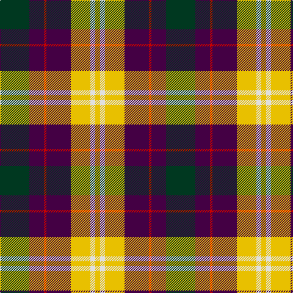

In pattern [GBRBBYWY](/patterns/gbrbbywy/).

This was sourced from tartans-authority.  It is a [8 stripes tartan](/stripes/stripes8/).

Original link http://www.tartansauthority.com/tartan-ferret/display/10151/

## Thread count
DG/48 DP24 R4 DP24 DP16 Ya32 LN8 Y/8

## Palette
Each colour and its ΔE from the base-6 reference it is a variant of.

| Colour | Shade | Base | ΔE (OKLab) |
|---|---|---|---|
| DG | <code style="background-color:#003820;">#003820</code> `#003820` | G <code style="background-color:#006100;">#006100</code> | 0.15 |
| DP | <code style="background-color:#440044;">#440044</code> `#440044` | B <code style="background-color:#2A418A;">#2A418A</code> | 0.18 |
| LN | <code style="background-color:#E0E0E0;">#E0E0E0</code> `#E0E0E0` | W <code style="background-color:#F7F7F7;">#F7F7F7</code> | 0.07 |
| R | <code style="background-color:#C80000;">#C80000</code> `#C80000` | R <code style="background-color:#CC0000;">#CC0000</code> | 0.01 |
| Y | <code style="background-color:#E8C000;">#E8C000</code> `#E8C000` | Y <code style="background-color:#F2BF00;">#F2BF00</code> | 0.02 |
| Ya | <code style="background-color:#E8C000;">#E8C000</code> `#E8C000` | Y <code style="background-color:#F2BF00;">#F2BF00</code> | 0.02 |

# Sample pattern

## Nearest tartans

The nearest existing variants by ΔTartan distance.

1. [Nicolson of Taransay (Personal)](/setts/s7/w12g20r44b32ga4k8k10-b2c2c80-g006818-ga289c18-k101010-rc80000-we0e0e0/) — ΔT 0.98
1. [De Maynard (Personal)](/setts/s8/b8r36g32r16y4r16ba40w8-b440044-ba2c2c80-g006818-re86000-wfcfcfc-ye8c000/) — ΔT 1.08
1. [Unnamed 2](/setts/s9/r10b2r10g26b16ba10r10w2b6-b000050-ba5480b0-g30a010-rc00000-we0e0e0/) — ΔT 1.12
1. [Unidentified #27](/setts/s9/r10b2r10g26b16ba10r10w2b6-b080848-ba3c82af-g309c18-rdc0000-we0e0e0/) — ΔT 1.12
1. [Nicolson of Taransay (Personal)](/setts/s7/w12g20r44b32ga4ga8ga10-b2c2c80-g006818-ga289c18-rc80000-we0e0e0/) — ΔT 1.14
1. [Comyn/Cumming](/setts/s9/b16k8b16k40y4g40r16w4r16-b3c82af-g005020-k101010-rdc0000-we0e0e0-ye8c000/) — ΔT 1.16
1. [Scotch House 2000 Dress](/setts/s7/g44w6k4y6k38r36b8-b1c0070-g006818-k101010-rc80000-we0e0e0-ye8c000/) — ΔT 1.21
1. [Pengelly, The Cornish](/setts/s7/w10k52y8wa48b16k6r8-b5a008c-k101010-rdc0000-we0e0e0-wac0c0c0-yfadc00/) — ΔT 1.23
1. [National (1934), The](/setts/s9/w4b6r12k16g24y2b8k4w4-b1c0070-g006818-k101010-rc80000-wfcfcfc-yd09800/) — ΔT 1.23
1. [Sligo County Crest (Fashion)](/setts/s11/y8k16ya8k52ya6k5w27r20g14k5ya6-g5c6428-k101010-r880000-we0e0e0-ydc943c-yaa0a0a0/) — ΔT 1.23

## Neighbour map

Every grey dot is one of 15726 variants placed by the first two principal components of the ΔTartan feature space (44% of its variance). Red is this tartan; blue dots are its nearest — click one to open its page.

<svg viewBox="0 0 640 380" role="img" style="max-width:100%;height:auto;border:1px solid #e0e0e0;border-radius:4px;display:block" xmlns="http://www.w3.org/2000/svg"><image href="/nn/cloud.v1.png" width="640" height="380"/><a href="/setts/s7/w12g20r44b32ga4k8k10-b2c2c80-g006818-ga289c18-k101010-rc80000-we0e0e0/"><circle cx="101.6" cy="160.3" r="4" fill="#3465a4"><title>Nicolson of Taransay (Personal)</title></circle></a><a href="/setts/s8/b8r36g32r16y4r16ba40w8-b440044-ba2c2c80-g006818-re86000-wfcfcfc-ye8c000/"><circle cx="139.4" cy="163.2" r="4" fill="#3465a4"><title>De Maynard (Personal)</title></circle></a><a href="/setts/s9/r10b2r10g26b16ba10r10w2b6-b000050-ba5480b0-g30a010-rc00000-we0e0e0/"><circle cx="116.1" cy="165.4" r="4" fill="#3465a4"><title>Unnamed 2</title></circle></a><a href="/setts/s9/r10b2r10g26b16ba10r10w2b6-b080848-ba3c82af-g309c18-rdc0000-we0e0e0/"><circle cx="116.9" cy="163.2" r="4" fill="#3465a4"><title>Unidentified #27</title></circle></a><a href="/setts/s7/w12g20r44b32ga4ga8ga10-b2c2c80-g006818-ga289c18-rc80000-we0e0e0/"><circle cx="102.5" cy="161.1" r="4" fill="#3465a4"><title>Nicolson of Taransay (Personal)</title></circle></a><a href="/setts/s9/b16k8b16k40y4g40r16w4r16-b3c82af-g005020-k101010-rdc0000-we0e0e0-ye8c000/"><circle cx="81.9" cy="161.5" r="4" fill="#3465a4"><title>Comyn/Cumming</title></circle></a><a href="/setts/s7/g44w6k4y6k38r36b8-b1c0070-g006818-k101010-rc80000-we0e0e0-ye8c000/"><circle cx="109.0" cy="157.8" r="4" fill="#3465a4"><title>Scotch House 2000 Dress</title></circle></a><a href="/setts/s7/w10k52y8wa48b16k6r8-b5a008c-k101010-rdc0000-we0e0e0-wac0c0c0-yfadc00/"><circle cx="115.3" cy="148.4" r="4" fill="#3465a4"><title>Pengelly, The Cornish</title></circle></a><a href="/setts/s9/w4b6r12k16g24y2b8k4w4-b1c0070-g006818-k101010-rc80000-wfcfcfc-yd09800/"><circle cx="70.0" cy="145.3" r="4" fill="#3465a4"><title>National (1934), The</title></circle></a><a href="/setts/s11/y8k16ya8k52ya6k5w27r20g14k5ya6-g5c6428-k101010-r880000-we0e0e0-ydc943c-yaa0a0a0/"><circle cx="146.4" cy="128.6" r="4" fill="#3465a4"><title>Sligo County Crest (Fashion)</title></circle></a><circle cx="119.8" cy="156.3" r="5" fill="#c00000"/></svg>

ID: /setts/s8/g48b24r4b24b16y32w8y8-b440044-g003820-rc80000-we0e0e0-ye8c000/
