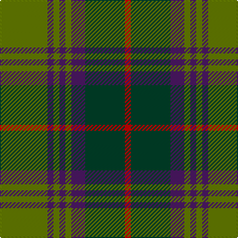

In pattern [GBGBGBGR](/patterns/gbgbgbgr/).

This was sourced from register-of-tartans.  It is a [8 stripes tartan](/stripes/stripes8/).

Original link https://www.tartanregister.gov.uk/tartanDetails.aspx?ref=796

## Thread count
G/48 DP6 G6 DP6 G6 DP14 DG40 R/6

## Palette
Each colour and its ΔE from the base-6 reference it is a variant of.

| Colour | Shade | Base | ΔE (OKLab) |
|---|---|---|---|
| DG | <code style="background-color:#004028;">#004028</code> `#004028` | G <code style="background-color:#006400;">#006400</code> | 0.14 |
| DP | <code style="background-color:#4C1864;">#4C1864</code> `#4C1864` | B <code style="background-color:#2C4084;">#2C4084</code> | 0.11 |
| G | <code style="background-color:#647C00;">#647C00</code> `#647C00` | G <code style="background-color:#006400;">#006400</code> | 0.12 |
| R | <code style="background-color:#C80000;">#C80000</code> `#C80000` | R <code style="background-color:#C80000;">#C80000</code> | 0.00 |

# Sample pattern

## Nearest tartans

The nearest existing variants by ΔTartan distance.

1. [Daks (0600150)](/setts/s8/r20b48g12ba16g80b12g12r20-b14283c-ba2c2c80-g006818-rc80000/) — ΔT 0.71
1. [Antrim, County](/setts/s10/g10b4g36y4b10y4r10b34g4y8-b14283c-g406054-rc04c08-ybc8c00/) — ΔT 0.99
1. [Ballantrae (Dalgety)](/setts/s7/g10r6g62ga40g6gb44r10-g604000-ga003820-gb289c18-rc80000/) — ΔT 1.09
1. [Ayrton 1979 No. 2 (Personal)](/setts/s8/b10k2g6k2b6k2g20r6-b1474b4-g006818-k101010-rc80000/) — ΔT 1.09
1. [Daks (Muted Loden)](/setts/s8/g6ga12gb4r4gb28ga4gb4g6-g604000-ga289c18-gb003820-rb03000/) — ΔT 1.10
1. [Ballintrae](/setts/s7/r10ra5r62g40r5ga44ra10-g003000-ga30a010-r806050-rac00000/) — ΔT 1.10
1. [McInery (Personal)](/setts/s8/r16g4r24k12r6b6g48k4-b1c0070-g006818-k101010-r880000/) — ΔT 1.12
1. [Thompson Hunting Family Tartan Tartan Number: 2093. Earliest known date: 1958 Designed for Lord Thomson of Fleet in 1958 based on a sample in the Moy Hall collection dating from the mid 19th century. The tartan is also suitable for MacTavishs and Thompsons, who claim descent from the Clan MacIntosh. See products available Copyright © Blair Urquhart, Comrie, 2015](/setts/s6/b8g56ga12b24k24b6-b5c8ca8-g604000-ga006818-k101010/) — ΔT 1.12
1. [MacNeish Htg](/setts/s11/r12g6k6ra48g8k20g8r4g48r12g4-g006818-k101010-r880000-ra888888/) — ΔT 1.13
1. [Unidentified Plaid 6](/setts/s10/r8b6r64ba60r8g64r6g64r6g6-b5480b0-ba304080-g008000-rc00000/) — ΔT 1.14

## Neighbour map

Every grey dot is one of 15726 variants placed by the first two principal components of the ΔTartan feature space (44% of its variance). Red is this tartan; blue dots are its nearest — click one to open its page.

<svg viewBox="0 0 640 380" role="img" style="max-width:100%;height:auto;border:1px solid #e0e0e0;border-radius:4px;display:block" xmlns="http://www.w3.org/2000/svg"><image href="/nn/cloud.v1.png" width="640" height="380"/><a href="/setts/s8/r20b48g12ba16g80b12g12r20-b14283c-ba2c2c80-g006818-rc80000/"><circle cx="245.9" cy="227.5" r="4" fill="#3465a4"><title>Daks (0600150)</title></circle></a><a href="/setts/s10/g10b4g36y4b10y4r10b34g4y8-b14283c-g406054-rc04c08-ybc8c00/"><circle cx="245.7" cy="201.3" r="4" fill="#3465a4"><title>Antrim, County</title></circle></a><a href="/setts/s7/g10r6g62ga40g6gb44r10-g604000-ga003820-gb289c18-rc80000/"><circle cx="259.3" cy="220.9" r="4" fill="#3465a4"><title>Ballantrae (Dalgety)</title></circle></a><a href="/setts/s8/b10k2g6k2b6k2g20r6-b1474b4-g006818-k101010-rc80000/"><circle cx="255.4" cy="210.9" r="4" fill="#3465a4"><title>Ayrton 1979 No. 2 (Personal)</title></circle></a><a href="/setts/s8/g6ga12gb4r4gb28ga4gb4g6-g604000-ga289c18-gb003820-rb03000/"><circle cx="294.2" cy="228.9" r="4" fill="#3465a4"><title>Daks (Muted Loden)</title></circle></a><a href="/setts/s7/r10ra5r62g40r5ga44ra10-g003000-ga30a010-r806050-rac00000/"><circle cx="251.9" cy="203.6" r="4" fill="#3465a4"><title>Ballintrae</title></circle></a><a href="/setts/s8/r16g4r24k12r6b6g48k4-b1c0070-g006818-k101010-r880000/"><circle cx="278.8" cy="197.4" r="4" fill="#3465a4"><title>McInery (Personal)</title></circle></a><a href="/setts/s6/b8g56ga12b24k24b6-b5c8ca8-g604000-ga006818-k101010/"><circle cx="236.5" cy="228.4" r="4" fill="#3465a4"><title>Thompson Hunting Family Tartan Tartan Number: 2093. Earliest known date: 1958 Designed for Lord Thomson of Fleet in 1958 based on a sample in the Moy Hall collection dating from the mid 19th century. The tartan is also suitable for MacTavishs and Thompsons, who claim descent from the Clan MacIntosh. See products available Copyright © Blair Urquhart, Comrie, 2015</title></circle></a><a href="/setts/s11/r12g6k6ra48g8k20g8r4g48r12g4-g006818-k101010-r880000-ra888888/"><circle cx="231.1" cy="174.1" r="4" fill="#3465a4"><title>MacNeish Htg</title></circle></a><a href="/setts/s10/r8b6r64ba60r8g64r6g64r6g6-b5480b0-ba304080-g008000-rc00000/"><circle cx="258.8" cy="180.7" r="4" fill="#3465a4"><title>Unidentified Plaid 6</title></circle></a><circle cx="265.5" cy="210.8" r="5" fill="#c00000"/></svg>

ID: /setts/s8/g48b6g6b6g6b14ga40r6-b4c1864-g647c00-ga004028-rc80000/
