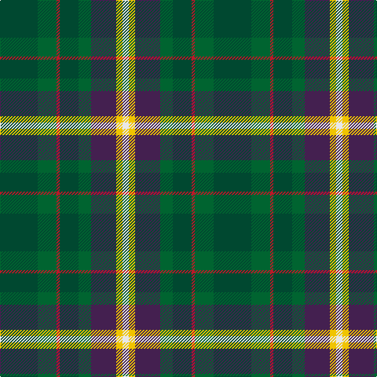

In pattern [GGRGGBYW](/patterns/ggrggbyw/).

This was sourced from register-of-tartans.  It is a [8 stripes tartan](/stripes/stripes8/).

Original link https://www.tartanregister.gov.uk/tartanDetails.aspx?ref=10151

## Attestations

This cloth appears in 2 source records; the oldest owns this page.

- 18/01/2010 — Connelly, James (Personal) (register-of-tartans, [record](https://www.tartanregister.gov.uk/tartanDetails.aspx?ref=10151))
- undated — Connelly Tartan Tartan Number: 9090. Earliest known date: 2009 November Designed by James Connelly for his daughters wedding in April 2010, with the help of The Tartan Shop of Comrie in Perthshire. The different shades of green signify the gaelic families from which the surname derives, the original spelling being O'Conghalie. Purple denotes the thistle, the national flower of Scotland and the O'Conghalies' move to a new country. The gold is a reminder to show generosity and kindness to others. White signifies, knowledge, loyalty, and integrity. The red, which runs through all of the above colours, symbolises the courage to maintain these standards. See products available Copyright © Blair Urquhart, Comrie, 2015 (house-of-tartan, [record](http://www.house-of-tartan.scotland.net/house/TartanViewjs.asp?colr=Def&tnam=9090))

## Thread count
DG/48 G24 R4 DG24 G16 DP32 Y8 LN/8

## Palette
Each colour and its ΔE from the base-6 reference it is a variant of.

| Colour | Shade | Base | ΔE (OKLab) |
|---|---|---|---|
| DG | <code style="background-color:#004830;">#004830</code> `#004830` | G <code style="background-color:#006400;">#006400</code> | 0.11 |
| DP | <code style="background-color:#442050;">#442050</code> `#442050` | B <code style="background-color:#2C4084;">#2C4084</code> | 0.12 |
| G | <code style="background-color:#006430;">#006430</code> `#006430` | G <code style="background-color:#006400;">#006400</code> | 0.04 |
| LN | <code style="background-color:#E8E8E8;">#E8E8E8</code> `#E8E8E8` | W <code style="background-color:#F4F4F0;">#F4F4F0</code> | 0.04 |
| R | <code style="background-color:#BC1828;">#BC1828</code> `#BC1828` | R <code style="background-color:#C80000;">#C80000</code> | 0.03 |
| Y | <code style="background-color:#F0C400;">#F0C400</code> `#F0C400` | Y <code style="background-color:#E8C000;">#E8C000</code> | 0.02 |

# Sample pattern

ID: /setts/s8/g48ga24r4g24ga16b32y8w8-b442050-g004830-ga006430-rbc1828-we8e8e8-yf0c400/
