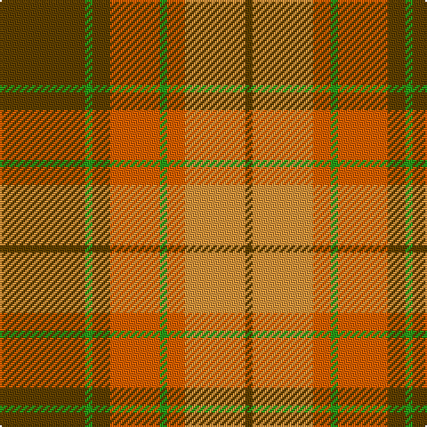

In pattern [GGGRGRYG](/patterns/gggrgryg/).

This was sourced from register-of-tartans.  It is a [8 stripes tartan](/stripes/stripes8/).

Original link https://www.tartanregister.gov.uk/tartanDetails.aspx?ref=2157

## Attestations

This cloth appears in 2 source records; the oldest owns this page.

- 01/01/1975 — Loch Rannoch #2 (register-of-tartans, [record](https://www.tartanregister.gov.uk/tartanDetails.aspx?ref=2157))
- 1975 — Loch Rannoch (District) (tartans-authority, [record](http://www.tartansauthority.com/tartan-ferret/display/1735/))

## Thread count
T/48 G4 T10 Oa28 G4 Oa10 O34 T/4

## Palette
Each colour and its ΔE from the base-6 reference it is a variant of.

| Colour | Shade | Base | ΔE (OKLab) |
|---|---|---|---|
| G | <code style="background-color:#289C18;">#289C18</code> `#289C18` | G <code style="background-color:#006400;">#006400</code> | 0.18 |
| O | <code style="background-color:#DC943C;">#DC943C</code> `#DC943C` | Y <code style="background-color:#E8C000;">#E8C000</code> | 0.12 |
| Oa | <code style="background-color:#E86000;">#E86000</code> `#E86000` | R <code style="background-color:#C80000;">#C80000</code> | 0.14 |
| T | <code style="background-color:#604000;">#604000</code> `#604000` | G <code style="background-color:#006400;">#006400</code> | 0.14 |

# Sample pattern

ID: /setts/s8/g48ga4g10r28ga4r10y34g4-g604000-ga289c18-re86000-ydc943c/
