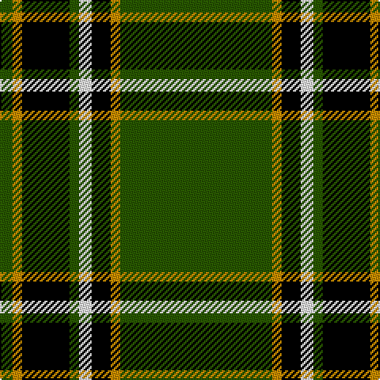

In pattern [GYKGWKYG](/patterns/gykgwkyg/).

This was sourced from register-of-tartans.  It is a [8 stripes tartan](/stripes/stripes8/).

Original link https://www.tartanregister.gov.uk/tartanDetails.aspx?ref=263

## Attestations

This cloth appears in 2 source records; the oldest owns this page.

- 01/01/1999 — Birmingham Irish Pipes & Drums (register-of-tartans, [record](https://www.tartanregister.gov.uk/tartanDetails.aspx?ref=263))
- 1999 — Birmingham Irish (Pipe Band) (tartans-authority, [record](http://www.tartansauthority.com/tartan-ferret/display/4232/))

## Thread count
Ga/8 DY6 K30 Ga6 W8 K12 DY6 Ga/96

## Palette
Each colour and its ΔE from the base-6 reference it is a variant of.

| Colour | Shade | Base | ΔE (OKLab) |
|---|---|---|---|
| B | <code style="background-color:#788CB4;">#788CB4</code> `#788CB4` | B <code style="background-color:#2A418A;">#2A418A</code> | 0.25 |
| DB | <code style="background-color:#00008C;">#00008C</code> `#00008C` | B <code style="background-color:#2A418A;">#2A418A</code> | 0.13 |
| DG | <code style="background-color:#003820;">#003820</code> `#003820` | G <code style="background-color:#006100;">#006100</code> | 0.15 |
| DR | <code style="background-color:#8C0000;">#8C0000</code> `#8C0000` | R <code style="background-color:#CC0000;">#CC0000</code> | 0.14 |
| DY | <code style="background-color:#C88C00;">#C88C00</code> `#C88C00` | Y <code style="background-color:#F2BF00;">#F2BF00</code> | 0.15 |
| G | <code style="background-color:#007800;">#007800</code> `#007800` | G <code style="background-color:#006100;">#006100</code> | 0.07 |
| Ga | <code style="background-color:#285800;">#285800</code> `#285800` | G <code style="background-color:#006100;">#006100</code> | 0.03 |
| K | <code style="background-color:#000000;">#000000</code> `#000000` | K <code style="background-color:#000000;">#000000</code> | 0.00 |
| N | <code style="background-color:#C8C8C8;">#C8C8C8</code> `#C8C8C8` | W <code style="background-color:#F7F7F7;">#F7F7F7</code> | 0.14 |
| P | <code style="background-color:#64008C;">#64008C</code> `#64008C` | B <code style="background-color:#2A418A;">#2A418A</code> | 0.14 |
| W | <code style="background-color:#F8F8F8;">#F8F8F8</code> `#F8F8F8` | W <code style="background-color:#F7F7F7;">#F7F7F7</code> | 0.00 |

# Sample pattern

## Nearest tartans

The nearest existing variants by ΔTartan distance.

1. [University of Alberta (Corporate)](/setts/s10/k3g32k2g4y4g2y4g4k6w3x2~g005010-k101010-we0e0e0-ye8c000/) — ΔT 0.89
1. [Forde](/setts/s10/g16ga1k2r1k1r1k2ga1k1g1x4~g008000-ga908000-k000000-rc00000/) — ΔT 1.08
1. [New York Jets](/setts/s8/g60w3k12r5g9r6k4w10~g005020-k101010-r888888-wffffff/) — ΔT 1.11
1. [Laggen Dress (Fashion)](/setts/s11/g42k10g2k2k2k2g10k6k2k3g2x2~g648860-k000000/) — ΔT 1.21
1. [Walterström (2014)](/setts/s8/g78b13y6r3y5g6b9y6x2~b003c64-g003c14-ra00000-yfccc00/) — ΔT 1.25
1. [Forde Irish Family Tartan Tartan Number: 829. Earliest known date: c1890 This pattern was recorded by Bill Johnston, Shippak, USA in 1978 along with other patterns extracted from the 'Clan Originaux' at Pendleton Mill. This and other Irish patterns appear to have originated in the former Waterford Mill in Ireland before they arrived at Pendleton in the late 19thC See products available Copyright © Blair Urquhart, Comrie, 2015](/setts/s10/g16y1k2r1k1r1k2y1k1g1x4~g006818-k101010-rc80000-ye8c000/) — ΔT 1.32
1. [Fort William](/setts/s11/g17b2ga2b2k21b2k3g30k2b2k4x2~b5480b0-g008000-ga30a010-k000000/) — ΔT 1.37
1. [Forde](/setts/s10/g30y2k3r2k2r2k3y2k2g4x2~g006818-k101010-rc80000-ye8c000/) — ΔT 1.38
1. [Moran](/setts/s6/g55k17r9k11y2k4x2~g008000-k000000-rc00020-yf0c000/) — ΔT 1.42
1. [Dryfe](/setts/s11/g42k10y2k2r2k2g10r6k2r3g2x2~g004c00-k000000-r780028-yfc9898/) — ΔT 1.43

## Neighbour map

Every grey dot is one of 15726 variants placed by the first two principal components of the ΔTartan feature space (44% of its variance). Red is this tartan; blue dots are its nearest — click one to open its page.

<svg viewBox="0 0 640 380" role="img" style="max-width:100%;height:auto;border:1px solid #e0e0e0;border-radius:4px;display:block" xmlns="http://www.w3.org/2000/svg"><image href="/nn/cloud.v1.png" width="640" height="380"/><a href="/setts/s10/k3g32k2g4y4g2y4g4k6w3x2~g005010-k101010-we0e0e0-ye8c000/"><circle cx="375.1" cy="147.4" r="4" fill="#3465a4"><title>University of Alberta (Corporate)</title></circle></a><a href="/setts/s10/g16ga1k2r1k1r1k2ga1k1g1x4~g008000-ga908000-k000000-rc00000/"><circle cx="360.5" cy="129.6" r="4" fill="#3465a4"><title>Forde</title></circle></a><a href="/setts/s8/g60w3k12r5g9r6k4w10~g005020-k101010-r888888-wffffff/"><circle cx="357.7" cy="145.4" r="4" fill="#3465a4"><title>New York Jets</title></circle></a><a href="/setts/s11/g42k10g2k2k2k2g10k6k2k3g2x2~g648860-k000000/"><circle cx="371.7" cy="118.2" r="4" fill="#3465a4"><title>Laggen Dress (Fashion)</title></circle></a><a href="/setts/s8/g78b13y6r3y5g6b9y6x2~b003c64-g003c14-ra00000-yfccc00/"><circle cx="424.9" cy="137.9" r="4" fill="#3465a4"><title>Walterström (2014)</title></circle></a><a href="/setts/s10/g16y1k2r1k1r1k2y1k1g1x4~g006818-k101010-rc80000-ye8c000/"><circle cx="387.0" cy="137.1" r="4" fill="#3465a4"><title>Forde Irish Family Tartan Tartan Number: 829. Earliest known date: c1890 This pattern was recorded by Bill Johnston, Shippak, USA in 1978 along with other patterns extracted from the 'Clan Originaux' at Pendleton Mill. This and other Irish patterns appear to have originated in the former Waterford Mill in Ireland before they arrived at Pendleton in the late 19thC See products available Copyright © Blair Urquhart, Comrie, 2015</title></circle></a><a href="/setts/s11/g17b2ga2b2k21b2k3g30k2b2k4x2~b5480b0-g008000-ga30a010-k000000/"><circle cx="284.5" cy="149.1" r="4" fill="#3465a4"><title>Fort William</title></circle></a><a href="/setts/s10/g30y2k3r2k2r2k3y2k2g4x2~g006818-k101010-rc80000-ye8c000/"><circle cx="398.9" cy="142.9" r="4" fill="#3465a4"><title>Forde</title></circle></a><a href="/setts/s6/g55k17r9k11y2k4x2~g008000-k000000-rc00020-yf0c000/"><circle cx="326.0" cy="157.2" r="4" fill="#3465a4"><title>Moran</title></circle></a><a href="/setts/s11/g42k10y2k2r2k2g10r6k2r3g2x2~g004c00-k000000-r780028-yfc9898/"><circle cx="413.7" cy="137.8" r="4" fill="#3465a4"><title>Dryfe</title></circle></a><circle cx="364.9" cy="153.8" r="5" fill="#c00000"/></svg>

ID: /setts/s8/g48y3k6w4g3k15y3g4x2~g285800-k000000-wf8f8f8-yc88c00/
