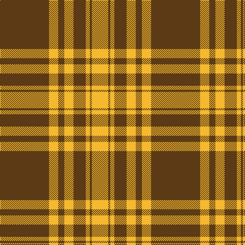

In pattern [GYGYGYGY](/patterns/gygygygy/).

This was sourced from register-of-tartans.  It is a [8 stripes tartan](/stripes/stripes8/).

Original link https://www.tartanregister.gov.uk/tartanDetails.aspx?ref=10761

## Thread count
T/96 Y18 T12 Y18 T24 Y8 T4 Y/32

## Palette
Each colour and its ΔE from the base-6 reference it is a variant of.

| Colour | Shade | Base | ΔE (OKLab) |
|---|---|---|---|
| T | <code style="background-color:#5B3A15;">#5B3A15</code> `#5B3A15` | G <code style="background-color:#006100;">#006100</code> | 0.15 |
| Y | <code style="background-color:#F5B92F;">#F5B92F</code> `#F5B92F` | Y <code style="background-color:#F2BF00;">#F2BF00</code> | 0.02 |

# Sample pattern

## Nearest tartans

The nearest existing variants by ΔTartan distance.

1. [Loughheed (Personal)](/setts/s8/b3y3b4b2y18b1y2b2x4~b4c0000-ydc943c/) — ΔT 1.08
1. [Monoch Airline](/setts/s6/y4k6y1k1y16k2x2~k101010-yd09800/) — ΔT 1.19
1. [Yellow Pencil (Corporate)](/setts/s8/g48y9g6y9g12y4g2y16x2~g604000-ydc943c/) — ΔT 1.28
1. [Menzies Brown & White Trade Tartan Tartan Number: 1752. Earliest known date: 1984 Nothing See products available Copyright © Blair Urquhart, Comrie, 2015](/setts/s8/g31w5g2w5g4w3g2w7x2~g604000-we0e0e0/) — ΔT 1.32
1. [Schranz-Gritte](/setts/s10/y3k2y4k5y24k5y4k2y3k2x2~k101010-yd87c00/) — ΔT 1.49
1. [Menzies Brown & White](/setts/s8/g31w5g2w5g4w3g2w7x2~g503c14-we0e0e0/) — ΔT 1.56
1. [Maxwell; Maxwell Ancient](/setts/s7/r3g16r4k6r28g1r3x2~g008000-k000000-rc00000/) — ΔT 1.67
1. [Livingstone](/setts/s10/g12r4k1r2k1r4g16r20g2r8x2~g008000-k000000-rc00000/) — ΔT 1.67
1. [Donachie](/setts/s10/r24g2r2g40r25g2r2g2r2g20x2~g008440-rc80000/) — ΔT 1.70
1. [Livingstone](/setts/s10/g14r4g2r2g2r4g19r30g2r9x2~g008000-rc00000/) — ΔT 1.72

## Neighbour map

Every grey dot is one of 15726 variants placed by the first two principal components of the ΔTartan feature space (44% of its variance). Red is this tartan; blue dots are its nearest — click one to open its page.

<svg viewBox="0 0 640 380" role="img" style="max-width:100%;height:auto;border:1px solid #e0e0e0;border-radius:4px;display:block" xmlns="http://www.w3.org/2000/svg"><image href="/nn/cloud.v1.png" width="640" height="380"/><a href="/setts/s8/b3y3b4b2y18b1y2b2x4~b4c0000-ydc943c/"><circle cx="447.2" cy="171.4" r="4" fill="#3465a4"><title>Loughheed (Personal)</title></circle></a><a href="/setts/s6/y4k6y1k1y16k2x2~k101010-yd09800/"><circle cx="446.3" cy="200.3" r="4" fill="#3465a4"><title>Monoch Airline</title></circle></a><a href="/setts/s8/g48y9g6y9g12y4g2y16x2~g604000-ydc943c/"><circle cx="476.6" cy="192.4" r="4" fill="#3465a4"><title>Yellow Pencil (Corporate)</title></circle></a><a href="/setts/s8/g31w5g2w5g4w3g2w7x2~g604000-we0e0e0/"><circle cx="428.4" cy="177.9" r="4" fill="#3465a4"><title>Menzies Brown &amp; White Trade Tartan Tartan Number: 1752. Earliest known date: 1984 Nothing See products available Copyright © Blair Urquhart, Comrie, 2015</title></circle></a><a href="/setts/s10/y3k2y4k5y24k5y4k2y3k2x2~k101010-yd87c00/"><circle cx="447.0" cy="180.9" r="4" fill="#3465a4"><title>Schranz-Gritte</title></circle></a><a href="/setts/s8/g31w5g2w5g4w3g2w7x2~g503c14-we0e0e0/"><circle cx="424.1" cy="178.8" r="4" fill="#3465a4"><title>Menzies Brown &amp; White</title></circle></a><a href="/setts/s7/r3g16r4k6r28g1r3x2~g008000-k000000-rc00000/"><circle cx="413.1" cy="159.8" r="4" fill="#3465a4"><title>Maxwell; Maxwell Ancient</title></circle></a><a href="/setts/s10/g12r4k1r2k1r4g16r20g2r8x2~g008000-k000000-rc00000/"><circle cx="372.4" cy="173.0" r="4" fill="#3465a4"><title>Livingstone</title></circle></a><a href="/setts/s10/r24g2r2g40r25g2r2g2r2g20x2~g008440-rc80000/"><circle cx="424.0" cy="185.1" r="4" fill="#3465a4"><title>Donachie</title></circle></a><a href="/setts/s10/g14r4g2r2g2r4g19r30g2r9x2~g008000-rc00000/"><circle cx="415.0" cy="197.3" r="4" fill="#3465a4"><title>Livingstone</title></circle></a><circle cx="438.0" cy="177.4" r="5" fill="#c00000"/></svg>

ID: /setts/s8/g48y9g6y9g12y4g2y16x2~g5b3a15-yf5b92f/
