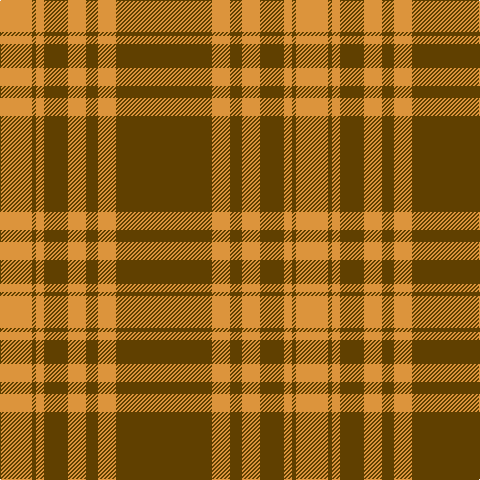

In pattern [GYGYGYGY](/patterns/gygygygy/).

This was sourced from tartans-authority.  It is a [8 stripes tartan](/stripes/stripes8/).

Original link http://www.tartansauthority.com/tartan-ferret/display/10761/

## Thread count
O/32 T4 O8 T24 O18 T12 O18 T/96

## Palette
Each colour and its ΔE from the base-6 reference it is a variant of.

| Colour | Shade | Base | ΔE (OKLab) |
|---|---|---|---|
| O | <code style="background-color:#DC943C;">#DC943C</code> `#DC943C` | Y <code style="background-color:#F2BF00;">#F2BF00</code> | 0.12 |
| T | <code style="background-color:#604000;">#604000</code> `#604000` | G <code style="background-color:#006100;">#006100</code> | 0.14 |

# Sample pattern

## Nearest tartans

The nearest existing variants by ΔTartan distance.

1. [Donachie](/setts/s10/r24g2r2g40r25g2r2g2r2g20x2~g008440-rc80000/) — ΔT 1.08
1. [Livingstone](/setts/s10/g14r4g2r2g2r4g19r30g2r9x2~g008000-rc00000/) — ΔT 1.15
1. [MacQuarrie #5](/setts/s6/r16g1r1g1r4g12x4~g006818-rc80000/) — ΔT 1.23
1. [Erskine](/setts/s6/g6r1g24r28g1r4x2~g008000-rc00000/) — ΔT 1.24
1. [Erskine (Green & Red) Clan Tartan Tartan Number: 891. Earliest known date: 1842 The Erskine clan or family originated in Renfrewshire. The first published version of the tartan appeared in the Vestiarium Scoticum, a romantic history of Scottish dress produced in 1842 by the Sobieski brothers. Cunningham tartan, published in the same work, differs only in the addition of a white stripe between the narrow green lines. Cunningham was one of the names adopted by the MacGregors, and this provides a tenuous connection which might explain the origin of the design. See products available Copyright © Blair Urquhart, Comrie, 2015](/setts/s6/g6r1g24r28g1r4x2~g006818-rc80000/) — ΔT 1.28
1. [Yellow Pencil](/setts/s8/g48y9g6y9g12y4g2y16x2~g5b3a15-yf5b92f/) — ΔT 1.28
1. [MacQuarrie](/setts/s6/r16g1r1g1r4g12x2~g004c00-rc80000/) — ΔT 1.40
1. [Erskine](/setts/s6/g6r1g24r28g1r4x2~g004c00-rc80000/) — ΔT 1.44
1. [Erskine (Vestiarium Scoticum)](/setts/s6/g6r1g24r28g1r4x2~g00643c-rc80000/) — ΔT 1.44
1. [MacKintosh 2](/setts/s6/r48b2r3g28r4b2x2~b304080-g008000-rc00000/) — ΔT 1.45

## Neighbour map

Every grey dot is one of 15726 variants placed by the first two principal components of the ΔTartan feature space (44% of its variance). Red is this tartan; blue dots are its nearest — click one to open its page.

<svg viewBox="0 0 640 380" role="img" style="max-width:100%;height:auto;border:1px solid #e0e0e0;border-radius:4px;display:block" xmlns="http://www.w3.org/2000/svg"><image href="/nn/cloud.v1.png" width="640" height="380"/><a href="/setts/s10/r24g2r2g40r25g2r2g2r2g20x2~g008440-rc80000/"><circle cx="424.0" cy="185.1" r="4" fill="#3465a4"><title>Donachie</title></circle></a><a href="/setts/s10/g14r4g2r2g2r4g19r30g2r9x2~g008000-rc00000/"><circle cx="415.0" cy="197.3" r="4" fill="#3465a4"><title>Livingstone</title></circle></a><a href="/setts/s6/r16g1r1g1r4g12x4~g006818-rc80000/"><circle cx="457.2" cy="218.6" r="4" fill="#3465a4"><title>MacQuarrie #5</title></circle></a><a href="/setts/s6/g6r1g24r28g1r4x2~g008000-rc00000/"><circle cx="431.1" cy="197.3" r="4" fill="#3465a4"><title>Erskine</title></circle></a><a href="/setts/s6/g6r1g24r28g1r4x2~g006818-rc80000/"><circle cx="438.3" cy="199.4" r="4" fill="#3465a4"><title>Erskine (Green &amp; Red) Clan Tartan Tartan Number: 891. Earliest known date: 1842 The Erskine clan or family originated in Renfrewshire. The first published version of the tartan appeared in the Vestiarium Scoticum, a romantic history of Scottish dress produced in 1842 by the Sobieski brothers. Cunningham tartan, published in the same work, differs only in the addition of a white stripe between the narrow green lines. Cunningham was one of the names adopted by the MacGregors, and this provides a tenuous connection which might explain the origin of the design. See products available Copyright © Blair Urquhart, Comrie, 2015</title></circle></a><a href="/setts/s8/g48y9g6y9g12y4g2y16x2~g5b3a15-yf5b92f/"><circle cx="438.0" cy="177.4" r="4" fill="#3465a4"><title>Yellow Pencil</title></circle></a><a href="/setts/s6/r16g1r1g1r4g12x2~g004c00-rc80000/"><circle cx="452.4" cy="217.2" r="4" fill="#3465a4"><title>MacQuarrie</title></circle></a><a href="/setts/s6/g6r1g24r28g1r4x2~g004c00-rc80000/"><circle cx="434.1" cy="198.2" r="4" fill="#3465a4"><title>Erskine</title></circle></a><a href="/setts/s6/g6r1g24r28g1r4x2~g00643c-rc80000/"><circle cx="444.5" cy="201.3" r="4" fill="#3465a4"><title>Erskine (Vestiarium Scoticum)</title></circle></a><a href="/setts/s6/r48b2r3g28r4b2x2~b304080-g008000-rc00000/"><circle cx="467.5" cy="173.7" r="4" fill="#3465a4"><title>MacKintosh 2</title></circle></a><circle cx="476.6" cy="192.4" r="5" fill="#c00000"/></svg>

ID: /setts/s8/g48y9g6y9g12y4g2y16x2~g604000-ydc943c/
