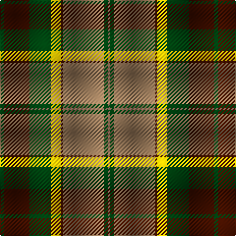

In pattern [GBGYBRGR](/patterns/gbgybrgr/).

This was sourced from weddslist.  It is a [8 stripes tartan](/stripes/stripes8/).

Original link http://www.weddslist.com/cgi-bin/tartans/pg.pl?source=sts

## Thread count
DG/4 DR26 DG22 Y10 DR2 LT42 DG4 LTa/2

## Palette
Each colour and its ΔE from the base-6 reference it is a variant of.

| Colour | Shade | Base | ΔE (OKLab) |
|---|---|---|---|
| DG | <code style="background-color:#004010;">#004010</code> `#004010` | G <code style="background-color:#006400;">#006400</code> | 0.12 |
| DR | <code style="background-color:#401000;">#401000</code> `#401000` | B <code style="background-color:#2C4084;">#2C4084</code> | 0.23 |
| LT | <code style="background-color:#A08060;">#A08060</code> `#A08060` | R <code style="background-color:#C80000;">#C80000</code> | 0.20 |
| LTa | <code style="background-color:#806050;">#806050</code> `#806050` | R <code style="background-color:#C80000;">#C80000</code> | 0.17 |
| Y | <code style="background-color:#F0C000;">#F0C000</code> `#F0C000` | Y <code style="background-color:#E8C000;">#E8C000</code> | 0.01 |

# Sample pattern

ID: /setts/s8/g4b26g22y10b2r42g4ra2-b401000-g004010-ra08060-ra806050-yf0c000/
