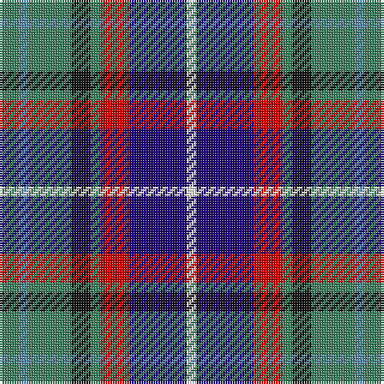

In pattern [GBGKGRBW](/patterns/gbgkgrbw/).

This was sourced from register-of-tartans.  It is a [8 stripes tartan](/stripes/stripes8/).

Original link https://www.tartanregister.gov.uk/tartanDetails.aspx?ref=627

## Attestations

This cloth appears in 2 source records; the oldest owns this page.

- 01/01/1996 — Cherokee (register-of-tartans, [record](https://www.tartanregister.gov.uk/tartanDetails.aspx?ref=627))
- 1996 — Cherokee (Corporate) (tartans-authority, [record](http://www.tartansauthority.com/tartan-ferret/display/4502/))

## Thread count
G/8 B4 G18 K8 G4 R12 DB24 W/4

## Palette
Each colour and its ΔE from the base-6 reference it is a variant of.

| Colour | Shade | Base | ΔE (OKLab) |
|---|---|---|---|
| B | <code style="background-color:#5C8CA8;">#5C8CA8</code> `#5C8CA8` | B <code style="background-color:#2A418A;">#2A418A</code> | 0.23 |
| DB | <code style="background-color:#1C0070;">#1C0070</code> `#1C0070` | B <code style="background-color:#2A418A;">#2A418A</code> | 0.14 |
| DG | <code style="background-color:#003820;">#003820</code> `#003820` | G <code style="background-color:#006100;">#006100</code> | 0.15 |
| G | <code style="background-color:#408060;">#408060</code> `#408060` | G <code style="background-color:#006100;">#006100</code> | 0.14 |
| K | <code style="background-color:#101010;">#101010</code> `#101010` | K <code style="background-color:#000000;">#000000</code> | 0.17 |
| R | <code style="background-color:#C80000;">#C80000</code> `#C80000` | R <code style="background-color:#CC0000;">#CC0000</code> | 0.01 |
| W | <code style="background-color:#F8F8F8;">#F8F8F8</code> `#F8F8F8` | W <code style="background-color:#F7F7F7;">#F7F7F7</code> | 0.00 |

# Sample pattern

## Nearest tartans

The nearest existing variants by ΔTartan distance.

1. [Mitsukoshi](/setts/s10/g12k3w3k3w3k3g13b6ba17r3~b07648c-ba141e46-g808080-k101010-r960000-we0e0e0~x2/) — ΔT 0.64
1. [Reekie (Name)](/setts/s6/k8r12w8g15b30y5~b2c2c80-g006818-k101010-rc80000-we0e0e0-ye8c000~x2/) — ΔT 0.79
1. [Hoban (Name)](/setts/s9/y3w9k3w4k9g15k9b11wa2~b2c2c80-g408060-k101010-wc49cd8-wafcfcfc-ye8c000~x4/) — ΔT 0.82
1. [Caledonian Labrador Retrievers](/setts/s8/r21b4ba5b4r5k21g21y5~b000048-ba501400-g006818-k101010-r9c68a4-yfccc00~x2/) — ΔT 0.90
1. [Waterford County Crest (Fashion)](/setts/s8/w8b5ba30y4b13y13g5ya5~b1c1c50-ba2c2c80-g006818-we0e0e0-ya0a0a0-yabc8c00~x2/) — ΔT 0.94
1. [Caledonian Labrador Retrievers](/setts/s8/r21y4b5y4r5k21g21ya5~b441800-g00643c-k101010-r9c68a4-y86c67c-yae0a126~x2/) — ΔT 0.96
1. [Celtic Women International](/setts/s9/r3b16ra2b2ra12k8g12k12w3~b2c2c80-g006818-k101010-rc80000-rab468ac-we0e0e0~x2/) — ΔT 1.00
1. [Sustainability (Fashion)](/setts/s8/b20k3g18r12ba4r12b15y4~b2c2c80-ba2888c4-g006818-k101010-rc80000-ye8c000~x2/) — ΔT 1.04
1. [Jamestown Parish Church (Corporate)](/setts/s6/r3y2g12k12b14w3~b2c2c80-g006818-k101010-rc80000-we0e0e0-ye8c000~x2/) — ΔT 1.05
1. [East Lothian](/setts/s7/b6ba17bb4ba2k11g3y4~b5c8ca8-ba2c2c80-bb780078-g006818-k101010-ye8c000~x2/) — ΔT 1.09

## Neighbour map

Every grey dot is one of 15726 variants placed by the first two principal components of the ΔTartan feature space (44% of its variance). Red is this tartan; blue dots are its nearest — click one to open its page.

<svg viewBox="0 0 640 380" role="img" style="max-width:100%;height:auto;border:1px solid #e0e0e0;border-radius:4px;display:block" xmlns="http://www.w3.org/2000/svg"><image href="/nn/cloud.v1.png" width="640" height="380"/><a href="/setts/s10/g12k3w3k3w3k3g13b6ba17r3~b07648c-ba141e46-g808080-k101010-r960000-we0e0e0~x2/"><circle cx="93.6" cy="173.1" r="4" fill="#3465a4"><title>Mitsukoshi</title></circle></a><a href="/setts/s6/k8r12w8g15b30y5~b2c2c80-g006818-k101010-rc80000-we0e0e0-ye8c000~x2/"><circle cx="81.4" cy="199.3" r="4" fill="#3465a4"><title>Reekie (Name)</title></circle></a><a href="/setts/s9/y3w9k3w4k9g15k9b11wa2~b2c2c80-g408060-k101010-wc49cd8-wafcfcfc-ye8c000~x4/"><circle cx="47.5" cy="180.1" r="4" fill="#3465a4"><title>Hoban (Name)</title></circle></a><a href="/setts/s8/r21b4ba5b4r5k21g21y5~b000048-ba501400-g006818-k101010-r9c68a4-yfccc00~x2/"><circle cx="59.5" cy="187.2" r="4" fill="#3465a4"><title>Caledonian Labrador Retrievers</title></circle></a><a href="/setts/s8/w8b5ba30y4b13y13g5ya5~b1c1c50-ba2c2c80-g006818-we0e0e0-ya0a0a0-yabc8c00~x2/"><circle cx="96.0" cy="169.2" r="4" fill="#3465a4"><title>Waterford County Crest (Fashion)</title></circle></a><a href="/setts/s8/r21y4b5y4r5k21g21ya5~b441800-g00643c-k101010-r9c68a4-y86c67c-yae0a126~x2/"><circle cx="61.5" cy="186.1" r="4" fill="#3465a4"><title>Caledonian Labrador Retrievers</title></circle></a><a href="/setts/s9/r3b16ra2b2ra12k8g12k12w3~b2c2c80-g006818-k101010-rc80000-rab468ac-we0e0e0~x2/"><circle cx="62.9" cy="177.0" r="4" fill="#3465a4"><title>Celtic Women International</title></circle></a><a href="/setts/s8/b20k3g18r12ba4r12b15y4~b2c2c80-ba2888c4-g006818-k101010-rc80000-ye8c000~x2/"><circle cx="119.2" cy="200.7" r="4" fill="#3465a4"><title>Sustainability (Fashion)</title></circle></a><a href="/setts/s6/r3y2g12k12b14w3~b2c2c80-g006818-k101010-rc80000-we0e0e0-ye8c000~x2/"><circle cx="71.5" cy="200.3" r="4" fill="#3465a4"><title>Jamestown Parish Church (Corporate)</title></circle></a><a href="/setts/s7/b6ba17bb4ba2k11g3y4~b5c8ca8-ba2c2c80-bb780078-g006818-k101010-ye8c000~x2/"><circle cx="132.3" cy="183.1" r="4" fill="#3465a4"><title>East Lothian</title></circle></a><circle cx="87.2" cy="189.0" r="5" fill="#c00000"/></svg>

ID: /setts/s8/g4b2g9k4g2r6ba12w2~b5c8ca8-ba1c0070-g408060-k101010-rc80000-wf8f8f8~x2/
