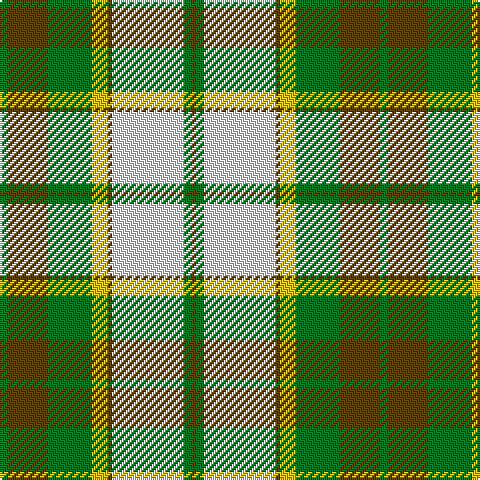

In pattern [GGGYGWGG](/patterns/gggygwgg/).

This was sourced from tartans-authority.  It is a [8 stripes tartan](/stripes/stripes8/).

Original link http://www.tartansauthority.com/tartan-ferret/display/912/

## Thread count
G/4 T20 G22 Y8 T2 LN36 G4 T/2

## Palette
Each colour and its ΔE from the base-6 reference it is a variant of.

| Colour | Shade | Base | ΔE (OKLab) |
|---|---|---|---|
| G | <code style="background-color:#007C1C;">#007C1C</code> `#007C1C` | G <code style="background-color:#006400;">#006400</code> | 0.07 |
| LN | <code style="background-color:#E0E0E0;">#E0E0E0</code> `#E0E0E0` | W <code style="background-color:#F4F4F0;">#F4F4F0</code> | 0.06 |
| T | <code style="background-color:#604000;">#604000</code> `#604000` | G <code style="background-color:#006400;">#006400</code> | 0.14 |
| Y | <code style="background-color:#E8C000;">#E8C000</code> `#E8C000` | Y <code style="background-color:#E8C000;">#E8C000</code> | 0.00 |

# Sample pattern

## Nearest tartans

The nearest existing variants by ΔTartan distance.

1. [Aviemore Check](/setts/s8/g4ga20g22y8ga2w36g4ga2-g006818-ga604000-we0e0e0-ye8c000/) — ΔT 0.24
1. [Aviemore, Check](/setts/s8/g4r20g22y8r2w36g4r2-g008000-r806050-we0e0e0-yf0c000/) — ΔT 0.53
1. [Dogwood](/setts/s8/g6r24g24ra10r2w50g4r2-g008000-r800000-ra906030-we0e0e0/) — ΔT 0.98
1. [Dogwood Trade Tartan Tartan Number: 913. Earliest known date: 1968 The registered tartan of the Dinwiddie Clan. Dinwiddies are normally associated with the Maxwells, but Lord Lyon stated, in 1988, that Dinwiddies were a sept of no other clan. See products available Copyright © Blair Urquhart, Comrie, 2015](/setts/s8/g6r24g24y10r2w50g4r2-g006818-r880000-we0e0e0-ya08858/) — ΔT 1.11
1. [Prince Edward Island, Dress](/setts/s9/g44r4g8r4g8r36w48r2y6-g006818-r880000-we0e0e0-yd09800/) — ΔT 1.13
1. [Dogwood](/setts/s8/g16b40g40r24b4w104g8b4-b381c0c-g004800-rb07430-wf8f4d0/) — ΔT 1.20
1. [National Trust](/setts/s8/g4b16g16y6b2w24g4b2-b441800-g006818-we0e0e0-ya08858/) — ΔT 1.22
1. [Bannock Bane M.406](/setts/s8/g8ga6g42ga4w28r44ga6r8-g005020-ga604000-rbe7832-we0e0e0/) — ΔT 1.27
1. [Gigha, Green (Dance)](/setts/s8/b8w4b2w36g36ga36y6ga8-b2c2c80-g003820-ga38885c-wf0e0c8-ye8d468/) — ΔT 1.35
1. [Scott, dress](/setts/s11/g8r4k2w60r20g28r8g10w4g10r8-g008000-k000000-rc00000-we0e0e0/) — ΔT 1.38

## Neighbour map

Every grey dot is one of 15726 variants placed by the first two principal components of the ΔTartan feature space (44% of its variance). Red is this tartan; blue dots are its nearest — click one to open its page.

<svg viewBox="0 0 640 380" role="img" style="max-width:100%;height:auto;border:1px solid #e0e0e0;border-radius:4px;display:block" xmlns="http://www.w3.org/2000/svg"><image href="/nn/cloud.v1.png" width="640" height="380"/><a href="/setts/s8/g4ga20g22y8ga2w36g4ga2-g006818-ga604000-we0e0e0-ye8c000/"><circle cx="184.9" cy="147.4" r="4" fill="#3465a4"><title>Aviemore Check</title></circle></a><a href="/setts/s8/g4r20g22y8r2w36g4r2-g008000-r806050-we0e0e0-yf0c000/"><circle cx="198.7" cy="151.9" r="4" fill="#3465a4"><title>Aviemore, Check</title></circle></a><a href="/setts/s8/g6r24g24ra10r2w50g4r2-g008000-r800000-ra906030-we0e0e0/"><circle cx="220.3" cy="126.2" r="4" fill="#3465a4"><title>Dogwood</title></circle></a><a href="/setts/s8/g6r24g24y10r2w50g4r2-g006818-r880000-we0e0e0-ya08858/"><circle cx="220.4" cy="126.0" r="4" fill="#3465a4"><title>Dogwood Trade Tartan Tartan Number: 913. Earliest known date: 1968 The registered tartan of the Dinwiddie Clan. Dinwiddies are normally associated with the Maxwells, but Lord Lyon stated, in 1988, that Dinwiddies were a sept of no other clan. See products available Copyright © Blair Urquhart, Comrie, 2015</title></circle></a><a href="/setts/s9/g44r4g8r4g8r36w48r2y6-g006818-r880000-we0e0e0-yd09800/"><circle cx="211.3" cy="127.8" r="4" fill="#3465a4"><title>Prince Edward Island, Dress</title></circle></a><a href="/setts/s8/g16b40g40r24b4w104g8b4-b381c0c-g004800-rb07430-wf8f4d0/"><circle cx="214.9" cy="120.2" r="4" fill="#3465a4"><title>Dogwood</title></circle></a><a href="/setts/s8/g4b16g16y6b2w24g4b2-b441800-g006818-we0e0e0-ya08858/"><circle cx="142.2" cy="170.5" r="4" fill="#3465a4"><title>National Trust</title></circle></a><a href="/setts/s8/g8ga6g42ga4w28r44ga6r8-g005020-ga604000-rbe7832-we0e0e0/"><circle cx="178.6" cy="178.4" r="4" fill="#3465a4"><title>Bannock Bane M.406</title></circle></a><a href="/setts/s8/b8w4b2w36g36ga36y6ga8-b2c2c80-g003820-ga38885c-wf0e0c8-ye8d468/"><circle cx="132.3" cy="140.2" r="4" fill="#3465a4"><title>Gigha, Green (Dance)</title></circle></a><a href="/setts/s11/g8r4k2w60r20g28r8g10w4g10r8-g008000-k000000-rc00000-we0e0e0/"><circle cx="232.4" cy="102.3" r="4" fill="#3465a4"><title>Scott, dress</title></circle></a><circle cx="187.3" cy="148.3" r="5" fill="#c00000"/></svg>

ID: /setts/s8/g4ga20g22y8ga2w36g4ga2-g007c1c-ga604000-we0e0e0-ye8c000/
