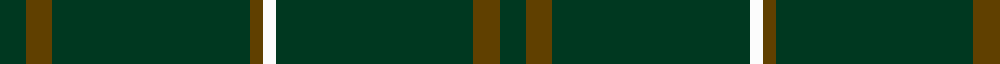
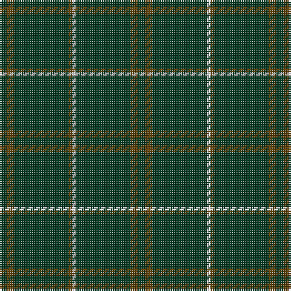

In pattern [GGGGWGGG](/patterns/ggggwggg/).

This was sourced from register-of-tartans.  It is a [8 stripes tartan](/stripes/stripes8/).

Original link https://www.tartanregister.gov.uk/tartanDetails.aspx?ref=200

## Thread count
DG/4 T4 DG30 T2 W2 DG30 T4 DG/4

## Palette
Each colour and its ΔE from the base-6 reference it is a variant of.

| Colour | Shade | Base | ΔE (OKLab) |
|---|---|---|---|
| DG | <code style="background-color:#003820;">#003820</code> `#003820` | G <code style="background-color:#006100;">#006100</code> | 0.15 |
| T | <code style="background-color:#604000;">#604000</code> `#604000` | G <code style="background-color:#006100;">#006100</code> | 0.14 |
| W | <code style="background-color:#FCFCFC;">#FCFCFC</code> `#FCFCFC` | W <code style="background-color:#F7F7F7;">#F7F7F7</code> | 0.01 |

# Sample pattern

## Nearest tartans

The nearest existing variants by ΔTartan distance.

1. [MacNab, Ancient](/setts/s5/g124r14k8r8g124-g005020-k101010-rdc0000/) — ΔT 1.88
1. [Welsh National](/setts/s8/r16g6r8g88w8g88r8g6-g00643c-rc8002c-we0e0e0/) — ΔT 1.92
1. [Renwick](/setts/s10/k6g4k40r4k24g4k8g4k12g4-g006818-k101010-rc80000/) — ΔT 2.06
1. [Langhein Family Tartan Tartan Number: 3235. Earliest known date: April 2002 Based on Black Watch Sett See products available Copyright © Blair Urquhart, Comrie, 2015](/setts/s7/k80g30k20r4k20y4k20-g003820-k101010-rc80000-ye8c000/) — ΔT 2.10
1. [Owen Welsh Name Tartan Tartan Number: 5750. Earliest known date: 2002 The tartan for this Welsh surname and its variations, Bowen, Ifan, is actually woven in Wales at the Cambrian Woollen Mill, weaving on the same site since 1830. This tartan differs from many traditional patterns in that the warp and weft differ, giving the finished worsted wool cloth more of a predominant stripe, vertically noticeable in the finished Kilt, or Cilt in Wales. See products available Copyright © Blair Urquhart, Comrie, 2015](/setts/s10/g6b2g4r2g6ba6g4ba4g36b4-b003c64-ba002048-g006818-rc80000/) — ΔT 2.14
1. [Menzies Hunting](/setts/s8/g96r8g4r8g12r4g6r18-g11450d-raa0000/) — ΔT 2.19
1. [Menzies Hunting](/setts/s8/g48r4g2r4g6r2g3r9-g11450d-raa0000/) — ΔT 2.19
1. [Walters (Personal)](/setts/s6/g8b8g80g8g8b4-b6c0070-g006818/) — ΔT 2.21
1. [Langhein, Alex (Personal)](/setts/s8/k80g30k20r4k20y4k20y4-g003820-k101010-rb03000-yd09800/) — ΔT 2.21
1. [Langhein, Alex (Personal)](/setts/s7/k80g30k20r4k20y4k20-g005830-k101010-rb03000-yd09800/) — ΔT 2.21

## Neighbour map

Every grey dot is one of 15726 variants placed by the first two principal components of the ΔTartan feature space (44% of its variance). Red is this tartan; blue dots are its nearest — click one to open its page.

<svg viewBox="0 0 640 380" role="img" style="max-width:100%;height:auto;border:1px solid #e0e0e0;border-radius:4px;display:block" xmlns="http://www.w3.org/2000/svg"><image href="/nn/cloud.v1.png" width="640" height="380"/><a href="/setts/s5/g124r14k8r8g124-g005020-k101010-rdc0000/"><circle cx="626.0" cy="259.0" r="4" fill="#3465a4"><title>MacNab, Ancient</title></circle></a><a href="/setts/s8/r16g6r8g88w8g88r8g6-g00643c-rc8002c-we0e0e0/"><circle cx="576.1" cy="204.3" r="4" fill="#3465a4"><title>Welsh National</title></circle></a><a href="/setts/s10/k6g4k40r4k24g4k8g4k12g4-g006818-k101010-rc80000/"><circle cx="562.0" cy="232.3" r="4" fill="#3465a4"><title>Renwick</title></circle></a><a href="/setts/s7/k80g30k20r4k20y4k20-g003820-k101010-rc80000-ye8c000/"><circle cx="567.4" cy="225.7" r="4" fill="#3465a4"><title>Langhein Family Tartan Tartan Number: 3235. Earliest known date: April 2002 Based on Black Watch Sett See products available Copyright © Blair Urquhart, Comrie, 2015</title></circle></a><a href="/setts/s10/g6b2g4r2g6ba6g4ba4g36b4-b003c64-ba002048-g006818-rc80000/"><circle cx="533.9" cy="185.6" r="4" fill="#3465a4"><title>Owen Welsh Name Tartan Tartan Number: 5750. Earliest known date: 2002 The tartan for this Welsh surname and its variations, Bowen, Ifan, is actually woven in Wales at the Cambrian Woollen Mill, weaving on the same site since 1830. This tartan differs from many traditional patterns in that the warp and weft differ, giving the finished worsted wool cloth more of a predominant stripe, vertically noticeable in the finished Kilt, or Cilt in Wales. See products available Copyright © Blair Urquhart, Comrie, 2015</title></circle></a><a href="/setts/s8/g96r8g4r8g12r4g6r18-g11450d-raa0000/"><circle cx="611.3" cy="197.8" r="4" fill="#3465a4"><title>Menzies Hunting</title></circle></a><a href="/setts/s8/g48r4g2r4g6r2g3r9-g11450d-raa0000/"><circle cx="611.3" cy="197.8" r="4" fill="#3465a4"><title>Menzies Hunting</title></circle></a><a href="/setts/s6/g8b8g80g8g8b4-b6c0070-g006818/"><circle cx="626.0" cy="220.1" r="4" fill="#3465a4"><title>Walters (Personal)</title></circle></a><a href="/setts/s8/k80g30k20r4k20y4k20y4-g003820-k101010-rb03000-yd09800/"><circle cx="542.8" cy="206.3" r="4" fill="#3465a4"><title>Langhein, Alex (Personal)</title></circle></a><a href="/setts/s7/k80g30k20r4k20y4k20-g005830-k101010-rb03000-yd09800/"><circle cx="547.2" cy="214.8" r="4" fill="#3465a4"><title>Langhein, Alex (Personal)</title></circle></a><circle cx="626.0" cy="234.4" r="5" fill="#c00000"/></svg>

ID: /setts/s8/g4ga4g30ga2w2g30ga4g4-g003820-ga604000-wfcfcfc/
