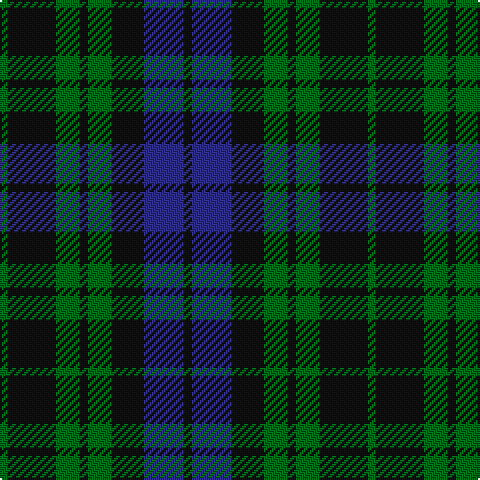

In pattern [GKGKGKBK](/patterns/gkgkgkbk/).

This was sourced from tartans-authority.  It is a [8 stripes tartan](/stripes/stripes8/).

Original link http://www.tartansauthority.com/tartan-ferret/display/10011/

## Attestations

This cloth appears in 2 source records; the oldest owns this page.

- Apr. 2009 — McCormick, Keith (Personal) (tartans-authority, [record](http://www.tartansauthority.com/tartan-ferret/display/10011/))
- undated — McCormick, Keith (Personal) Canadian Personal Tartan Tartan Number: 10011. Earliest known date: Apr. 2009 A personal tartan for Keith McCormick and his family. Blue represents the Nashwaak River, a well known salmon river in New Brunswick; green is for the forest through which the river flows and since the designer is a retired barrister, his gown is represented by the black. This tartan is for the use of Keith McCormick, his immediate family and those with his permission during his lifetime. After Keith McCormick's death, this tartan can be worn by any of the name McCormick or its variants. This tartan should only be woven by permission of Keith McCormick during his lifetime. After Keith McCormick's death, it may be woven by anyone. See products available Copyright © Blair Urquhart, Comrie, 2015 (house-of-tartan, [record](http://www.house-of-tartan.scotland.net/house/TartanViewjs.asp?colr=Def&tnam=10011))

## Thread count
G/4 K24 G12 K4 G12 K16 DB20 K/4

## Palette
Each colour and its ΔE from the base-6 reference it is a variant of.

| Colour | Shade | Base | ΔE (OKLab) |
|---|---|---|---|
| DB | <code style="background-color:#2C2C80;">#2C2C80</code> `#2C2C80` | B <code style="background-color:#2C4084;">#2C4084</code> | 0.05 |
| G | <code style="background-color:#006818;">#006818</code> `#006818` | G <code style="background-color:#006400;">#006400</code> | 0.02 |
| K | <code style="background-color:#101010;">#101010</code> `#101010` | K <code style="background-color:#000000;">#000000</code> | 0.17 |

# Sample pattern

ID: /setts/s8/g4k24g12k4g12k16b20k4-b2c2c80-g006818-k101010/
