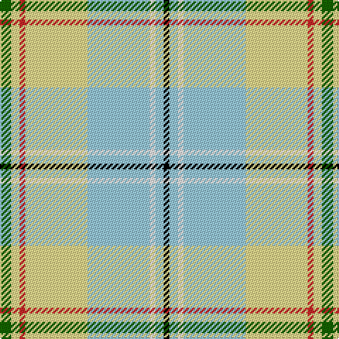

This page is one **sett** — a single exact thread-count. It belongs to the [tartan](/tartans/g4ly3r2ly22lb22w2lb3k2/)
(the same proportion at any scale), whose colour order is pattern [GYRYWWWK](/stripes/gyrywwwk/).

Sourced from register-of-tartans.  It is a [8 stripe tartan](/stripes/stripes8/).

Original link https://www.tartanregister.gov.uk/tartanDetails.aspx?ref=11147

## Also known as

This cloth is also recorded under:

- Pardo, Luis Alejandro Aguilar

2 attestations — the source records this cloth was collapsed from (oldest owns this page)

<ul>
<li>16/02/2014 — Aguilar Pardo, Luis Alejandro (Personal) (register-of-tartans, <a href="https://www.tartanregister.gov.uk/tartanDetails.aspx?ref=11147">record</a>)</li>
<li>2014 — Pardo, Luis Alejandro Aguilar (tartans-authority, <a href="http://www.tartansauthority.com/tartan-ferret/display/11147/">record</a>)</li>
</ul>

## Register references

External register numbers recorded for this tartan.

- Scottish Register of Tartans: [11147](https://www.tartanregister.gov.uk/tartanDetails.aspx?ref=11147)

## Thread count
G/8 LY6 R4 LY44 LB44 W4 LB6 K/4

## Palette
Each colour and the base-6 reference it is a variant of.

| Colour | Shade | Base |
|---|---|---|
| G | <code style="background-color:#146400;">#146400</code> `oklch(43.9% 0.144 140.9)` <small>#146400</small> | G <code style="background-color:#006100;">#006100</code> |
| K | <code style="background-color:#000000;">#000000</code> `oklch(0.0% 0.000 0.0)` <small>#000000</small> | K <code style="background-color:#000000;">#000000</code> |
| LB | <code style="background-color:#98C8E8;">#98C8E8</code> `oklch(81.0% 0.068 237.9)` <small>#98C8E8</small> | W <code style="background-color:#F7F7F7;">#F7F7F7</code> |
| LY | <code style="background-color:#F8E38C;">#F8E38C</code> `oklch(91.4% 0.110 96.2)` <small>#F8E38C</small> | Y <code style="background-color:#F2BF00;">#F2BF00</code> |
| R | <code style="background-color:#C82828;">#C82828</code> `oklch(54.2% 0.196 26.8)` <small>#C82828</small> | R <code style="background-color:#CC0000;">#CC0000</code> |
| W | <code style="background-color:#FFFFFF;">#FFFFFF</code> `oklch(100.0% 0.000 89.9)` <small>#FFFFFF</small> | W <code style="background-color:#F7F7F7;">#F7F7F7</code> |

# Sample pattern

## Nearest tartans

The nearest existing variants by ΔTartan distance, with this tartan at the top so the swatches line up against it.

ΔTartan

Tartan

Sett

—

<a href="/ttd/edit/#slug=g4ly3r2ly22lb22w2lb3k2~x2">Aguilar Pardo, Luis Alejandro (Personal)</a> <a class="nn-out" href="/setts/s8/g4ly3r2ly22lb22w2lb3k2~x2/" title="open its dictionary page">↗</a>

1.29

<a href="/ttd/edit/#slug=r9w27k7w45lb60dg4lo5">Ch. Supt. Everett and Mrs Julene Sum</a> <a class="nn-out" href="/setts/s7/r9w27k7w45lb60dg4lo5/" title="open its dictionary page">↗</a>

1.32

<a href="/ttd/edit/#slug=t4t24ly5g2t3db5ly33db2~x2">Los Angeles (District)</a> <a class="nn-out" href="/setts/s8/t4t24ly5g2t3db5ly33db2~x2/" title="open its dictionary page">↗</a>

1.34

<a href="/ttd/edit/#slug=w43k5r3g5ly27dp5~x2">Reekie, Charlene (Personal)</a> <a class="nn-out" href="/setts/s6/w43k5r3g5ly27dp5~x2/" title="open its dictionary page">↗</a>

1.36

<a href="/ttd/edit/#slug=r9w25k7w45lt60g4ly5">Ch. Supt. Everett and Mrs Julene Summerfield Dress</a> <a class="nn-out" href="/setts/s7/r9w25k7w45lt60g4ly5/" title="open its dictionary page">↗</a>

1.37

<a href="/ttd/edit/#slug=w26lb9k2lb2w2lb2o11lb8ly2o2r2~x2">Manchester Blues Dress (Comm)</a> <a class="nn-out" href="/setts/s11/w26lb9k2lb2w2lb2o11lb8ly2o2r2~x2/" title="open its dictionary page">↗</a>

1.47

<a href="/ttd/edit/#slug=lb26w9k2w2lb2w2o11w8ly2o2r2~x2">Manchester Blues Modern</a> <a class="nn-out" href="/setts/s11/lb26w9k2w2lb2w2o11w8ly2o2r2~x2/" title="open its dictionary page">↗</a>

1.50

<a href="/ttd/edit/#slug=w43k5r3dg5ly27m5~x2">Reekie, Charlene</a> <a class="nn-out" href="/setts/s6/w43k5r3dg5ly27m5~x2/" title="open its dictionary page">↗</a>

1.52

<a href="/ttd/edit/#slug=g9k2r4g14w3lp3w23g5ly3~x2">Taylor, dress</a> <a class="nn-out" href="/setts/s9/g9k2r4g14w3lp3w23g5ly3~x2/" title="open its dictionary page">↗</a>

1.56

<a href="/ttd/edit/#slug=g3w29g3db3g3db6g13ly3r2~x2">Nova Scotia, dress</a> <a class="nn-out" href="/setts/s9/g3w29g3db3g3db6g13ly3r2~x2/" title="open its dictionary page">↗</a>

1.57

<a href="/ttd/edit/#slug=g4y4g2w36y14w2lt4g7m5w3~x2">Rikaco Eve</a> <a class="nn-out" href="/setts/s10/g4y4g2w36y14w2lt4g7m5w3~x2/" title="open its dictionary page">↗</a>

## Neighbour map

Every grey dot is one of 14299 variants placed by the first two principal components of the ΔTartan feature space (44% of its variance). Red is this tartan; blue dots are its nearest — click one to open its page.

<svg viewBox="0 0 640 380" role="img" style="max-width:100%;height:auto;border:1px solid #e0e0e0;border-radius:4px;display:block" xmlns="http://www.w3.org/2000/svg"><image href="/nn/cloud.v1.png" width="640" height="380"/><a href="/setts/s7/r9w27k7w45lb60dg4lo5/"><circle cx="207.3" cy="125.2" r="4" fill="#3465a4"><title>Ch. Supt. Everett and Mrs Julene Sum</title></circle></a><a href="/setts/s8/t4t24ly5g2t3db5ly33db2~x2/"><circle cx="255.4" cy="119.4" r="4" fill="#3465a4"><title>Los Angeles (District)</title></circle></a><a href="/setts/s6/w43k5r3g5ly27dp5~x2/"><circle cx="214.7" cy="119.0" r="4" fill="#3465a4"><title>Reekie, Charlene (Personal)</title></circle></a><a href="/setts/s7/r9w25k7w45lt60g4ly5/"><circle cx="204.2" cy="125.0" r="4" fill="#3465a4"><title>Ch. Supt. Everett and Mrs Julene Summerfield Dress</title></circle></a><a href="/setts/s11/w26lb9k2lb2w2lb2o11lb8ly2o2r2~x2/"><circle cx="188.9" cy="105.6" r="4" fill="#3465a4"><title>Manchester Blues Dress (Comm)</title></circle></a><a href="/setts/s11/lb26w9k2w2lb2w2o11w8ly2o2r2~x2/"><circle cx="191.5" cy="108.6" r="4" fill="#3465a4"><title>Manchester Blues Modern</title></circle></a><a href="/setts/s6/w43k5r3dg5ly27m5~x2/"><circle cx="209.0" cy="113.9" r="4" fill="#3465a4"><title>Reekie, Charlene</title></circle></a><a href="/setts/s9/g9k2r4g14w3lp3w23g5ly3~x2/"><circle cx="163.4" cy="130.6" r="4" fill="#3465a4"><title>Taylor, dress</title></circle></a><a href="/setts/s9/g3w29g3db3g3db6g13ly3r2~x2/"><circle cx="210.8" cy="120.6" r="4" fill="#3465a4"><title>Nova Scotia, dress</title></circle></a><a href="/setts/s10/g4y4g2w36y14w2lt4g7m5w3~x2/"><circle cx="240.8" cy="96.5" r="4" fill="#3465a4"><title>Rikaco Eve</title></circle></a><circle cx="193.6" cy="121.4" r="5" fill="#c00000"/></svg>

ID: /setts/s8/g4ly3r2ly22lb22w2lb3k2~x2/
