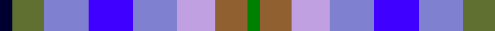

In pattern [GRWBBBGK](/patterns/grwbbbgk/).

This was sourced from weddslist.  It is a [8 stripes tartan](/stripes/stripes8/).

Original link http://www.weddslist.com/cgi-bin/tartans/pg.pl?source=sts

## Thread count
DB/4 G10 Ba14 B14 Ba14 LP12 LT10 Ga/4

## Palette
Each colour and its ΔE from the base-6 reference it is a variant of.

| Colour | Shade | Base | ΔE (OKLab) |
|---|---|---|---|
| B | <code style="background-color:#4000FF;">#4000FF</code> `#4000FF` | B <code style="background-color:#2A418A;">#2A418A</code> | 0.19 |
| Ba | <code style="background-color:#8080D0;">#8080D0</code> `#8080D0` | B <code style="background-color:#2A418A;">#2A418A</code> | 0.24 |
| DB | <code style="background-color:#000030;">#000030</code> `#000030` | K <code style="background-color:#000000;">#000000</code> | 0.17 |
| G | <code style="background-color:#607030;">#607030</code> `#607030` | G <code style="background-color:#006100;">#006100</code> | 0.11 |
| Ga | <code style="background-color:#008000;">#008000</code> `#008000` | G <code style="background-color:#006100;">#006100</code> | 0.10 |
| LP | <code style="background-color:#C0A0E0;">#C0A0E0</code> `#C0A0E0` | W <code style="background-color:#F7F7F7;">#F7F7F7</code> | 0.24 |
| LT | <code style="background-color:#906030;">#906030</code> `#906030` | R <code style="background-color:#CC0000;">#CC0000</code> | 0.15 |

# Sample pattern

## Nearest tartans

The nearest existing variants by ΔTartan distance.

1. [Scotia](/setts/s8/b6ba6w4r16ba6b22bb14g6-b8080d0-ba000050-bb800080-g008000-r806050-we0e0e0/) — ΔT 1.80
1. [Union Club of British Columbia](/setts/s12/r8k4b16w16wa4w16ba16k4ba16w8ba16y4-b505050-ba3c82af-k101010-r888888-w98c8e8-wae0e0e0-ye8c000/) — ΔT 1.83
1. [Scotia Trade Tartan Tartan Number: 89. Earliest known date: 1968 Originally designed by James Allan of East Kilbride and woven by him in 1850. The sett was reconstructed by David Easton, Galashiels, as a National tartan for Scotland. It did not catch on and the tartan is rarely seen today. See products available Copyright © Blair Urquhart, Comrie, 2015](/setts/s8/b6ba6w4g16ba6b22bb14ga6-b2888c4-ba202060-bb780078-g604000-ga006818-we0e0e0/) — ΔT 1.89
1. [New York City](/setts/s7/b16ba24k8ba24r24g32ra8-b1474b4-ba2c2c80-g006818-k101010-r888888-raa00000/) — ΔT 1.93
1. [O'Sullivan](/setts/s11/b24k16b40w8ba40g16ba24g36r8g16y8-b1474b4-ba1c0070-g408060-k101010-rc80000-wfcfcfc-ye8c000/) — ΔT 1.95
1. [DunBroch](/setts/s11/b8ba16k4ba10w4ba10g16bb14g4bb14g6-b483d8b-ba539dc2-bb700038-g00572b-k101010-we1cdb2/) — ΔT 1.99
1. [Stewarton (Fashion)](/setts/s8/k4g12r12b12r12y12ra12k4-b1c0070-g006818-k101010-r888888-raa07c58-ya0a0a0/) — ΔT 2.03
1. [Blackdown Hills Corporate Tartan Tartan Number: 6711. Earliest known date: 1991 The Blackdown Hills on the Devon/Somerset border were designated as an Area of Outstanding Natural Beauty (AONB) in 1991 and this tartan was designed to celebrate that occasion. Designed at Coldharbour Mill at Cullompton in Devon. See products available Copyright © Blair Urquhart, Comrie, 2015](/setts/s7/k32b32y8b32r32ba32w8-b34506c-ba202060-k101010-rc85858-wf8f8f8-yd87c00/) — ΔT 2.06
1. [Devon Companion](/setts/s7/r20b16y4b16k16g16w4-b2c2c80-g603800-k101010-r888888-wfcfcfc-ye8c000/) — ΔT 2.12
1. [Saltcoats (Saskatchewan)](/setts/s11/b6y6g30ba16w16b12g30ba12y6ga12r6-b141e46-ba0596fa-g808080-ga003c14-rdc0000-we0e0e0-ye8c000/) — ΔT 2.18

## Neighbour map

Every grey dot is one of 15726 variants placed by the first two principal components of the ΔTartan feature space (44% of its variance). Red is this tartan; blue dots are its nearest — click one to open its page.

<svg viewBox="0 0 640 380" role="img" style="max-width:100%;height:auto;border:1px solid #e0e0e0;border-radius:4px;display:block" xmlns="http://www.w3.org/2000/svg"><image href="/nn/cloud.v1.png" width="640" height="380"/><a href="/setts/s8/b6ba6w4r16ba6b22bb14g6-b8080d0-ba000050-bb800080-g008000-r806050-we0e0e0/"><circle cx="75.7" cy="199.7" r="4" fill="#3465a4"><title>Scotia</title></circle></a><a href="/setts/s12/r8k4b16w16wa4w16ba16k4ba16w8ba16y4-b505050-ba3c82af-k101010-r888888-w98c8e8-wae0e0e0-ye8c000/"><circle cx="49.4" cy="195.6" r="4" fill="#3465a4"><title>Union Club of British Columbia</title></circle></a><a href="/setts/s8/b6ba6w4g16ba6b22bb14ga6-b2888c4-ba202060-bb780078-g604000-ga006818-we0e0e0/"><circle cx="82.2" cy="208.0" r="4" fill="#3465a4"><title>Scotia Trade Tartan Tartan Number: 89. Earliest known date: 1968 Originally designed by James Allan of East Kilbride and woven by him in 1850. The sett was reconstructed by David Easton, Galashiels, as a National tartan for Scotland. It did not catch on and the tartan is rarely seen today. See products available Copyright © Blair Urquhart, Comrie, 2015</title></circle></a><a href="/setts/s7/b16ba24k8ba24r24g32ra8-b1474b4-ba2c2c80-g006818-k101010-r888888-raa00000/"><circle cx="72.9" cy="259.1" r="4" fill="#3465a4"><title>New York City</title></circle></a><a href="/setts/s11/b24k16b40w8ba40g16ba24g36r8g16y8-b1474b4-ba1c0070-g408060-k101010-rc80000-wfcfcfc-ye8c000/"><circle cx="15.1" cy="187.3" r="4" fill="#3465a4"><title>O'Sullivan</title></circle></a><a href="/setts/s11/b8ba16k4ba10w4ba10g16bb14g4bb14g6-b483d8b-ba539dc2-bb700038-g00572b-k101010-we1cdb2/"><circle cx="52.3" cy="220.0" r="4" fill="#3465a4"><title>DunBroch</title></circle></a><a href="/setts/s8/k4g12r12b12r12y12ra12k4-b1c0070-g006818-k101010-r888888-raa07c58-ya0a0a0/"><circle cx="14.0" cy="260.7" r="4" fill="#3465a4"><title>Stewarton (Fashion)</title></circle></a><a href="/setts/s7/k32b32y8b32r32ba32w8-b34506c-ba202060-k101010-rc85858-wf8f8f8-yd87c00/"><circle cx="56.6" cy="243.3" r="4" fill="#3465a4"><title>Blackdown Hills Corporate Tartan Tartan Number: 6711. Earliest known date: 1991 The Blackdown Hills on the Devon/Somerset border were designated as an Area of Outstanding Natural Beauty (AONB) in 1991 and this tartan was designed to celebrate that occasion. Designed at Coldharbour Mill at Cullompton in Devon. See products available Copyright © Blair Urquhart, Comrie, 2015</title></circle></a><a href="/setts/s7/r20b16y4b16k16g16w4-b2c2c80-g603800-k101010-r888888-wfcfcfc-ye8c000/"><circle cx="50.1" cy="229.0" r="4" fill="#3465a4"><title>Devon Companion</title></circle></a><a href="/setts/s11/b6y6g30ba16w16b12g30ba12y6ga12r6-b141e46-ba0596fa-g808080-ga003c14-rdc0000-we0e0e0-ye8c000/"><circle cx="50.0" cy="169.5" r="4" fill="#3465a4"><title>Saltcoats (Saskatchewan)</title></circle></a><circle cx="14.0" cy="232.3" r="5" fill="#c00000"/></svg>

ID: /setts/s8/g4r10w12b14ba14b14ga10k4-b8080d0-ba4000ff-g008000-ga607030-k000030-r906030-wc0a0e0/
