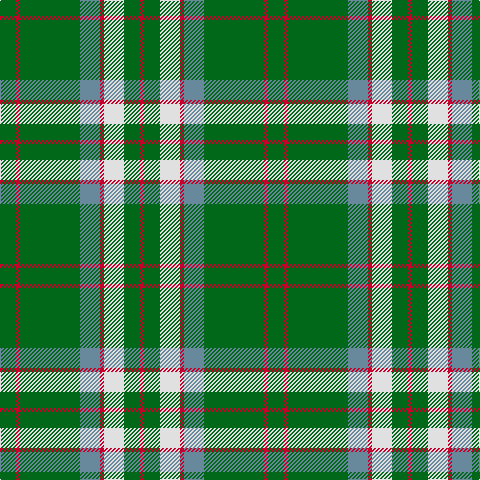

In pattern [GRGBRWGR](/stripes/grgbrwgr/).

This was sourced from tartans-authority.  It is a [8 stripe tartan](/stripes/stripes8/).

Original link http://www.tartansauthority.com/tartan-ferret/display/10271/

## Thread count
G/16 R4 G60 B20 R4 LN20 G16 R/4

## Palette
Each colour and the base-6 reference it is a variant of.

| Colour | Shade | Base |
|---|---|---|
| B | <code style="background-color:#68889C;">#68889C</code> `oklch(61.0% 0.047 236.0)` <small>#68889C</small> | B <code style="background-color:#2A418A;">#2A418A</code> |
| G | <code style="background-color:#006818;">#006818</code> `oklch(45.0% 0.142 145.0)` <small>#006818</small> | G <code style="background-color:#006100;">#006100</code> |
| LN | <code style="background-color:#E0E0E0;">#E0E0E0</code> `oklch(90.7% 0.000 89.9)` <small>#E0E0E0</small> | W <code style="background-color:#F7F7F7;">#F7F7F7</code> |
| R | <code style="background-color:#C8002C;">#C8002C</code> `oklch(52.6% 0.212 22.0)` <small>#C8002C</small> | R <code style="background-color:#CC0000;">#CC0000</code> |

# Sample pattern

## Nearest tartans

The nearest existing variants by ΔTartan distance.

1. [Duke of York Hunting](/setts/s8/g99db20w8db30ly8db10ly8g46/) — ΔT 0.94
1. [MacKintosh, hunting](/setts/s7/db1r3g11r2db5g11ly1~x2/) — ΔT 1.03
1. [Leach Hunting](/setts/s7/k3lb1g15g6k2dr3lb2~x2/) — ΔT 1.13
1. [Sir Billi (Corporate)](/setts/s6/r8g12w5k11g42k3~x2/) — ΔT 1.17
1. [Welsh Assembly (Fashion)](/setts/s8/g5o9g4w5g30r2g4r2~x2/) — ΔT 1.24
1. [Arkansas](/setts/s7/g3w1g12r6g3k3g2~x4/) — ΔT 1.25
1. [Monroig, Eric (Personal)](/setts/s12/r2b2g16ly1b6r1ly1r1b6ly1g16ly2~x2/) — ΔT 1.25
1. [Island Weavers (Corporate)](/setts/s10/g33db2g33r2db12r12g4r2g4w3~x2/) — ΔT 1.29
1. [MacKintosh Hunting](/setts/s7/ly2g12db6r3g12r4db1~x2/) — ΔT 1.32
1. [Scottish Scouts](/setts/s7/r3g22db16g14r2g6ly1~x2/) — ΔT 1.35

## Neighbour map

Every grey dot is one of 14299 variants placed by the first two principal components of the ΔTartan feature space (44% of its variance). Red is this tartan; blue dots are its nearest — click one to open its page.

<svg viewBox="0 0 640 380" role="img" style="max-width:100%;height:auto;border:1px solid #e0e0e0;border-radius:4px;display:block" xmlns="http://www.w3.org/2000/svg"><image href="/nn/cloud.v1.png" width="640" height="380"/><a href="/setts/s8/g99db20w8db30ly8db10ly8g46/"><circle cx="357.0" cy="188.3" r="4" fill="#3465a4"><title>Duke of York Hunting</title></circle></a><a href="/setts/s7/db1r3g11r2db5g11ly1~x2/"><circle cx="365.2" cy="217.4" r="4" fill="#3465a4"><title>MacKintosh, hunting</title></circle></a><a href="/setts/s7/k3lb1g15g6k2dr3lb2~x2/"><circle cx="351.9" cy="179.7" r="4" fill="#3465a4"><title>Leach Hunting</title></circle></a><a href="/setts/s6/r8g12w5k11g42k3~x2/"><circle cx="373.7" cy="191.9" r="4" fill="#3465a4"><title>Sir Billi (Corporate)</title></circle></a><a href="/setts/s8/g5o9g4w5g30r2g4r2~x2/"><circle cx="434.0" cy="181.9" r="4" fill="#3465a4"><title>Welsh Assembly (Fashion)</title></circle></a><a href="/setts/s7/g3w1g12r6g3k3g2~x4/"><circle cx="367.1" cy="208.6" r="4" fill="#3465a4"><title>Arkansas</title></circle></a><a href="/setts/s12/r2b2g16ly1b6r1ly1r1b6ly1g16ly2~x2/"><circle cx="324.3" cy="143.9" r="4" fill="#3465a4"><title>Monroig, Eric (Personal)</title></circle></a><a href="/setts/s10/g33db2g33r2db12r12g4r2g4w3~x2/"><circle cx="414.5" cy="167.7" r="4" fill="#3465a4"><title>Island Weavers (Corporate)</title></circle></a><a href="/setts/s7/ly2g12db6r3g12r4db1~x2/"><circle cx="322.7" cy="216.9" r="4" fill="#3465a4"><title>MacKintosh Hunting</title></circle></a><a href="/setts/s7/r3g22db16g14r2g6ly1~x2/"><circle cx="408.6" cy="202.2" r="4" fill="#3465a4"><title>Scottish Scouts</title></circle></a><circle cx="353.4" cy="180.5" r="5" fill="#c00000"/></svg>

ID: /setts/s8/g4r1g15t5r1w5g4r1~x4/
