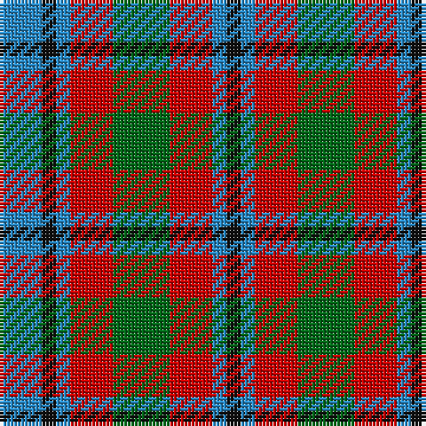

**Bands:** [KBRGRBKB](/stripes/kbrgrbkb/) · **Stripes:** [K T R G R T K T](/stripes/stripes8/) K T R G R T K T

This was sourced from register-of-tartans.  It is a [8 band tartan](/bands/bands8/).

Original link https://www.tartanregister.gov.uk/tartanDetails.aspx?ref=4745

## Also known as

This cloth is also recorded under:

- Wilson's, No 214

## Register references

External register numbers recorded for this tartan.

- Scottish Register of Tartans: [4745](https://www.tartanregister.gov.uk/tartanDetails.aspx?ref=4745)
- Scottish Tartans Authority (ITI): 238
- Scottish Tartans World Register: 238

## Thread count
B/12 K4 B4 R12 G16 R12 B4 K/4

## Palette
Each colour and its ΔE from the base-6 reference it is a variant of.

| Colour | Shade | Base | ΔE (OKLab) |
|---|---|---|---|
| B | <code style="background-color:#2888C4;">#2888C4</code> `#2888C4` | B <code style="background-color:#2A418A;">#2A418A</code> | 0.21 |
| DG | <code style="background-color:#003820;">#003820</code> `#003820` | G <code style="background-color:#006100;">#006100</code> | 0.15 |
| G | <code style="background-color:#006818;">#006818</code> `#006818` | G <code style="background-color:#006100;">#006100</code> | 0.02 |
| K | <code style="background-color:#101010;">#101010</code> `#101010` | K <code style="background-color:#000000;">#000000</code> | 0.17 |
| R | <code style="background-color:#C80000;">#C80000</code> `#C80000` | R <code style="background-color:#CC0000;">#CC0000</code> | 0.01 |

# Sample pattern

## Nearest tartans

The nearest existing variants by ΔTartan distance.

1. [Holden Monaro Corporate Tartan Tartan Number: 8700. Earliest known date: 1831 Holden Monaro GTS 1978 car seats. Reproduction colours. Warp 162 threads Weft 202 threads. Last weaving went through with slight difference. Sett size = 4 3/8th - 4 3/4 inch (112mm - 120mm) See products available Copyright © Blair Urquhart, Comrie, 2015](/setts/s8/lr10dt3lr3dt3lr3dt11dy11o3~x2/) — ΔT 0.61
1. [Chaudhri (Name)](/setts/s8/dp13r8lb5dg24lb5r10lb5r10~x2/) — ΔT 0.82
1. [Stewart (Artefact)](/setts/s7/r2g4db8r9g9k2r2~x4/) — ΔT 0.82
1. [Stewart, Plaid](/setts/s7/r2g4db8r9g9k2r2~x2/) — ΔT 0.83
1. [Chaudhri, Zafar Iqbal](/setts/s8/dp13n8w5dg24w5n10w5n10~x2/) — ΔT 0.84
1. [Stewart/Stuart C18th - Cf 1314 & 4454](/setts/s12/g4db9r9g9k2r2k2g9r9db8g4r2~x4/) — ΔT 1.09
1. [Carnegie](/setts/s8/r33g17db50g17r11g17r9k7/) — ΔT 1.14
1. [Forrester (James) (Personal)](/setts/s8/db16r14g16ly3g16r14db16w3~x2/) — ΔT 1.20
1. [Creek Indian Nation](/setts/s5/db2g4ly1db1r2~x12/) — ΔT 1.20
1. [Glasgow District Tartan Tartan Number: 534. Earliest known date: pre 1992 Originally from the Sindex cards and now woven by House of Edgar in their Old and Rare collection. Need to check if it actually appears in the Old and Rare book. See products available Copyright © Blair Urquhart, Comrie, 2015](/setts/s8/o10g14o3db14o10g14o3db4~x2/) — ΔT 1.24

## Neighbour map

Every grey dot is one of 14299 variants placed by the first two principal components of the ΔTartan feature space (44% of its variance). Red is this tartan; blue dots are its nearest — click one to open its page.

<svg viewBox="0 0 640 380" role="img" style="max-width:100%;height:auto;border:1px solid #e0e0e0;border-radius:4px;display:block" xmlns="http://www.w3.org/2000/svg"><image href="/nn/cloud.v1.png" width="640" height="380"/><a href="/setts/s8/lr10dt3lr3dt3lr3dt11dy11o3~x2/"><circle cx="141.5" cy="250.1" r="4" fill="#3465a4"><title>Holden Monaro Corporate Tartan Tartan Number: 8700. Earliest known date: 1831 Holden Monaro GTS 1978 car seats. Reproduction colours. Warp 162 threads Weft 202 threads. Last weaving went through with slight difference. Sett size = 4 3/8th - 4 3/4 inch (112mm - 120mm) See products available Copyright © Blair Urquhart, Comrie, 2015</title></circle></a><a href="/setts/s8/dp13r8lb5dg24lb5r10lb5r10~x2/"><circle cx="120.2" cy="230.9" r="4" fill="#3465a4"><title>Chaudhri (Name)</title></circle></a><a href="/setts/s7/r2g4db8r9g9k2r2~x4/"><circle cx="160.1" cy="252.5" r="4" fill="#3465a4"><title>Stewart (Artefact)</title></circle></a><a href="/setts/s7/r2g4db8r9g9k2r2~x2/"><circle cx="146.0" cy="246.5" r="4" fill="#3465a4"><title>Stewart, Plaid</title></circle></a><a href="/setts/s8/dp13n8w5dg24w5n10w5n10~x2/"><circle cx="108.6" cy="231.1" r="4" fill="#3465a4"><title>Chaudhri, Zafar Iqbal</title></circle></a><a href="/setts/s12/g4db9r9g9k2r2k2g9r9db8g4r2~x4/"><circle cx="145.0" cy="238.7" r="4" fill="#3465a4"><title>Stewart/Stuart C18th - Cf 1314 &amp; 4454</title></circle></a><a href="/setts/s8/r33g17db50g17r11g17r9k7/"><circle cx="158.1" cy="221.0" r="4" fill="#3465a4"><title>Carnegie</title></circle></a><a href="/setts/s8/db16r14g16ly3g16r14db16w3~x2/"><circle cx="93.0" cy="239.6" r="4" fill="#3465a4"><title>Forrester (James) (Personal)</title></circle></a><a href="/setts/s5/db2g4ly1db1r2~x12/"><circle cx="144.5" cy="273.3" r="4" fill="#3465a4"><title>Creek Indian Nation</title></circle></a><a href="/setts/s8/o10g14o3db14o10g14o3db4~x2/"><circle cx="180.5" cy="273.0" r="4" fill="#3465a4"><title>Glasgow District Tartan Tartan Number: 534. Earliest known date: pre 1992 Originally from the Sindex cards and now woven by House of Edgar in their Old and Rare collection. Need to check if it actually appears in the Old and Rare book. See products available Copyright © Blair Urquhart, Comrie, 2015</title></circle></a><circle cx="117.4" cy="249.9" r="5" fill="#c00000"/></svg>

ID: /setts/s8/g4r3t1k1t3~x4/
