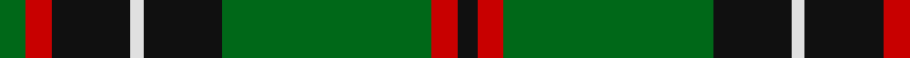

In pattern [GRKWKGRK](/patterns/grkwkgrk/).

This was sourced from register-of-tartans.  It is a [8 stripes tartan](/stripes/stripes8/).

Original link https://www.tartanregister.gov.uk/tartanDetails.aspx?ref=2467

## Thread count
G/8 R8 K24 LN4 K24 G64 R8 K/6

## Palette
Each colour and its ΔE from the base-6 reference it is a variant of.

| Colour | Shade | Base | ΔE (OKLab) |
|---|---|---|---|
| G | <code style="background-color:#006818;">#006818</code> `#006818` | G <code style="background-color:#006100;">#006100</code> | 0.02 |
| K | <code style="background-color:#101010;">#101010</code> `#101010` | K <code style="background-color:#000000;">#000000</code> | 0.17 |
| LN | <code style="background-color:#E0E0E0;">#E0E0E0</code> `#E0E0E0` | W <code style="background-color:#F7F7F7;">#F7F7F7</code> | 0.07 |
| R | <code style="background-color:#C80000;">#C80000</code> `#C80000` | R <code style="background-color:#CC0000;">#CC0000</code> | 0.01 |

# Sample pattern

## Nearest tartans

The nearest existing variants by ΔTartan distance.

1. [Danareth](/setts/s10/k7g6y3k12r19k12g62k62g12r7~g008b00-k101010-r8b0000-yffe600/) — ΔT 0.80
1. [Sin-Cos (Corporate)](/setts/s10/k60g64ga5g8ga5g64k60y8k8y8~g006818-ga004c2c-k101010-ye8c000/) — ΔT 0.88
1. [Danareth (Corporate)](/setts/s10/k7g6y3k12r19k12g62k62g12r7~g006818-k101010-r880000-yfccc00/) — ΔT 0.97
1. [John Telfar, Dunbar hunting](/setts/s7/g5k2g28k10r26b4g4~b304080-g008000-k000000-r806050~x2/) — ΔT 0.98
1. [Keirnan Irish Family Tartan Tartan Number: 1800. Earliest known date: 1880 This pattern was recorded by Bill Johnston, Shippak, USA in 1978 along with other patterns extracted from the 'Clan Originaux' at Pendleton Mill. This and other Irish patterns appear to have originated in the former Waterford Mill in Ireland before they arrived at Pendleton in the late 19C See products available Copyright © Blair Urquhart, Comrie, 2015](/setts/s10/w2g4k6r2k2r2k3r2g20w1~g006818-k101010-rc80000-we0e0e0~x2/) — ΔT 1.02
1. [Hartmann (Personal)](/setts/s8/b4k8w3k8g4k4g32k4~b2888c4-g006818-k101010-we0e0e0~x2/) — ΔT 1.04
1. [Vipont (Yellow line)](/setts/s7/r3g14k2b2g14k36y3~b9058d8-g006818-k101010-rc80000-ye8c000~x2/) — ΔT 1.04
1. [Georgia District Tartan Tartan Number: 794. Earliest known date: 1982 The tartan commemorates the founding of the State of Georgia and combines elements in the design associated with its historic past. General Oglethorpe commanded the Highland Independant Company of Foot which, in 1746, wore the Black Watch tartan. Captain John 'Mohr' MacIntosh is remembered in the MacIntosh red. Georgia tartan is much in evidence at the annual Stone Mountain Highland Games held in Atlanta, Georgias capital. See products available Copyright © Blair Urquhart, Comrie, 2015](/setts/s8/g36k2g2k2g3k12b10r20~b5c8ca8-g006818-k101010-rc80000~x2/) — ΔT 1.05
1. [Georgia, State of](/setts/s8/g36k2g2k2g3k12b10r20~b5c8ca8-g006818-k101010-rc8002c~x2/) — ΔT 1.06
1. [MacArthur (Variant)](/setts/s6/r3g30k12g6k16y2~g006818-k101010-rc80000-ye8c000~x2/) — ΔT 1.08

## Neighbour map

Every grey dot is one of 15726 variants placed by the first two principal components of the ΔTartan feature space (44% of its variance). Red is this tartan; blue dots are its nearest — click one to open its page.

<svg viewBox="0 0 640 380" role="img" style="max-width:100%;height:auto;border:1px solid #e0e0e0;border-radius:4px;display:block" xmlns="http://www.w3.org/2000/svg"><image href="/nn/cloud.v1.png" width="640" height="380"/><a href="/setts/s10/k7g6y3k12r19k12g62k62g12r7~g008b00-k101010-r8b0000-yffe600/"><circle cx="274.9" cy="150.9" r="4" fill="#3465a4"><title>Danareth</title></circle></a><a href="/setts/s10/k60g64ga5g8ga5g64k60y8k8y8~g006818-ga004c2c-k101010-ye8c000/"><circle cx="279.3" cy="188.0" r="4" fill="#3465a4"><title>Sin-Cos (Corporate)</title></circle></a><a href="/setts/s10/k7g6y3k12r19k12g62k62g12r7~g006818-k101010-r880000-yfccc00/"><circle cx="306.1" cy="163.5" r="4" fill="#3465a4"><title>Danareth (Corporate)</title></circle></a><a href="/setts/s7/g5k2g28k10r26b4g4~b304080-g008000-k000000-r806050~x2/"><circle cx="250.7" cy="190.2" r="4" fill="#3465a4"><title>John Telfar, Dunbar hunting</title></circle></a><a href="/setts/s10/w2g4k6r2k2r2k3r2g20w1~g006818-k101010-rc80000-we0e0e0~x2/"><circle cx="311.5" cy="139.7" r="4" fill="#3465a4"><title>Keirnan Irish Family Tartan Tartan Number: 1800. Earliest known date: 1880 This pattern was recorded by Bill Johnston, Shippak, USA in 1978 along with other patterns extracted from the 'Clan Originaux' at Pendleton Mill. This and other Irish patterns appear to have originated in the former Waterford Mill in Ireland before they arrived at Pendleton in the late 19C See products available Copyright © Blair Urquhart, Comrie, 2015</title></circle></a><a href="/setts/s8/b4k8w3k8g4k4g32k4~b2888c4-g006818-k101010-we0e0e0~x2/"><circle cx="302.1" cy="190.1" r="4" fill="#3465a4"><title>Hartmann (Personal)</title></circle></a><a href="/setts/s7/r3g14k2b2g14k36y3~b9058d8-g006818-k101010-rc80000-ye8c000~x2/"><circle cx="301.1" cy="160.2" r="4" fill="#3465a4"><title>Vipont (Yellow line)</title></circle></a><a href="/setts/s8/g36k2g2k2g3k12b10r20~b5c8ca8-g006818-k101010-rc80000~x2/"><circle cx="272.5" cy="164.8" r="4" fill="#3465a4"><title>Georgia District Tartan Tartan Number: 794. Earliest known date: 1982 The tartan commemorates the founding of the State of Georgia and combines elements in the design associated with its historic past. General Oglethorpe commanded the Highland Independant Company of Foot which, in 1746, wore the Black Watch tartan. Captain John 'Mohr' MacIntosh is remembered in the MacIntosh red. Georgia tartan is much in evidence at the annual Stone Mountain Highland Games held in Atlanta, Georgias capital. See products available Copyright © Blair Urquhart, Comrie, 2015</title></circle></a><a href="/setts/s8/g36k2g2k2g3k12b10r20~b5c8ca8-g006818-k101010-rc8002c~x2/"><circle cx="271.5" cy="164.3" r="4" fill="#3465a4"><title>Georgia, State of</title></circle></a><a href="/setts/s6/r3g30k12g6k16y2~g006818-k101010-rc80000-ye8c000~x2/"><circle cx="316.8" cy="213.2" r="4" fill="#3465a4"><title>MacArthur (Variant)</title></circle></a><circle cx="294.1" cy="175.9" r="5" fill="#c00000"/></svg>

ID: /setts/s8/g4r4k12w2k12g32r4k3~g006818-k101010-rc80000-we0e0e0~x2/
