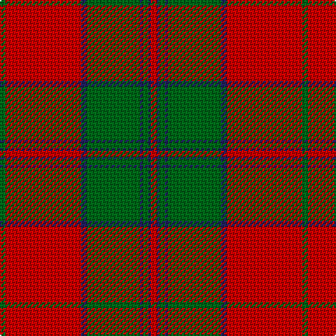

In pattern [GRBGBGBR](/patterns/grbgbgbr/).

This was sourced from register-of-tartans.  It is a [8 stripes tartan](/stripes/stripes8/).

Original link https://www.tartanregister.gov.uk/tartanDetails.aspx?ref=4106

## Attestations

This cloth appears in 2 source records; the oldest owns this page.

- 01/01/2002 — Thomas of Wales (register-of-tartans, [record](https://www.tartanregister.gov.uk/tartanDetails.aspx?ref=4106))
- 2002 — Thomas (Werlsh Name) (tartans-authority, [record](http://www.tartansauthority.com/tartan-ferret/display/5763/))

## Thread count
G/4 R54 DB4 G38 DB2 G4 DB2 R/4

## Palette
Each colour and its ΔE from the base-6 reference it is a variant of.

| Colour | Shade | Base | ΔE (OKLab) |
|---|---|---|---|
| DB | <code style="background-color:#202060;">#202060</code> `#202060` | B <code style="background-color:#2C4084;">#2C4084</code> | 0.11 |
| DG | <code style="background-color:#003820;">#003820</code> `#003820` | G <code style="background-color:#006400;">#006400</code> | 0.16 |
| G | <code style="background-color:#006818;">#006818</code> `#006818` | G <code style="background-color:#006400;">#006400</code> | 0.02 |
| LN | <code style="background-color:#E0E0E0;">#E0E0E0</code> `#E0E0E0` | W <code style="background-color:#F4F4F0;">#F4F4F0</code> | 0.06 |
| R | <code style="background-color:#C80000;">#C80000</code> `#C80000` | R <code style="background-color:#C80000;">#C80000</code> | 0.00 |

# Sample pattern

## Nearest tartans

The nearest existing variants by ΔTartan distance.

1. [Unidentified Cant #09](/setts/s8/r44b2g26r3b2r3g26b2-b2c2c80-g006818-rc80000/) — ΔT 0.78
1. [MacDonell of Glengarry #4](/setts/s11/g36r6g4r4b12r4g4r48g2r4g12-b2c4084-g005020-rdc0000/) — ΔT 0.94
1. [MacDonald 1](/setts/s9/g4r4b2r48b12r6g24r8b2-b304080-g008000-rc00000/) — ΔT 0.99
1. [MacDonell of Glengarry](/setts/s11/g36r6g4r4b12r4g4r48g2r4g12-b304080-g008000-rc00000/) — ΔT 0.99
1. [Drummond #3](/setts/s12/g8r2g2r56g16k2g2k2g36r2g2r8-g005020-k101010-rdc0000/) — ΔT 1.00
1. [Drummond VS](/setts/s12/g4r1g1r28g8k1g1k1g18r1g1r4-g004c00-k000000-rc80000/) — ΔT 1.06
1. [Strang (Personal)](/setts/s8/r72g36r8g12k2w4k2g4-g146400-k000000-rb00000-wc8c8c8/) — ΔT 1.09
1. [Chisholm, The](/setts/s10/r12w2r48b12g4b2g4b2g24r2-b304080-g008000-rc00000-we0e0e0/) — ΔT 1.15
1. [MacDonell of Keppoch](/setts/s11/r12b2r2g56r8b16w2r64g2r8g4-b304080-g008000-rc00000-we0e0e0/) — ΔT 1.15
1. [Robertson 6](/setts/s6/g4r72b16r4g40r4-b304080-g008000-rc00000/) — ΔT 1.17

## Neighbour map

Every grey dot is one of 15726 variants placed by the first two principal components of the ΔTartan feature space (44% of its variance). Red is this tartan; blue dots are its nearest — click one to open its page.

<svg viewBox="0 0 640 380" role="img" style="max-width:100%;height:auto;border:1px solid #e0e0e0;border-radius:4px;display:block" xmlns="http://www.w3.org/2000/svg"><image href="/nn/cloud.v1.png" width="640" height="380"/><a href="/setts/s8/r44b2g26r3b2r3g26b2-b2c2c80-g006818-rc80000/"><circle cx="375.5" cy="168.8" r="4" fill="#3465a4"><title>Unidentified Cant #09</title></circle></a><a href="/setts/s11/g36r6g4r4b12r4g4r48g2r4g12-b2c4084-g005020-rdc0000/"><circle cx="359.5" cy="141.9" r="4" fill="#3465a4"><title>MacDonell of Glengarry #4</title></circle></a><a href="/setts/s9/g4r4b2r48b12r6g24r8b2-b304080-g008000-rc00000/"><circle cx="420.3" cy="153.5" r="4" fill="#3465a4"><title>MacDonald 1</title></circle></a><a href="/setts/s11/g36r6g4r4b12r4g4r48g2r4g12-b304080-g008000-rc00000/"><circle cx="361.7" cy="145.9" r="4" fill="#3465a4"><title>MacDonell of Glengarry</title></circle></a><a href="/setts/s12/g8r2g2r56g16k2g2k2g36r2g2r8-g005020-k101010-rdc0000/"><circle cx="394.5" cy="119.9" r="4" fill="#3465a4"><title>Drummond #3</title></circle></a><a href="/setts/s12/g4r1g1r28g8k1g1k1g18r1g1r4-g004c00-k000000-rc80000/"><circle cx="395.6" cy="123.2" r="4" fill="#3465a4"><title>Drummond VS</title></circle></a><a href="/setts/s8/r72g36r8g12k2w4k2g4-g146400-k000000-rb00000-wc8c8c8/"><circle cx="421.7" cy="122.2" r="4" fill="#3465a4"><title>Strang (Personal)</title></circle></a><a href="/setts/s10/r12w2r48b12g4b2g4b2g24r2-b304080-g008000-rc00000-we0e0e0/"><circle cx="366.2" cy="124.9" r="4" fill="#3465a4"><title>Chisholm, The</title></circle></a><a href="/setts/s11/r12b2r2g56r8b16w2r64g2r8g4-b304080-g008000-rc00000-we0e0e0/"><circle cx="376.5" cy="108.4" r="4" fill="#3465a4"><title>MacDonell of Keppoch</title></circle></a><a href="/setts/s6/g4r72b16r4g40r4-b304080-g008000-rc00000/"><circle cx="398.0" cy="185.9" r="4" fill="#3465a4"><title>Robertson 6</title></circle></a><circle cx="403.8" cy="145.7" r="5" fill="#c00000"/></svg>

ID: /setts/s8/g4r54b4g38b2g4b2r4-b202060-g006818-rc80000/
