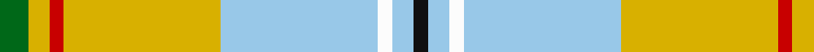

In pattern [GYRYWWWK](/patterns/gyrywwwk/).

This was sourced from tartans-authority.  It is a [8 stripes tartan](/stripes/stripes8/).

Original link http://www.tartansauthority.com/tartan-ferret/display/11147/

## Thread count
G/8 Y6 R4 Y44 LB44 W4 LB6 K/4

## Palette
Each colour and its ΔE from the base-6 reference it is a variant of.

| Colour | Shade | Base | ΔE (OKLab) |
|---|---|---|---|
| G | <code style="background-color:#006818;">#006818</code> `#006818` | G <code style="background-color:#006100;">#006100</code> | 0.02 |
| K | <code style="background-color:#101010;">#101010</code> `#101010` | K <code style="background-color:#000000;">#000000</code> | 0.17 |
| LB | <code style="background-color:#98C8E8;">#98C8E8</code> `#98C8E8` | W <code style="background-color:#F7F7F7;">#F7F7F7</code> | 0.18 |
| R | <code style="background-color:#C80000;">#C80000</code> `#C80000` | R <code style="background-color:#CC0000;">#CC0000</code> | 0.01 |
| W | <code style="background-color:#FCFCFC;">#FCFCFC</code> `#FCFCFC` | W <code style="background-color:#F7F7F7;">#F7F7F7</code> | 0.01 |
| Y | <code style="background-color:#D8B000;">#D8B000</code> `#D8B000` | Y <code style="background-color:#F2BF00;">#F2BF00</code> | 0.06 |

# Sample pattern

## Nearest tartans

The nearest existing variants by ΔTartan distance.

1. [Aguilar Pardo, Luis Alejandro (Personal)](/setts/s8/g4y3r2y22w22wa2w3k2~g146400-k000000-rc82828-w98c8e8-waffffff-yf8e38c~x2/) — ΔT 0.83
1. [Los Angeles (District)](/setts/s8/b4b24y5g2b3ba5y33ba2~b6098b8-ba2c2c80-g289c18-ye8c000~x2/) — ΔT 0.90
1. [State Seal of Delaware (Fashion)](/setts/s10/w38b18w4y3g10ya3g4w3ya17r4~b003c64-g006818-rc80000-wc0c0c0-yfccc00-yaa08858~x2/) — ΔT 1.50
1. [Taylor, dress](/setts/s9/g9k2r4g14w3wa3w23g5y3~g008000-k000000-rd03030-we0e0e0-wac0a0e0-yf0c000~x2/) — ΔT 1.51
1. [Reekie, Charlene (Personal)](/setts/s6/w43k5r3g5y27b5~b780078-g006818-k101010-rc80000-we0e0e0-yfccc00~x2/) — ΔT 1.52
1. [Taylor Dress Family Tartan Tartan Number: 823. Earliest known date: 1992 A dress tartan for dancers See products available Copyright © Blair Urquhart, Comrie, 2015](/setts/s9/g9k2r4g14w3wa3w23g5y3~g006818-k101010-rd05054-we0e0e0-wac49cd8-ye8c000~x2/) — ΔT 1.56
1. [Chambers, Christopher J (Personal)](/setts/s7/b16r1g16w1ga1w8ra3~b5f749c-g649848-ga5d321f-rca2625-ra86264d-wf9f5ef~x2/) — ΔT 1.60
1. [Mission (District)](/setts/s8/y2w14k1g11k2r2ga2k1~g00a424-ga50a47c-k101010-re87878-w98c8e8-yec8048~x4/) — ΔT 1.62
1. [MacKellar Dress (Reproduction colours)](/setts/s11/r35w4r3y7r3w4r7g15ya4w36ya5~g2a2303-rbe7832-we0e0e0-ye8c000-ya949494~x2/) — ΔT 1.62
1. [Nova Scotia, dress](/setts/s9/g3w29g3b3g3b6g13y3r2~b304080-g008000-rc00000-we0e0e0-yf0c000~x2/) — ΔT 1.66

## Neighbour map

Every grey dot is one of 15726 variants placed by the first two principal components of the ΔTartan feature space (44% of its variance). Red is this tartan; blue dots are its nearest — click one to open its page.

<svg viewBox="0 0 640 380" role="img" style="max-width:100%;height:auto;border:1px solid #e0e0e0;border-radius:4px;display:block" xmlns="http://www.w3.org/2000/svg"><image href="/nn/cloud.v1.png" width="640" height="380"/><a href="/setts/s8/g4y3r2y22w22wa2w3k2~g146400-k000000-rc82828-w98c8e8-waffffff-yf8e38c~x2/"><circle cx="191.8" cy="121.4" r="4" fill="#3465a4"><title>Aguilar Pardo, Luis Alejandro (Personal)</title></circle></a><a href="/setts/s8/b4b24y5g2b3ba5y33ba2~b6098b8-ba2c2c80-g289c18-ye8c000~x2/"><circle cx="253.8" cy="118.0" r="4" fill="#3465a4"><title>Los Angeles (District)</title></circle></a><a href="/setts/s10/w38b18w4y3g10ya3g4w3ya17r4~b003c64-g006818-rc80000-wc0c0c0-yfccc00-yaa08858~x2/"><circle cx="174.6" cy="120.0" r="4" fill="#3465a4"><title>State Seal of Delaware (Fashion)</title></circle></a><a href="/setts/s9/g9k2r4g14w3wa3w23g5y3~g008000-k000000-rd03030-we0e0e0-wac0a0e0-yf0c000~x2/"><circle cx="161.0" cy="131.5" r="4" fill="#3465a4"><title>Taylor, dress</title></circle></a><a href="/setts/s6/w43k5r3g5y27b5~b780078-g006818-k101010-rc80000-we0e0e0-yfccc00~x2/"><circle cx="213.6" cy="122.1" r="4" fill="#3465a4"><title>Reekie, Charlene (Personal)</title></circle></a><a href="/setts/s9/g9k2r4g14w3wa3w23g5y3~g006818-k101010-rd05054-we0e0e0-wac49cd8-ye8c000~x2/"><circle cx="161.9" cy="131.9" r="4" fill="#3465a4"><title>Taylor Dress Family Tartan Tartan Number: 823. Earliest known date: 1992 A dress tartan for dancers See products available Copyright © Blair Urquhart, Comrie, 2015</title></circle></a><a href="/setts/s7/b16r1g16w1ga1w8ra3~b5f749c-g649848-ga5d321f-rca2625-ra86264d-wf9f5ef~x2/"><circle cx="168.6" cy="134.4" r="4" fill="#3465a4"><title>Chambers, Christopher J (Personal)</title></circle></a><a href="/setts/s8/y2w14k1g11k2r2ga2k1~g00a424-ga50a47c-k101010-re87878-w98c8e8-yec8048~x4/"><circle cx="160.7" cy="121.3" r="4" fill="#3465a4"><title>Mission (District)</title></circle></a><a href="/setts/s11/r35w4r3y7r3w4r7g15ya4w36ya5~g2a2303-rbe7832-we0e0e0-ye8c000-ya949494~x2/"><circle cx="185.5" cy="122.2" r="4" fill="#3465a4"><title>MacKellar Dress (Reproduction colours)</title></circle></a><a href="/setts/s9/g3w29g3b3g3b6g13y3r2~b304080-g008000-rc00000-we0e0e0-yf0c000~x2/"><circle cx="208.2" cy="121.9" r="4" fill="#3465a4"><title>Nova Scotia, dress</title></circle></a><circle cx="211.3" cy="130.0" r="5" fill="#c00000"/></svg>

ID: /setts/s8/g4y3r2y22w22wa2w3k2~g006818-k101010-rc80000-w98c8e8-wafcfcfc-yd8b000~x2/
