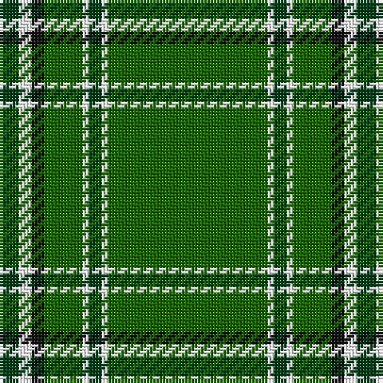

In pattern [GWGWGKWG](/patterns/gwgwgkwg/).

This was sourced from register-of-tartans.  It is a [8 stripes tartan](/stripes/stripes8/).

Original link https://www.tartanregister.gov.uk/tartanDetails.aspx?ref=11254

## Thread count
DG/6 W4 K4 G12 W2 DG4 W2 G/50

## Palette
Each colour and its ΔE from the base-6 reference it is a variant of.

| Colour | Shade | Base | ΔE (OKLab) |
|---|---|---|---|
| DG | <code style="background-color:#003C14;">#003C14</code> `#003C14` | G <code style="background-color:#006400;">#006400</code> | 0.14 |
| G | <code style="background-color:#146400;">#146400</code> `#146400` | G <code style="background-color:#006400;">#006400</code> | 0.01 |
| K | <code style="background-color:#101010;">#101010</code> `#101010` | K <code style="background-color:#000000;">#000000</code> | 0.17 |
| W | <code style="background-color:#FFFFFF;">#FFFFFF</code> `#FFFFFF` | W <code style="background-color:#F4F4F0;">#F4F4F0</code> | 0.03 |

# Sample pattern

## Nearest tartans

The nearest existing variants by ΔTartan distance.

1. [Walterstrm (2014))](/setts/s8/g156b26y12r6y10g12b18y12-b2c2c80-g006818-rc80000-yfccc00/) — ΔT 1.09
1. [Marshall University](/setts/s8/g50w2ga4w2g12k4w4ga6-g289c18-ga003820-k101010-wfcfcfc/) — ΔT 1.26
1. [Delta Lambda Phi](/setts/s12/y10k2y12g40w2g6w2g6w2g60k2y4-g006400-k101010-wffffff-yffcc33/) — ΔT 1.29
1. [Delta Lambda Phi (Corporate)](/setts/s12/y10k2y12g40w2g6w2g6w2g60k2y4-g006818-k101010-wfcfcfc-ybc8c00/) — ΔT 1.37
1. [Inman (2016)](/setts/s7/r4g48k4g24y12k2r4-g005020-k101010-rdc0000-ye0a126/) — ΔT 1.39
1. [Marshall, Fields](/setts/s8/g80b4w4b4y4b46g64r4-b000050-g008000-rc00000-we0e0e0-yf0c000/) — ΔT 1.43
1. [Sarros (Personal) XX](/setts/s8/k4w4b16k8g66r4g32w4-b2c2c80-g006818-k101010-rc8002c-wfcfcfc/) — ΔT 1.45
1. [Leach Htg (Name)](/setts/s6/k6w2g42k4b6w4-b501400-g289c18-k101010-wc0c0c0/) — ΔT 1.49
1. [Skene, or Tribe of Mar](/setts/s5/r2k4g32k4y2-g008000-k000000-rc00000-yf0c000/) — ΔT 1.49
1. [Portosalvo](/setts/s11/g10w2g64b2g16b18g4w4r6b6w2-b27408b-g1da237-rcc1100-wffffff/) — ΔT 1.50

## Neighbour map

Every grey dot is one of 15726 variants placed by the first two principal components of the ΔTartan feature space (44% of its variance). Red is this tartan; blue dots are its nearest — click one to open its page.

<svg viewBox="0 0 640 380" role="img" style="max-width:100%;height:auto;border:1px solid #e0e0e0;border-radius:4px;display:block" xmlns="http://www.w3.org/2000/svg"><image href="/nn/cloud.v1.png" width="640" height="380"/><a href="/setts/s8/g156b26y12r6y10g12b18y12-b2c2c80-g006818-rc80000-yfccc00/"><circle cx="421.7" cy="131.0" r="4" fill="#3465a4"><title>Walterstrm (2014))</title></circle></a><a href="/setts/s8/g50w2ga4w2g12k4w4ga6-g289c18-ga003820-k101010-wfcfcfc/"><circle cx="455.8" cy="134.1" r="4" fill="#3465a4"><title>Marshall University</title></circle></a><a href="/setts/s12/y10k2y12g40w2g6w2g6w2g60k2y4-g006400-k101010-wffffff-yffcc33/"><circle cx="473.7" cy="110.6" r="4" fill="#3465a4"><title>Delta Lambda Phi</title></circle></a><a href="/setts/s12/y10k2y12g40w2g6w2g6w2g60k2y4-g006818-k101010-wfcfcfc-ybc8c00/"><circle cx="512.2" cy="128.0" r="4" fill="#3465a4"><title>Delta Lambda Phi (Corporate)</title></circle></a><a href="/setts/s7/r4g48k4g24y12k2r4-g005020-k101010-rdc0000-ye0a126/"><circle cx="471.3" cy="169.5" r="4" fill="#3465a4"><title>Inman (2016)</title></circle></a><a href="/setts/s8/g80b4w4b4y4b46g64r4-b000050-g008000-rc00000-we0e0e0-yf0c000/"><circle cx="387.2" cy="146.9" r="4" fill="#3465a4"><title>Marshall, Fields</title></circle></a><a href="/setts/s8/k4w4b16k8g66r4g32w4-b2c2c80-g006818-k101010-rc8002c-wfcfcfc/"><circle cx="403.8" cy="153.7" r="4" fill="#3465a4"><title>Sarros (Personal) XX</title></circle></a><a href="/setts/s6/k6w2g42k4b6w4-b501400-g289c18-k101010-wc0c0c0/"><circle cx="385.2" cy="153.2" r="4" fill="#3465a4"><title>Leach Htg (Name)</title></circle></a><a href="/setts/s5/r2k4g32k4y2-g008000-k000000-rc00000-yf0c000/"><circle cx="431.3" cy="174.9" r="4" fill="#3465a4"><title>Skene, or Tribe of Mar</title></circle></a><a href="/setts/s11/g10w2g64b2g16b18g4w4r6b6w2-b27408b-g1da237-rcc1100-wffffff/"><circle cx="439.7" cy="113.9" r="4" fill="#3465a4"><title>Portosalvo</title></circle></a><circle cx="469.7" cy="142.0" r="5" fill="#c00000"/></svg>

ID: /setts/s8/g50w2ga4w2g12k4w4ga6-g146400-ga003c14-k101010-wffffff/
