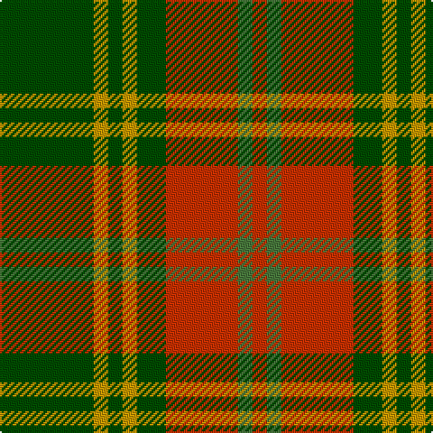

In pattern [GYGYGRGR](/patterns/gygygrgr/).

This was sourced from register-of-tartans.  It is a [8 stripes tartan](/stripes/stripes8/).

Original link https://www.tartanregister.gov.uk/tartanDetails.aspx?ref=3210

## Thread count
G/52 DY8 G8 DY8 G16 R40 Ga8 R/8

## Palette
Each colour and its ΔE from the base-6 reference it is a variant of.

| Colour | Shade | Base | ΔE (OKLab) |
|---|---|---|---|
| DY | <code style="background-color:#C89800;">#C89800</code> `#C89800` | Y <code style="background-color:#E8C000;">#E8C000</code> | 0.12 |
| G | <code style="background-color:#004C00;">#004C00</code> `#004C00` | G <code style="background-color:#006400;">#006400</code> | 0.08 |
| Ga | <code style="background-color:#48783C;">#48783C</code> `#48783C` | G <code style="background-color:#006400;">#006400</code> | 0.10 |
| R | <code style="background-color:#C83000;">#C83000</code> `#C83000` | R <code style="background-color:#C80000;">#C80000</code> | 0.04 |

# Sample pattern

ID: /setts/s8/g52y8g8y8g16r40ga8r8-g004c00-ga48783c-rc83000-yc89800/
