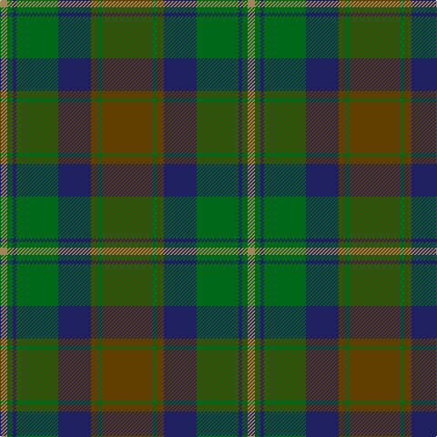

In pattern [GGGBGBGY](/patterns/gggbgbgy/).

This was sourced from register-of-tartans.  It is a [8 stripes tartan](/stripes/stripes8/).

Original link https://www.tartanregister.gov.uk/tartanDetails.aspx?ref=875

## Attestations

This cloth appears in 2 source records; the oldest owns this page.

- 01/01/2002 — Eastern Western Motor Group, Dalbraith (register-of-tartans, [record](https://www.tartanregister.gov.uk/tartanDetails.aspx?ref=875))
- pre 2002 — Dalbraith-Eastern Western (Corporate (tartans-authority, [record](http://www.tartansauthority.com/tartan-ferret/display/2197/))

## Thread count
LT/8 G6 DB4 G46 DB36 T8 G4 T/56

## Palette
Each colour and its ΔE from the base-6 reference it is a variant of.

| Colour | Shade | Base | ΔE (OKLab) |
|---|---|---|---|
| DB | <code style="background-color:#202060;">#202060</code> `#202060` | B <code style="background-color:#2A418A;">#2A418A</code> | 0.11 |
| G | <code style="background-color:#006818;">#006818</code> `#006818` | G <code style="background-color:#006100;">#006100</code> | 0.02 |
| LT | <code style="background-color:#A08858;">#A08858</code> `#A08858` | Y <code style="background-color:#F2BF00;">#F2BF00</code> | 0.21 |
| T | <code style="background-color:#604000;">#604000</code> `#604000` | G <code style="background-color:#006100;">#006100</code> | 0.14 |

# Sample pattern

## Nearest tartans

The nearest existing variants by ΔTartan distance.

1. [John Telfar Dunbar/Hunting Tartan Tartan Number: 776. Earliest known date: pre 2003 Check this entry... See products available Copyright © Blair Urquhart, Comrie, 2015](/setts/s7/g10k4g56k20ga52b8g8-b2c2c80-g006818-ga604000-k101010/) — ΔT 1.06
1. [Grampian (District)](/setts/s8/g48r4g6b28ba48r4ba6b6-b303070-ba14283c-g5c6428-rc80000/) — ΔT 1.07
1. [State Seal of Minnesota (Fashion)](/setts/s8/r8g92r20b20ga66b10ga8y6-b2c2c80-g006818-ga604000-r880000-ybc8c00/) — ΔT 1.07
1. [Royal Scottish Agricultural Benevolent Institution](/setts/s10/g10b10g10b10g10ga48b2ba24ga12b6-b3c2010-ba003478-g845800-ga146400/) — ΔT 1.09
1. [Ancient Universal (Fashion?)](/setts/s8/g24ga4g4ga4g4gb16gc16gb2-g789484-ga003820-gb604000-gc5c6428/) — ΔT 1.14
1. [Strange of Balcaskie (Clan)](/setts/s7/g64ga14g14ga32b64y6ga16-b2c2c80-g006818-ga604000-ye8c000/) — ΔT 1.14
1. [Bennett, John Paul (Personal)](/setts/s7/g4ga62k41b6k4b38r4-b5b5758-g715937-ga1a4014-k101010-rb93e5a/) — ΔT 1.15
1. [Brave for Men (Fashion)](/setts/s8/k5g5k5g34b33k6b5r2-b5c5c5c-g604000-k101010-r888888/) — ΔT 1.31
1. [Jones (Arizona) (Name)](/setts/s10/g36k2r18k24r18k2g36k2b12g2-b5c5c5c-g005c34-k101010-r880000/) — ΔT 1.32
1. [John Muir Way](/setts/s8/g70ga38r6gb16r6ga16r6b6-b2c2c80-g603800-ga003820-gb408060-rc80000/) — ΔT 1.33

## Neighbour map

Every grey dot is one of 15726 variants placed by the first two principal components of the ΔTartan feature space (44% of its variance). Red is this tartan; blue dots are its nearest — click one to open its page.

<svg viewBox="0 0 640 380" role="img" style="max-width:100%;height:auto;border:1px solid #e0e0e0;border-radius:4px;display:block" xmlns="http://www.w3.org/2000/svg"><image href="/nn/cloud.v1.png" width="640" height="380"/><a href="/setts/s7/g10k4g56k20ga52b8g8-b2c2c80-g006818-ga604000-k101010/"><circle cx="330.0" cy="225.9" r="4" fill="#3465a4"><title>John Telfar Dunbar/Hunting Tartan Tartan Number: 776. Earliest known date: pre 2003 Check this entry... See products available Copyright © Blair Urquhart, Comrie, 2015</title></circle></a><a href="/setts/s8/g48r4g6b28ba48r4ba6b6-b303070-ba14283c-g5c6428-rc80000/"><circle cx="273.4" cy="212.4" r="4" fill="#3465a4"><title>Grampian (District)</title></circle></a><a href="/setts/s8/r8g92r20b20ga66b10ga8y6-b2c2c80-g006818-ga604000-r880000-ybc8c00/"><circle cx="284.9" cy="186.4" r="4" fill="#3465a4"><title>State Seal of Minnesota (Fashion)</title></circle></a><a href="/setts/s10/g10b10g10b10g10ga48b2ba24ga12b6-b3c2010-ba003478-g845800-ga146400/"><circle cx="297.3" cy="188.5" r="4" fill="#3465a4"><title>Royal Scottish Agricultural Benevolent Institution</title></circle></a><a href="/setts/s8/g24ga4g4ga4g4gb16gc16gb2-g789484-ga003820-gb604000-gc5c6428/"><circle cx="280.5" cy="219.9" r="4" fill="#3465a4"><title>Ancient Universal (Fashion?)</title></circle></a><a href="/setts/s7/g64ga14g14ga32b64y6ga16-b2c2c80-g006818-ga604000-ye8c000/"><circle cx="240.3" cy="234.1" r="4" fill="#3465a4"><title>Strange of Balcaskie (Clan)</title></circle></a><a href="/setts/s7/g4ga62k41b6k4b38r4-b5b5758-g715937-ga1a4014-k101010-rb93e5a/"><circle cx="286.6" cy="202.3" r="4" fill="#3465a4"><title>Bennett, John Paul (Personal)</title></circle></a><a href="/setts/s8/k5g5k5g34b33k6b5r2-b5c5c5c-g604000-k101010-r888888/"><circle cx="352.7" cy="206.2" r="4" fill="#3465a4"><title>Brave for Men (Fashion)</title></circle></a><a href="/setts/s10/g36k2r18k24r18k2g36k2b12g2-b5c5c5c-g005c34-k101010-r880000/"><circle cx="314.1" cy="194.5" r="4" fill="#3465a4"><title>Jones (Arizona) (Name)</title></circle></a><a href="/setts/s8/g70ga38r6gb16r6ga16r6b6-b2c2c80-g603800-ga003820-gb408060-rc80000/"><circle cx="296.6" cy="197.1" r="4" fill="#3465a4"><title>John Muir Way</title></circle></a><circle cx="285.3" cy="210.8" r="5" fill="#c00000"/></svg>

ID: /setts/s8/g56ga4g8b36ga46b4ga6y8-b202060-g604000-ga006818-ya08858/
