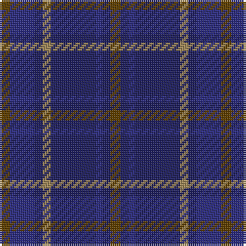

In pattern [GBBBYBBG](/patterns/gbbbybbg/).

This was sourced from house-of-tartan.  It is a [8 stripes tartan](/stripes/stripes8/).

Original link http://www.house-of-tartan.scotland.net/house/TartanViewjs.asp?colr=Def&tnam=1725

## Thread count
T/5 DB12 DBa4 LT4 DBa22 DB3 DBa4 T/5

## Palette
Each colour and its ΔE from the base-6 reference it is a variant of.

| Colour | Shade | Base | ΔE (OKLab) |
|---|---|---|---|
| DB | <code style="background-color:#2C2C80;">#2C2C80</code> `#2C2C80` | B <code style="background-color:#2A418A;">#2A418A</code> | 0.06 |
| DBa | <code style="background-color:#202060;">#202060</code> `#202060` | B <code style="background-color:#2A418A;">#2A418A</code> | 0.11 |
| LT | <code style="background-color:#A08858;">#A08858</code> `#A08858` | Y <code style="background-color:#F2BF00;">#F2BF00</code> | 0.21 |
| T | <code style="background-color:#604000;">#604000</code> `#604000` | G <code style="background-color:#006100;">#006100</code> | 0.14 |

# Sample pattern

## Nearest tartans

The nearest existing variants by ΔTartan distance.

1. [Daks (Blue)](/setts/s8/g6b12ba4y4ba22b4ba4g6-b2c2c80-ba202060-g604000-ya08858/) — ΔT 0.54
1. [New Club Centenary](/setts/s9/b8ba36r4ba4r4ba18g40ba6g8-b440044-ba2c2c80-g003820-r880000/) — ΔT 1.09
1. [United Colours of Scotland (Corporat](/setts/s7/g14b6g14ba44b44w6b10-b2c2c80-ba003c64-g003820-we0e0e0/) — ΔT 1.15
1. [Edinburgh Monarchs (Corporate)](/setts/s8/b10ba8bb2ba28b28bb2b10y6-b1c3854-ba2c2c84-bb501400-yd09800/) — ΔT 1.19
1. [Stone of Destiny, The (Commemorative](/setts/s9/b8y4b40ba4r8ba4b6ba24b4-b2c2c80-ba14283c-r880000-yd09800/) — ΔT 1.26
1. [Edinburgh Monarchs](/setts/s8/b10ba8bb2ba28b28bb2b10y6-b14283c-ba202060-bb501400-yd09800/) — ΔT 1.41
1. [Great Scot (Fashion)](/setts/s7/b12ba6b52bb41r12bc6r12-b2c2c80-ba2888c4-bb003c64-bc780078-rb468ac/) — ΔT 1.43
1. [Hutchesons' Grammar School](/setts/s10/b8r6b60ba60ra8bb16ra8ba60b60r6-b14283c-ba2c2c80-bb5c8ca8-rc80000-ra888888/) — ΔT 1.49
1. [Dalmeny - 1965 (Fashion)](/setts/s10/b16k2b16k4g12r2g12k4b16w2-b202060-g003820-k101010-rc80000-wc0c0c0/) — ΔT 1.52
1. [St. George's (Birmingham) (School)](/setts/s7/r8b42w4b40ba42b4ba4-b003c64-ba2c2c80-rc80000-wfcfcfc/) — ΔT 1.54

## Neighbour map

Every grey dot is one of 15726 variants placed by the first two principal components of the ΔTartan feature space (44% of its variance). Red is this tartan; blue dots are its nearest — click one to open its page.

<svg viewBox="0 0 640 380" role="img" style="max-width:100%;height:auto;border:1px solid #e0e0e0;border-radius:4px;display:block" xmlns="http://www.w3.org/2000/svg"><image href="/nn/cloud.v1.png" width="640" height="380"/><a href="/setts/s8/g6b12ba4y4ba22b4ba4g6-b2c2c80-ba202060-g604000-ya08858/"><circle cx="301.8" cy="270.6" r="4" fill="#3465a4"><title>Daks (Blue)</title></circle></a><a href="/setts/s9/b8ba36r4ba4r4ba18g40ba6g8-b440044-ba2c2c80-g003820-r880000/"><circle cx="372.7" cy="238.8" r="4" fill="#3465a4"><title>New Club Centenary</title></circle></a><a href="/setts/s7/g14b6g14ba44b44w6b10-b2c2c80-ba003c64-g003820-we0e0e0/"><circle cx="284.6" cy="264.9" r="4" fill="#3465a4"><title>United Colours of Scotland (Corporat</title></circle></a><a href="/setts/s8/b10ba8bb2ba28b28bb2b10y6-b1c3854-ba2c2c84-bb501400-yd09800/"><circle cx="379.7" cy="238.8" r="4" fill="#3465a4"><title>Edinburgh Monarchs (Corporate)</title></circle></a><a href="/setts/s9/b8y4b40ba4r8ba4b6ba24b4-b2c2c80-ba14283c-r880000-yd09800/"><circle cx="396.9" cy="224.0" r="4" fill="#3465a4"><title>Stone of Destiny, The (Commemorative</title></circle></a><a href="/setts/s8/b10ba8bb2ba28b28bb2b10y6-b14283c-ba202060-bb501400-yd09800/"><circle cx="382.8" cy="242.7" r="4" fill="#3465a4"><title>Edinburgh Monarchs</title></circle></a><a href="/setts/s7/b12ba6b52bb41r12bc6r12-b2c2c80-ba2888c4-bb003c64-bc780078-rb468ac/"><circle cx="280.8" cy="229.2" r="4" fill="#3465a4"><title>Great Scot (Fashion)</title></circle></a><a href="/setts/s10/b8r6b60ba60ra8bb16ra8ba60b60r6-b14283c-ba2c2c80-bb5c8ca8-rc80000-ra888888/"><circle cx="285.1" cy="209.1" r="4" fill="#3465a4"><title>Hutchesons' Grammar School</title></circle></a><a href="/setts/s10/b16k2b16k4g12r2g12k4b16w2-b202060-g003820-k101010-rc80000-wc0c0c0/"><circle cx="326.9" cy="242.4" r="4" fill="#3465a4"><title>Dalmeny - 1965 (Fashion)</title></circle></a><a href="/setts/s7/r8b42w4b40ba42b4ba4-b003c64-ba2c2c80-rc80000-wfcfcfc/"><circle cx="405.8" cy="247.6" r="4" fill="#3465a4"><title>St. George's (Birmingham) (School)</title></circle></a><circle cx="331.7" cy="256.4" r="5" fill="#c00000"/></svg>

ID: /setts/s8/g5b12ba4y4ba22b3ba4g5-b2c2c80-ba202060-g604000-ya08858/
