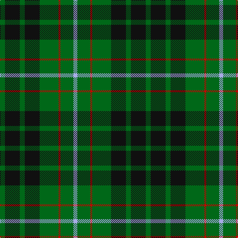

**Bands:** [GKGKGRGW](/stripes/gkgkgrgw/) · **Stripes:** [G K G K G R G LB](/stripes/stripes8/) G K G K G R G LB

This was sourced from tartans-authority.  It is a [8 band tartan](/bands/bands8/).

Original link http://www.tartansauthority.com/tartan-ferret/display/2570/

## Thread count
G/10 K30 G10 K30 G38 R4 G26 LP/8

## Palette
Each colour and its ΔE from the base-6 reference it is a variant of.

| Colour | Shade | Base | ΔE (OKLab) |
|---|---|---|---|
| G | <code style="background-color:#006818;">#006818</code> `#006818` | G <code style="background-color:#006100;">#006100</code> | 0.02 |
| K | <code style="background-color:#101010;">#101010</code> `#101010` | K <code style="background-color:#000000;">#000000</code> | 0.17 |
| LP | <code style="background-color:#A8ACE8;">#A8ACE8</code> `#A8ACE8` | W <code style="background-color:#F7F7F7;">#F7F7F7</code> | 0.23 |
| R | <code style="background-color:#C80000;">#C80000</code> `#C80000` | R <code style="background-color:#CC0000;">#CC0000</code> | 0.01 |

# Sample pattern

## Nearest tartans

The nearest existing variants by ΔTartan distance.

1. [MacAulay of Lewis](/setts/s8/g6k16r3k16g28k4g12w3~x2/) — ΔT 0.62
1. [Fitzpatrick Hunting](/setts/s9/g5ly1g3ly2g8k8db1k8g1~x4/) — ΔT 1.00
1. [Salvation Army Htg (Corporate)](/setts/s7/db5dg8k1ly2k1dg8db4~x4/) — ΔT 1.02
1. [MacAulay Hunting](/setts/s8/g6k16w1k16g8k4g12r2~x2/) — ΔT 1.06
1. [Holman (Personal)](/setts/s6/r3k9g20k16g7b3~x2/) — ΔT 1.15
1. [Holman (Personal)](/setts/s10/g7k12g12k9r3k9g20k16g7b3~x2/) — ΔT 1.15
1. [MacKintosh Hunting](/setts/s7/ly2dg12db6r3dg12r4db1/) — ΔT 1.17
1. [Cameron Hunting](/setts/s7/r3dg10r3dg14db16dg3ly2/) — ΔT 1.18
1. [Strath Hallidale (Sutherland)](/setts/s14/g13r2g19k15g5k15g5k15g5k15g19r2g13lb4~x2/) — ΔT 1.18
1. [MacIver Hunting](/setts/s9/w2g12k3g3k16g3k3g12ly2~x2/) — ΔT 1.21

## Neighbour map

Every grey dot is one of 14299 variants placed by the first two principal components of the ΔTartan feature space (44% of its variance). Red is this tartan; blue dots are its nearest — click one to open its page.

<svg viewBox="0 0 640 380" role="img" style="max-width:100%;height:auto;border:1px solid #e0e0e0;border-radius:4px;display:block" xmlns="http://www.w3.org/2000/svg"><image href="/nn/cloud.v1.png" width="640" height="380"/><a href="/setts/s8/g6k16r3k16g28k4g12w3~x2/"><circle cx="280.1" cy="221.8" r="4" fill="#3465a4"><title>MacAulay of Lewis</title></circle></a><a href="/setts/s9/g5ly1g3ly2g8k8db1k8g1~x4/"><circle cx="232.3" cy="220.8" r="4" fill="#3465a4"><title>Fitzpatrick Hunting</title></circle></a><a href="/setts/s7/db5dg8k1ly2k1dg8db4~x4/"><circle cx="295.5" cy="252.0" r="4" fill="#3465a4"><title>Salvation Army Htg (Corporate)</title></circle></a><a href="/setts/s8/g6k16w1k16g8k4g12r2~x2/"><circle cx="326.7" cy="216.4" r="4" fill="#3465a4"><title>MacAulay Hunting</title></circle></a><a href="/setts/s6/r3k9g20k16g7b3~x2/"><circle cx="252.3" cy="262.9" r="4" fill="#3465a4"><title>Holman (Personal)</title></circle></a><a href="/setts/s10/g7k12g12k9r3k9g20k16g7b3~x2/"><circle cx="245.6" cy="261.1" r="4" fill="#3465a4"><title>Holman (Personal)</title></circle></a><a href="/setts/s7/ly2dg12db6r3dg12r4db1/"><circle cx="302.3" cy="209.5" r="4" fill="#3465a4"><title>MacKintosh Hunting</title></circle></a><a href="/setts/s7/r3dg10r3dg14db16dg3ly2/"><circle cx="263.7" cy="229.7" r="4" fill="#3465a4"><title>Cameron Hunting</title></circle></a><a href="/setts/s14/g13r2g19k15g5k15g5k15g5k15g19r2g13lb4~x2/"><circle cx="276.7" cy="223.8" r="4" fill="#3465a4"><title>Strath Hallidale (Sutherland)</title></circle></a><a href="/setts/s9/w2g12k3g3k16g3k3g12ly2~x2/"><circle cx="273.8" cy="205.1" r="4" fill="#3465a4"><title>MacIver Hunting</title></circle></a><circle cx="279.5" cy="238.2" r="5" fill="#c00000"/></svg>

ID: /setts/s8/g5k15g5k15g19r2g13lb4~x2/
