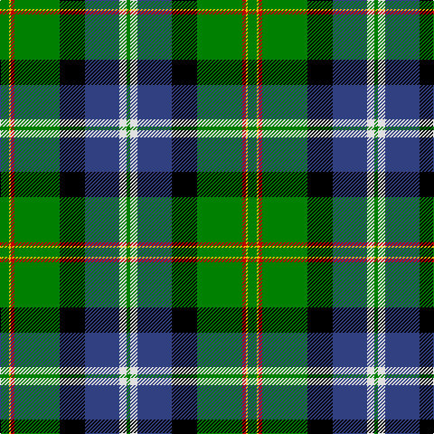

In pattern [GWBKGRYG](/stripes/gwbkgryg/).

This was sourced from weddslist.  It is a [8 stripe tartan](/stripes/stripes8/).

Original link http://www.weddslist.com/cgi-bin/tartans/pg.pl?source=sts

## Attestations

This cloth appears in 2 source records; the oldest owns this page.

- undated — Tooth (weddslist, [record](http://www.weddslist.com/cgi-bin/tartans/pg.pl?source=sts))
- undated — Tooth Family Tartan Tartan Number: 922. Earliest known date: 1980 STS collection. See products available Copyright © Blair Urquhart, Comrie, 2015 (house-of-tartan, [record](http://www.house-of-tartan.scotland.net/house/TartanViewjs.asp?colr=Def&tnam=922))

## Thread count
G/10 Y2 R4 G50 K28 B38 LN8 G/4

## Palette
Each colour and the base-6 reference it is a variant of.

| Colour | Shade | Base |
|---|---|---|
| B | <code style="background-color:#304080;">#304080</code> `oklch(39.4% 0.109 270.2)` <small>#304080</small> | B <code style="background-color:#2A418A;">#2A418A</code> |
| G | <code style="background-color:#008000;">#008000</code> `oklch(52.0% 0.177 142.5)` <small>#008000</small> | G <code style="background-color:#006100;">#006100</code> |
| K | <code style="background-color:#000000;">#000000</code> `oklch(0.0% 0.000 0.0)` <small>#000000</small> | K <code style="background-color:#000000;">#000000</code> |
| LN | <code style="background-color:#E0E0E0;">#E0E0E0</code> `oklch(90.7% 0.000 89.9)` <small>#E0E0E0</small> | W <code style="background-color:#F7F7F7;">#F7F7F7</code> |
| R | <code style="background-color:#C00000;">#C00000</code> `oklch(50.7% 0.208 29.2)` <small>#C00000</small> | R <code style="background-color:#CC0000;">#CC0000</code> |
| Y | <code style="background-color:#F0C000;">#F0C000</code> `oklch(82.7% 0.169 90.5)` <small>#F0C000</small> | Y <code style="background-color:#F2BF00;">#F2BF00</code> |

# Sample pattern

## Nearest tartans

The nearest existing variants by ΔTartan distance.

1. [Birch (Name)](/setts/s9/g3dp2g25k6r2k6t20k1lb2~x2/) — ΔT 0.66
1. [East Lothian](/setts/s7/t6db17p4db2k11g33ly4~x2/) — ΔT 0.86
1. [Gilhooley (Name)](/setts/s11/ly7g1k1ly2k9g22g7k27b4k3w4~x2/) — ΔT 0.92
1. [Birch](/setts/s9/g3p4g23k10r2k10t18k1w3~x2/) — ΔT 0.99
1. [MacNeil 3](/setts/s8/g45w2r3k15r3db15r3db15~x2/) — ΔT 1.02
1. [National Millennium (Commemorative)](/setts/s9/w2k4db16lo12g36k1k6lo2w2~x2/) — ΔT 1.04
1. [Colquhoun](/setts/s7/db4k2db16w1k8g24r4~x2/) — ΔT 1.06
1. [PMMC](/setts/s7/r3k11dg29k28g19ly2b1~x2/) — ΔT 1.07
1. [Wishart, hunting](/setts/s7/k2db2g16db2ly1db13w2~x2/) — ΔT 1.14
1. [PMMC](/setts/s7/r3k11g29k28g19ly2db1~x2/) — ΔT 1.14

## Neighbour map

Every grey dot is one of 14299 variants placed by the first two principal components of the ΔTartan feature space (44% of its variance). Red is this tartan; blue dots are its nearest — click one to open its page.

<svg viewBox="0 0 640 380" role="img" style="max-width:100%;height:auto;border:1px solid #e0e0e0;border-radius:4px;display:block" xmlns="http://www.w3.org/2000/svg"><image href="/nn/cloud.v1.png" width="640" height="380"/><a href="/setts/s9/g3dp2g25k6r2k6t20k1lb2~x2/"><circle cx="193.6" cy="102.0" r="4" fill="#3465a4"><title>Birch (Name)</title></circle></a><a href="/setts/s7/t6db17p4db2k11g33ly4~x2/"><circle cx="170.7" cy="144.5" r="4" fill="#3465a4"><title>East Lothian</title></circle></a><a href="/setts/s11/ly7g1k1ly2k9g22g7k27b4k3w4~x2/"><circle cx="194.7" cy="92.9" r="4" fill="#3465a4"><title>Gilhooley (Name)</title></circle></a><a href="/setts/s9/g3p4g23k10r2k10t18k1w3~x2/"><circle cx="135.6" cy="117.9" r="4" fill="#3465a4"><title>Birch</title></circle></a><a href="/setts/s8/g45w2r3k15r3db15r3db15~x2/"><circle cx="230.4" cy="135.1" r="4" fill="#3465a4"><title>MacNeil 3</title></circle></a><a href="/setts/s9/w2k4db16lo12g36k1k6lo2w2~x2/"><circle cx="219.3" cy="86.0" r="4" fill="#3465a4"><title>National Millennium (Commemorative)</title></circle></a><a href="/setts/s7/db4k2db16w1k8g24r4~x2/"><circle cx="212.9" cy="148.6" r="4" fill="#3465a4"><title>Colquhoun</title></circle></a><a href="/setts/s7/r3k11dg29k28g19ly2b1~x2/"><circle cx="212.8" cy="141.8" r="4" fill="#3465a4"><title>PMMC</title></circle></a><a href="/setts/s7/k2db2g16db2ly1db13w2~x2/"><circle cx="194.4" cy="139.0" r="4" fill="#3465a4"><title>Wishart, hunting</title></circle></a><a href="/setts/s7/r3k11g29k28g19ly2db1~x2/"><circle cx="212.5" cy="141.8" r="4" fill="#3465a4"><title>PMMC</title></circle></a><circle cx="194.4" cy="120.7" r="5" fill="#c00000"/></svg>

ID: /setts/s8/g5ly1r2g25k14db19w4g2~x2/
