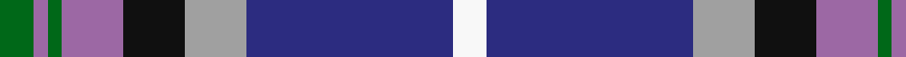
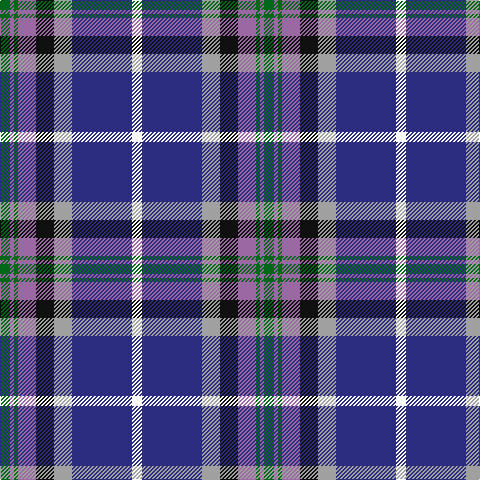

In pattern [GRGRKYBW](/patterns/grgrkybw/).

This was sourced from register-of-tartans.  It is a [8 stripes tartan](/stripes/stripes8/).

Original link https://www.tartanregister.gov.uk/tartanDetails.aspx?ref=47

## Attestations

This cloth appears in 2 source records; the oldest owns this page.

- 01/12/2002 — Alexander of Menstry (register-of-tartans, [record](https://www.tartanregister.gov.uk/tartanDetails.aspx?ref=47))
- 2002 — Alexander of Menstry (Personal) (tartans-authority, [record](http://www.tartansauthority.com/tartan-ferret/display/6713/))

## Thread count
G/10 LP4 G4 LP18 K18 N18 DB60 W/10

## Palette
Each colour and its ΔE from the base-6 reference it is a variant of.

| Colour | Shade | Base | ΔE (OKLab) |
|---|---|---|---|
| B | <code style="background-color:#2888C4;">#2888C4</code> `#2888C4` | B <code style="background-color:#2A418A;">#2A418A</code> | 0.21 |
| DB | <code style="background-color:#2C2C80;">#2C2C80</code> `#2C2C80` | B <code style="background-color:#2A418A;">#2A418A</code> | 0.06 |
| G | <code style="background-color:#006818;">#006818</code> `#006818` | G <code style="background-color:#006100;">#006100</code> | 0.02 |
| K | <code style="background-color:#101010;">#101010</code> `#101010` | K <code style="background-color:#000000;">#000000</code> | 0.17 |
| LP | <code style="background-color:#9C68A4;">#9C68A4</code> `#9C68A4` | R <code style="background-color:#CC0000;">#CC0000</code> | 0.21 |
| N | <code style="background-color:#A0A0A0;">#A0A0A0</code> `#A0A0A0` | Y <code style="background-color:#F2BF00;">#F2BF00</code> | 0.21 |
| Na | <code style="background-color:#888888;">#888888</code> `#888888` | R <code style="background-color:#CC0000;">#CC0000</code> | 0.24 |
| W | <code style="background-color:#F8F8F8;">#F8F8F8</code> `#F8F8F8` | W <code style="background-color:#F7F7F7;">#F7F7F7</code> | 0.00 |

# Sample pattern

## Nearest tartans

The nearest existing variants by ΔTartan distance.

1. [Unidentified (Woven sample)](/setts/s8/k16w6k4b64r19k8g42y6~b3850c8-g006818-k101010-r981c70-wf8f8f8-ye8c000/) — ΔT 0.57
1. [Fulbright Foundation](/setts/s8/r3y25b6ba3r2bb5ba18w3x2~b1c1c50-ba1c0070-bb507c94-rc8002c-we0e0e0-ya0a0a0/) — ΔT 0.67
1. [GYL (Personal)](/setts/s10/b28r3w3r3w3r3b14k12ba38y8~b2c2c80-ba2888c4-k101010-rc80000-we0e0e0-ye8c000/) — ΔT 0.79
1. [Ohio District Tartan Tartan Number: 651. Earliest known date: 1984 Design is based on the colours of Ohio's flag and state seal. The widths of the stripes in each colour are based on the date Ohio was admitted to the Union. The tartan first went on display at the Ohio Scottish Games in June 1983. See products available Copyright © Blair Urquhart, Comrie, 2015](/setts/s9/b16w6r8b3y1g1ba3b1g9x2~b2c2c80-ba2888c4-g006818-rc80000-we0e0e0-ye8c000/) — ΔT 0.84
1. [Ogilvie of Inverquharity or Ohio](/setts/s9/b16w6r8b3y1g1ya3b1g10x4~b1c0070-g006818-rc80000-we0e0e0-yd09800-ya48a4c0/) — ΔT 0.84
1. [GYL family (Personal)](/setts/s10/b28r3w3r3w3r3b28k12ba38wa8~b2c4084-ba0064ac-k101010-rdc0000-we0e0e0-wafafa96/) — ΔT 0.88
1. [Moran (Virgin Islands) (Personal)](/setts/s9/b3r3k5g8w2k13ba13b26w3x2~b2888c4-ba2c2c80-g006818-k101010-rc80000-we0e0e0/) — ΔT 0.89
1. [Queen Margaret University](/setts/s9/b4w3b17wa10k1ba5k1wa6g3x2~b2c4084-ba5a008c-g005020-k101010-we0e0e0-wac0c0c0/) — ΔT 0.93
1. [Moran (Coilessan) (Personal)](/setts/s8/b26ba13k13w2g8k5r3b3x2~b2888c4-ba2c2c80-g006818-k101010-rc80000-we0e0e0/) — ΔT 0.96
1. [Air Force](/setts/s11/w4b8r3b25k13g4ba29b3ba8b2r3x2~b304080-ba5480b0-g30a010-k000000-r802040-we0e0e0/) — ΔT 0.97

## Neighbour map

Every grey dot is one of 15726 variants placed by the first two principal components of the ΔTartan feature space (44% of its variance). Red is this tartan; blue dots are its nearest — click one to open its page.

<svg viewBox="0 0 640 380" role="img" style="max-width:100%;height:auto;border:1px solid #e0e0e0;border-radius:4px;display:block" xmlns="http://www.w3.org/2000/svg"><image href="/nn/cloud.v1.png" width="640" height="380"/><a href="/setts/s8/k16w6k4b64r19k8g42y6~b3850c8-g006818-k101010-r981c70-wf8f8f8-ye8c000/"><circle cx="158.3" cy="132.7" r="4" fill="#3465a4"><title>Unidentified (Woven sample)</title></circle></a><a href="/setts/s8/r3y25b6ba3r2bb5ba18w3x2~b1c1c50-ba1c0070-bb507c94-rc8002c-we0e0e0-ya0a0a0/"><circle cx="150.1" cy="132.5" r="4" fill="#3465a4"><title>Fulbright Foundation</title></circle></a><a href="/setts/s10/b28r3w3r3w3r3b14k12ba38y8~b2c2c80-ba2888c4-k101010-rc80000-we0e0e0-ye8c000/"><circle cx="140.8" cy="125.1" r="4" fill="#3465a4"><title>GYL (Personal)</title></circle></a><a href="/setts/s9/b16w6r8b3y1g1ba3b1g9x2~b2c2c80-ba2888c4-g006818-rc80000-we0e0e0-ye8c000/"><circle cx="158.1" cy="127.2" r="4" fill="#3465a4"><title>Ohio District Tartan Tartan Number: 651. Earliest known date: 1984 Design is based on the colours of Ohio's flag and state seal. The widths of the stripes in each colour are based on the date Ohio was admitted to the Union. The tartan first went on display at the Ohio Scottish Games in June 1983. See products available Copyright © Blair Urquhart, Comrie, 2015</title></circle></a><a href="/setts/s9/b16w6r8b3y1g1ya3b1g10x4~b1c0070-g006818-rc80000-we0e0e0-yd09800-ya48a4c0/"><circle cx="145.0" cy="125.2" r="4" fill="#3465a4"><title>Ogilvie of Inverquharity or Ohio</title></circle></a><a href="/setts/s10/b28r3w3r3w3r3b28k12ba38wa8~b2c4084-ba0064ac-k101010-rdc0000-we0e0e0-wafafa96/"><circle cx="180.3" cy="134.8" r="4" fill="#3465a4"><title>GYL family (Personal)</title></circle></a><a href="/setts/s9/b3r3k5g8w2k13ba13b26w3x2~b2888c4-ba2c2c80-g006818-k101010-rc80000-we0e0e0/"><circle cx="129.5" cy="142.0" r="4" fill="#3465a4"><title>Moran (Virgin Islands) (Personal)</title></circle></a><a href="/setts/s9/b4w3b17wa10k1ba5k1wa6g3x2~b2c4084-ba5a008c-g005020-k101010-we0e0e0-wac0c0c0/"><circle cx="166.6" cy="126.5" r="4" fill="#3465a4"><title>Queen Margaret University</title></circle></a><a href="/setts/s8/b26ba13k13w2g8k5r3b3x2~b2888c4-ba2c2c80-g006818-k101010-rc80000-we0e0e0/"><circle cx="147.2" cy="155.7" r="4" fill="#3465a4"><title>Moran (Coilessan) (Personal)</title></circle></a><a href="/setts/s11/w4b8r3b25k13g4ba29b3ba8b2r3x2~b304080-ba5480b0-g30a010-k000000-r802040-we0e0e0/"><circle cx="157.8" cy="126.4" r="4" fill="#3465a4"><title>Air Force</title></circle></a><circle cx="160.9" cy="133.0" r="5" fill="#c00000"/></svg>

ID: /setts/s8/g5r2g2r9k9y9b30w5x2~b2c2c80-g006818-k101010-r9c68a4-wf8f8f8-ya0a0a0/
