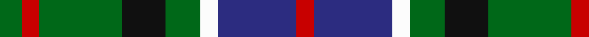

In pattern [GRGKGWBR](/stripes/grgkgwbr/).

This was sourced from tartans-authority.  It is a [8 stripe tartan](/stripes/stripes8/).

Original link http://www.tartansauthority.com/tartan-ferret/display/6050/

## Thread count
G/10 R8 G38 K20 G16 W8 DB36 R/8

## Palette
Each colour and its ΔE from the base-6 reference it is a variant of.

| Colour | Shade | Base | ΔE (OKLab) |
|---|---|---|---|
| DB | <code style="background-color:#2C2C80;">#2C2C80</code> `#2C2C80` | B <code style="background-color:#2A418A;">#2A418A</code> | 0.06 |
| G | <code style="background-color:#006818;">#006818</code> `#006818` | G <code style="background-color:#006100;">#006100</code> | 0.02 |
| K | <code style="background-color:#101010;">#101010</code> `#101010` | K <code style="background-color:#000000;">#000000</code> | 0.17 |
| R | <code style="background-color:#C80000;">#C80000</code> `#C80000` | R <code style="background-color:#CC0000;">#CC0000</code> | 0.01 |
| W | <code style="background-color:#FCFCFC;">#FCFCFC</code> `#FCFCFC` | W <code style="background-color:#F7F7F7;">#F7F7F7</code> | 0.01 |

# Sample pattern

## Nearest tartans

The nearest existing variants by ΔTartan distance.

1. [MacKean Dress (Personal)](/setts/s9/r1k2g4k1g1k2db3k1w1~x6/) — ΔT 0.93
1. [Soutar (Name)](/setts/s9/k20w3t20k3r3dg20r10w3k20~x2/) — ΔT 0.95
1. [Wilson's No.194](/setts/s10/k3r1g5k3w1dp3~x2/) — ΔT 0.97
1. [Brodie Hunting](/setts/s7/r2k8lo1k8g8t8r2~x4/) — ΔT 1.01
1. [Maitland](/setts/s9/dg3db8dg3k4dg9ly2db2ly2r2~x2/) — ΔT 1.01
1. [Maitland](/setts/s9/dg3db8dg3k4dg9ly2db2ly2r2/) — ΔT 1.01
1. [Disciples of Christ Motorcycle Ministry (Switzerland)](/setts/s7/k22g21k5g12t12o3w4~x2/) — ΔT 1.03
1. [Wilson's No.176](/setts/s8/k8t3g13dp12ly2~x2/) — ΔT 1.05
1. [MacRae Hunting](/setts/s8/dg24k4dg6r4dg6k19dt22w5~x2/) — ΔT 1.07
1. [Wilson's No.124](/setts/s8/g14dp11y3k5y3dp11g14ly2~x2/) — ΔT 1.07

## Neighbour map

Every grey dot is one of 14299 variants placed by the first two principal components of the ΔTartan feature space (44% of its variance). Red is this tartan; blue dots are its nearest — click one to open its page.

<svg viewBox="0 0 640 380" role="img" style="max-width:100%;height:auto;border:1px solid #e0e0e0;border-radius:4px;display:block" xmlns="http://www.w3.org/2000/svg"><image href="/nn/cloud.v1.png" width="640" height="380"/><a href="/setts/s9/r1k2g4k1g1k2db3k1w1~x6/"><circle cx="100.2" cy="236.6" r="4" fill="#3465a4"><title>MacKean Dress (Personal)</title></circle></a><a href="/setts/s9/k20w3t20k3r3dg20r10w3k20~x2/"><circle cx="135.0" cy="195.5" r="4" fill="#3465a4"><title>Soutar (Name)</title></circle></a><a href="/setts/s10/k3r1g5k3w1dp3~x2/"><circle cx="109.1" cy="220.6" r="4" fill="#3465a4"><title>Wilson's No.194</title></circle></a><a href="/setts/s7/r2k8lo1k8g8t8r2~x4/"><circle cx="155.6" cy="218.0" r="4" fill="#3465a4"><title>Brodie Hunting</title></circle></a><a href="/setts/s9/dg3db8dg3k4dg9ly2db2ly2r2~x2/"><circle cx="134.6" cy="228.7" r="4" fill="#3465a4"><title>Maitland</title></circle></a><a href="/setts/s9/dg3db8dg3k4dg9ly2db2ly2r2/"><circle cx="134.6" cy="228.7" r="4" fill="#3465a4"><title>Maitland</title></circle></a><a href="/setts/s7/k22g21k5g12t12o3w4~x2/"><circle cx="156.2" cy="221.1" r="4" fill="#3465a4"><title>Disciples of Christ Motorcycle Ministry (Switzerland)</title></circle></a><a href="/setts/s8/k8t3g13dp12ly2~x2/"><circle cx="150.4" cy="233.5" r="4" fill="#3465a4"><title>Wilson's No.176</title></circle></a><a href="/setts/s8/dg24k4dg6r4dg6k19dt22w5~x2/"><circle cx="156.9" cy="221.2" r="4" fill="#3465a4"><title>MacRae Hunting</title></circle></a><a href="/setts/s8/g14dp11y3k5y3dp11g14ly2~x2/"><circle cx="184.9" cy="220.5" r="4" fill="#3465a4"><title>Wilson's No.124</title></circle></a><circle cx="140.9" cy="224.8" r="5" fill="#c00000"/></svg>

ID: /setts/s8/g5r4g19k10g8w4db18r4~x2/
