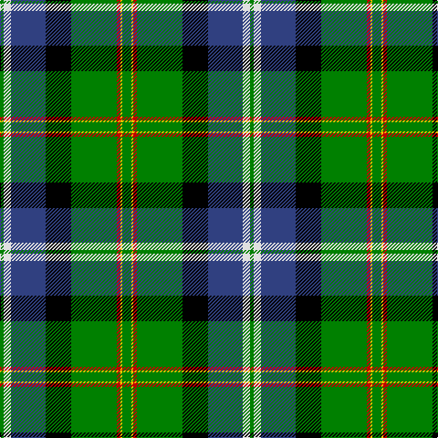

In pattern [GWBKGRYG](/patterns/gwbkgryg/).

This was sourced from weddslist.  It is a [8 stripes tartan](/stripes/stripes8/).

Original link http://www.weddslist.com/cgi-bin/tartans/pg.pl?source=sts

## Thread count
G/4 LN8 B38 K28 G50 R4 Y2 G/10

## Palette
Each colour and its ΔE from the base-6 reference it is a variant of.

| Colour | Shade | Base | ΔE (OKLab) |
|---|---|---|---|
| B | <code style="background-color:#304080;">#304080</code> `#304080` | B <code style="background-color:#2A418A;">#2A418A</code> | 0.02 |
| G | <code style="background-color:#008000;">#008000</code> `#008000` | G <code style="background-color:#006100;">#006100</code> | 0.10 |
| K | <code style="background-color:#000000;">#000000</code> `#000000` | K <code style="background-color:#000000;">#000000</code> | 0.00 |
| LN | <code style="background-color:#E0E0E0;">#E0E0E0</code> `#E0E0E0` | W <code style="background-color:#F7F7F7;">#F7F7F7</code> | 0.07 |
| R | <code style="background-color:#C00000;">#C00000</code> `#C00000` | R <code style="background-color:#CC0000;">#CC0000</code> | 0.03 |
| Y | <code style="background-color:#F0C000;">#F0C000</code> `#F0C000` | Y <code style="background-color:#F2BF00;">#F2BF00</code> | 0.00 |

# Sample pattern

## Nearest tartans

The nearest existing variants by ΔTartan distance.

1. [Birch (Name)](/setts/s9/g3b2g25k6r2k6ba20k1w2x2~b64008c-ba788cb4-g007800-k000000-r8c0000-wc8c8c8/) — ΔT 0.66
1. [East Lothian](/setts/s7/b6ba17bb4ba2k11g33y4x2~b5480b0-ba304080-bb800080-g008000-k000000-yf0c000/) — ΔT 0.86
1. [Gilhooley (Name)](/setts/s11/y7g1k1y2k9ga22g7k27b4k3w4x2~b1474b4-g006818-ga289c18-k101010-wf8f8f8-ye8c000/) — ΔT 0.93
1. [Tooth Family Tartan Tartan Number: 922. Earliest known date: 1980 STS collection. See products available Copyright © Blair Urquhart, Comrie, 2015](/setts/s8/g5y1r2g25k14b19w4g2x2~b2c2c80-g006818-k101010-rc80000-we0e0e0-ye8c000/) — ΔT 0.99
1. [Birch](/setts/s9/g3b4g23k10r2k10ba18k1w3x2~b800080-ba5480b0-g008000-k000000-rc00020-we0e0e0/) — ΔT 0.99
1. [MacNeil 3](/setts/s8/g45w2r3k15r3b15r3b15x2~b304080-g008000-k000000-rc00000-we0e0e0/) — ΔT 1.01
1. [National Millennium (Commemorative)](/setts/s9/w2k4b16y12g36k1k6y2w2x2~b1c0070-g006818-k101010-wfcfcfc-yd09800/) — ΔT 1.04
1. [Colquhoun](/setts/s7/b4k2b16w1k8g24r4x2~b304080-g008000-k000000-rc00000-we0e0e0/) — ΔT 1.06
1. [PMMC](/setts/s7/r3k11g29k28ga19y2b1x2~b0000ff-g005020-ga289c18-k101010-rff0000-yffe600/) — ΔT 1.07
1. [Sinclair, hunting](/setts/s7/g2r1g30k16w1b16r2x2~b304080-g008000-k000000-rc00000-we0e0e0/) — ΔT 1.10

## Neighbour map

Every grey dot is one of 15726 variants placed by the first two principal components of the ΔTartan feature space (44% of its variance). Red is this tartan; blue dots are its nearest — click one to open its page.

<svg viewBox="0 0 640 380" role="img" style="max-width:100%;height:auto;border:1px solid #e0e0e0;border-radius:4px;display:block" xmlns="http://www.w3.org/2000/svg"><image href="/nn/cloud.v1.png" width="640" height="380"/><a href="/setts/s9/g3b2g25k6r2k6ba20k1w2x2~b64008c-ba788cb4-g007800-k000000-r8c0000-wc8c8c8/"><circle cx="190.0" cy="101.1" r="4" fill="#3465a4"><title>Birch (Name)</title></circle></a><a href="/setts/s7/b6ba17bb4ba2k11g33y4x2~b5480b0-ba304080-bb800080-g008000-k000000-yf0c000/"><circle cx="167.0" cy="142.8" r="4" fill="#3465a4"><title>East Lothian</title></circle></a><a href="/setts/s11/y7g1k1y2k9ga22g7k27b4k3w4x2~b1474b4-g006818-ga289c18-k101010-wf8f8f8-ye8c000/"><circle cx="191.4" cy="92.7" r="4" fill="#3465a4"><title>Gilhooley (Name)</title></circle></a><a href="/setts/s8/g5y1r2g25k14b19w4g2x2~b2c2c80-g006818-k101010-rc80000-we0e0e0-ye8c000/"><circle cx="217.1" cy="129.3" r="4" fill="#3465a4"><title>Tooth Family Tartan Tartan Number: 922. Earliest known date: 1980 STS collection. See products available Copyright © Blair Urquhart, Comrie, 2015</title></circle></a><a href="/setts/s9/g3b4g23k10r2k10ba18k1w3x2~b800080-ba5480b0-g008000-k000000-rc00020-we0e0e0/"><circle cx="131.7" cy="117.0" r="4" fill="#3465a4"><title>Birch</title></circle></a><a href="/setts/s8/g45w2r3k15r3b15r3b15x2~b304080-g008000-k000000-rc00000-we0e0e0/"><circle cx="227.0" cy="134.4" r="4" fill="#3465a4"><title>MacNeil 3</title></circle></a><a href="/setts/s9/w2k4b16y12g36k1k6y2w2x2~b1c0070-g006818-k101010-wfcfcfc-yd09800/"><circle cx="216.0" cy="84.6" r="4" fill="#3465a4"><title>National Millennium (Commemorative)</title></circle></a><a href="/setts/s7/b4k2b16w1k8g24r4x2~b304080-g008000-k000000-rc00000-we0e0e0/"><circle cx="209.3" cy="147.7" r="4" fill="#3465a4"><title>Colquhoun</title></circle></a><a href="/setts/s7/r3k11g29k28ga19y2b1x2~b0000ff-g005020-ga289c18-k101010-rff0000-yffe600/"><circle cx="209.6" cy="139.0" r="4" fill="#3465a4"><title>PMMC</title></circle></a><a href="/setts/s7/g2r1g30k16w1b16r2x2~b304080-g008000-k000000-rc00000-we0e0e0/"><circle cx="248.4" cy="131.3" r="4" fill="#3465a4"><title>Sinclair, hunting</title></circle></a><circle cx="190.7" cy="120.0" r="5" fill="#c00000"/></svg>

ID: /setts/s8/g5y1r2g25k14b19w4g2x2~b304080-g008000-k000000-rc00000-we0e0e0-yf0c000/
