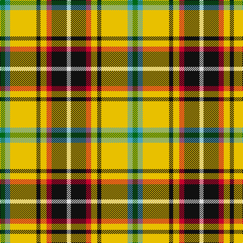

In pattern [GYYKYRKW](/patterns/gyykyrkw/).

This was sourced from register-of-tartans.  It is a [8 stripes tartan](/stripes/stripes8/).

Original link https://www.tartanregister.gov.uk/tartanDetails.aspx?ref=763

## Register references

External register numbers recorded for this tartan.

- Scottish Register of Tartans: [763](https://www.tartanregister.gov.uk/tartanDetails.aspx?ref=763)
- Scottish Tartans Authority (ITI): 4044
- Scottish Tartans World Register: 2809

## Thread count
G/10 B10 Y52 K8 Y12 R10 K30 LN/8

## Palette
Each colour and its ΔE from the base-6 reference it is a variant of.

| Colour | Shade | Base | ΔE (OKLab) |
|---|---|---|---|
| B | <code style="background-color:#48A4C0;">#48A4C0</code> `#48A4C0` | Y <code style="background-color:#F2BF00;">#F2BF00</code> | 0.29 |
| G | <code style="background-color:#006818;">#006818</code> `#006818` | G <code style="background-color:#006100;">#006100</code> | 0.02 |
| K | <code style="background-color:#101010;">#101010</code> `#101010` | K <code style="background-color:#000000;">#000000</code> | 0.17 |
| LN | <code style="background-color:#E0E0E0;">#E0E0E0</code> `#E0E0E0` | W <code style="background-color:#F7F7F7;">#F7F7F7</code> | 0.07 |
| R | <code style="background-color:#C8002C;">#C8002C</code> `#C8002C` | R <code style="background-color:#CC0000;">#CC0000</code> | 0.03 |
| Y | <code style="background-color:#E8C000;">#E8C000</code> `#E8C000` | Y <code style="background-color:#F2BF00;">#F2BF00</code> | 0.02 |

# Sample pattern

## Nearest tartans

The nearest existing variants by ΔTartan distance.

1. [Cornish Christophers (Personal)](/setts/s8/g5y5ya26k4ya6r5k15w4~g009420-k101010-rc8002c-we0e0e0-y48a4c0-yae8c000~x2/) — ΔT 0.10
1. [MacShane (Clan)](/setts/s8/g9w2g9k2y14ya4w2r2~g003820-k101010-rc80000-wfcfcfc-ya08858-yabc8c00~x4/) — ΔT 1.29
1. [Madewell Dress](/setts/s8/r2k2w16g13ga6y2k2w2~g003820-ga289c18-k101010-rc80000-we0e0e0-ye8c000~x2/) — ΔT 1.35
1. [Cornish National District Tartan Tartan Number: 1567. Earliest known date: 1963 The ancient kingdom of Cornwall is remembered in this tartan, designed by the Cornish poet, E.E. Morton-Nance. He regarded tartan as the "heritage of all Celts" and extold brave Cornishmen to wear the kilt of black and saffron, "Tints blazoned by her ancient Kings". There is also a Cornish Hunting tartan of more recent origin based on this sett. See products available Copyright © Blair Urquhart, Comrie, 2015](/setts/s6/w5k26y26b7k3r3~b5c8ca8-k101010-rc80000-we0e0e0-ye8c000~x2/) — ΔT 1.40
1. [Cawte of Middlebanknock (Personal)](/setts/s9/g13y16w4y4r4y4k20y8r8~g408060-k101010-rc80000-wfcfcfc-ye8c000~x2/) — ΔT 1.42
1. [Shepherd Piping (Personal)](/setts/s6/k5y2g7ya18g2w2~g604000-k101010-we0e0e0-yf0e490-yad8bc0c~x4/) — ΔT 1.43
1. [Red Dirt Girl](/setts/s9/b21r2y18r2y18r2g8w6b10~b441800-g003820-rb03000-wffffff-y86c67c~x2/) — ΔT 1.43
1. [Wilson's, No 109](/setts/s8/g8r11k3y2b8g15r5w2~b800080-g008000-k000000-rc00000-we0e0e0-yf0c000~x2/) — ΔT 1.46
1. [Barbour - Muted](/setts/s7/y4r2y21b11w2ra21ya4~b1c1c1c-ra00000-ra98481c-wfcfcfc-yd8b000-yafccc00~x2/) — ΔT 1.47
1. [Sawyer](/setts/s8/g2w1g10b1k4r8ba1r2~b304080-ba5480b0-g008000-k000000-rc00000-we0e0e0~x4/) — ΔT 1.48

## Neighbour map

Every grey dot is one of 15726 variants placed by the first two principal components of the ΔTartan feature space (44% of its variance). Red is this tartan; blue dots are its nearest — click one to open its page.

<svg viewBox="0 0 640 380" role="img" style="max-width:100%;height:auto;border:1px solid #e0e0e0;border-radius:4px;display:block" xmlns="http://www.w3.org/2000/svg"><image href="/nn/cloud.v1.png" width="640" height="380"/><a href="/setts/s8/g5y5ya26k4ya6r5k15w4~g009420-k101010-rc8002c-we0e0e0-y48a4c0-yae8c000~x2/"><circle cx="127.1" cy="154.2" r="4" fill="#3465a4"><title>Cornish Christophers (Personal)</title></circle></a><a href="/setts/s8/g9w2g9k2y14ya4w2r2~g003820-k101010-rc80000-wfcfcfc-ya08858-yabc8c00~x4/"><circle cx="125.5" cy="170.5" r="4" fill="#3465a4"><title>MacShane (Clan)</title></circle></a><a href="/setts/s8/r2k2w16g13ga6y2k2w2~g003820-ga289c18-k101010-rc80000-we0e0e0-ye8c000~x2/"><circle cx="108.6" cy="140.2" r="4" fill="#3465a4"><title>Madewell Dress</title></circle></a><a href="/setts/s6/w5k26y26b7k3r3~b5c8ca8-k101010-rc80000-we0e0e0-ye8c000~x2/"><circle cx="158.3" cy="173.1" r="4" fill="#3465a4"><title>Cornish National District Tartan Tartan Number: 1567. Earliest known date: 1963 The ancient kingdom of Cornwall is remembered in this tartan, designed by the Cornish poet, E.E. Morton-Nance. He regarded tartan as the &quot;heritage of all Celts&quot; and extold brave Cornishmen to wear the kilt of black and saffron, &quot;Tints blazoned by her ancient Kings&quot;. There is also a Cornish Hunting tartan of more recent origin based on this sett. See products available Copyright © Blair Urquhart, Comrie, 2015</title></circle></a><a href="/setts/s9/g13y16w4y4r4y4k20y8r8~g408060-k101010-rc80000-wfcfcfc-ye8c000~x2/"><circle cx="85.4" cy="192.2" r="4" fill="#3465a4"><title>Cawte of Middlebanknock (Personal)</title></circle></a><a href="/setts/s6/k5y2g7ya18g2w2~g604000-k101010-we0e0e0-yf0e490-yad8bc0c~x4/"><circle cx="206.7" cy="166.2" r="4" fill="#3465a4"><title>Shepherd Piping (Personal)</title></circle></a><a href="/setts/s9/b21r2y18r2y18r2g8w6b10~b441800-g003820-rb03000-wffffff-y86c67c~x2/"><circle cx="149.3" cy="165.0" r="4" fill="#3465a4"><title>Red Dirt Girl</title></circle></a><a href="/setts/s8/g8r11k3y2b8g15r5w2~b800080-g008000-k000000-rc00000-we0e0e0-yf0c000~x2/"><circle cx="131.1" cy="179.0" r="4" fill="#3465a4"><title>Wilson's, No 109</title></circle></a><a href="/setts/s7/y4r2y21b11w2ra21ya4~b1c1c1c-ra00000-ra98481c-wfcfcfc-yd8b000-yafccc00~x2/"><circle cx="147.6" cy="145.9" r="4" fill="#3465a4"><title>Barbour - Muted</title></circle></a><a href="/setts/s8/g2w1g10b1k4r8ba1r2~b304080-ba5480b0-g008000-k000000-rc00000-we0e0e0~x4/"><circle cx="158.6" cy="147.2" r="4" fill="#3465a4"><title>Sawyer</title></circle></a><circle cx="127.4" cy="154.4" r="5" fill="#c00000"/></svg>

ID: /setts/s8/g5y5ya26k4ya6r5k15w4~g006818-k101010-rc8002c-we0e0e0-y48a4c0-yae8c000~x2/
