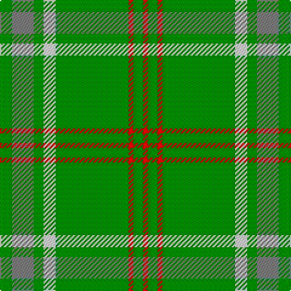

In pattern [GGGWGRGR](/stripes/gggwgrgr/).

This was sourced from weddslist.  It is a [8 stripe tartan](/stripes/stripes8/).

Original link http://www.weddslist.com/cgi-bin/tartans/pg.pl?source=sts

## Also known as

This cloth is also recorded under:

- Welsh Assembly Commemorative

## Thread count
G/10 N18 G8 LN10 G60 R4 G8 R/4

## Palette
Each colour and the base-6 reference it is a variant of.

| Colour | Shade | Base |
|---|---|---|
| G | <code style="background-color:#008000;">#008000</code> `oklch(52.0% 0.177 142.5)` <small>#008000</small> | G <code style="background-color:#006100;">#006100</code> |
| LN | <code style="background-color:#E0E0E0;">#E0E0E0</code> `oklch(90.7% 0.000 89.9)` <small>#E0E0E0</small> | W <code style="background-color:#F7F7F7;">#F7F7F7</code> |
| N | <code style="background-color:#808080;">#808080</code> `oklch(60.0% 0.000 89.9)` <small>#808080</small> | G <code style="background-color:#006100;">#006100</code> |
| R | <code style="background-color:#C00000;">#C00000</code> `oklch(50.7% 0.208 29.2)` <small>#C00000</small> | R <code style="background-color:#CC0000;">#CC0000</code> |

# Sample pattern

## Nearest tartans

The nearest existing variants by ΔTartan distance.

1. [Glenlivet](/setts/s8/g18r6g75b6g13dy35g12b6/) — ΔT 0.63
1. [Welsh Assembly (Fashion)](/setts/s8/g5o9g4w5g30r2g4r2~x2/) — ΔT 0.78
1. [Annapolis Valley](/setts/s6/g30t8g5lb4g5r2~x4/) — ΔT 1.28
1. [St. Christopher (Corporate)](/setts/s8/dg5r3dg3lo2dg1ly8dg24lo2~x2/) — ΔT 1.32
1. [Welsh Assembly](/setts/s14/o9g4w5g30r2g4r2g4r2g30w5g4o9g5~x2/) — ΔT 1.37
1. [Ross Hunting Clan Tartan Tartan Number: 756. Earliest known date: 1850 The threadcount is based on a sample from the MacGregor-Hastie collection of the Scottish Tartans Society. This version originally showed the light green overcheck having six stripes. BU noted irregularities in the threadcount, and suggests that 4 light green stripes would produce a more plausible kilting fabric. BU created the original transcription. Earliest historical reference. Other sources give Smith Museum, Stirling as the source. See products available Copyright © Blair Urquhart, Comrie, 2015](/setts/s12/g6g3g3g4g4k5g3k5g28r2g4r2~x2/) — ΔT 1.42
1. [Seattle](/setts/s10/g14w1db2r1g1r1db2w1g4ly1~x4/) — ΔT 1.50
1. [Scottish Scouts](/setts/s7/r3g22db16g14r2g6ly1~x2/) — ΔT 1.50
1. [MacKintosh, hunting](/setts/s7/db1r3g11r2db5g11ly1~x2/) — ΔT 1.51
1. [Owen (Welsh Name)](/setts/s10/g3r1g2db1g3r3g2r2g18r2~x2/) — ΔT 1.61

## Neighbour map

Every grey dot is one of 14299 variants placed by the first two principal components of the ΔTartan feature space (44% of its variance). Red is this tartan; blue dots are its nearest — click one to open its page.

<svg viewBox="0 0 640 380" role="img" style="max-width:100%;height:auto;border:1px solid #e0e0e0;border-radius:4px;display:block" xmlns="http://www.w3.org/2000/svg"><image href="/nn/cloud.v1.png" width="640" height="380"/><a href="/setts/s8/g18r6g75b6g13dy35g12b6/"><circle cx="419.4" cy="199.9" r="4" fill="#3465a4"><title>Glenlivet</title></circle></a><a href="/setts/s8/g5o9g4w5g30r2g4r2~x2/"><circle cx="434.0" cy="181.9" r="4" fill="#3465a4"><title>Welsh Assembly (Fashion)</title></circle></a><a href="/setts/s6/g30t8g5lb4g5r2~x4/"><circle cx="478.3" cy="213.0" r="4" fill="#3465a4"><title>Annapolis Valley</title></circle></a><a href="/setts/s8/dg5r3dg3lo2dg1ly8dg24lo2~x2/"><circle cx="442.4" cy="158.4" r="4" fill="#3465a4"><title>St. Christopher (Corporate)</title></circle></a><a href="/setts/s14/o9g4w5g30r2g4r2g4r2g30w5g4o9g5~x2/"><circle cx="420.6" cy="160.7" r="4" fill="#3465a4"><title>Welsh Assembly</title></circle></a><a href="/setts/s12/g6g3g3g4g4k5g3k5g28r2g4r2~x2/"><circle cx="435.9" cy="179.8" r="4" fill="#3465a4"><title>Ross Hunting Clan Tartan Tartan Number: 756. Earliest known date: 1850 The threadcount is based on a sample from the MacGregor-Hastie collection of the Scottish Tartans Society. This version originally showed the light green overcheck having six stripes. BU noted irregularities in the threadcount, and suggests that 4 light green stripes would produce a more plausible kilting fabric. BU created the original transcription. Earliest historical reference. Other sources give Smith Museum, Stirling as the source. See products available Copyright © Blair Urquhart, Comrie, 2015</title></circle></a><a href="/setts/s10/g14w1db2r1g1r1db2w1g4ly1~x4/"><circle cx="384.2" cy="138.8" r="4" fill="#3465a4"><title>Seattle</title></circle></a><a href="/setts/s7/r3g22db16g14r2g6ly1~x2/"><circle cx="408.6" cy="202.2" r="4" fill="#3465a4"><title>Scottish Scouts</title></circle></a><a href="/setts/s7/db1r3g11r2db5g11ly1~x2/"><circle cx="365.2" cy="217.4" r="4" fill="#3465a4"><title>MacKintosh, hunting</title></circle></a><a href="/setts/s10/g3r1g2db1g3r3g2r2g18r2~x2/"><circle cx="514.3" cy="170.0" r="4" fill="#3465a4"><title>Owen (Welsh Name)</title></circle></a><circle cx="442.1" cy="186.8" r="5" fill="#c00000"/></svg>

ID: /setts/s8/g5y9g4w5g30r2g4r2~x2/
